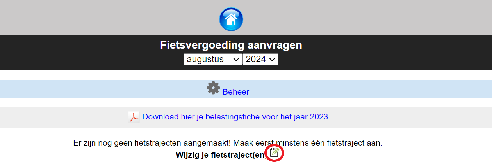
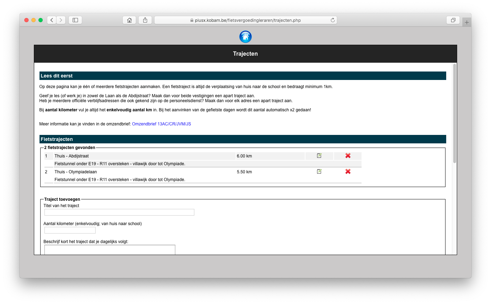
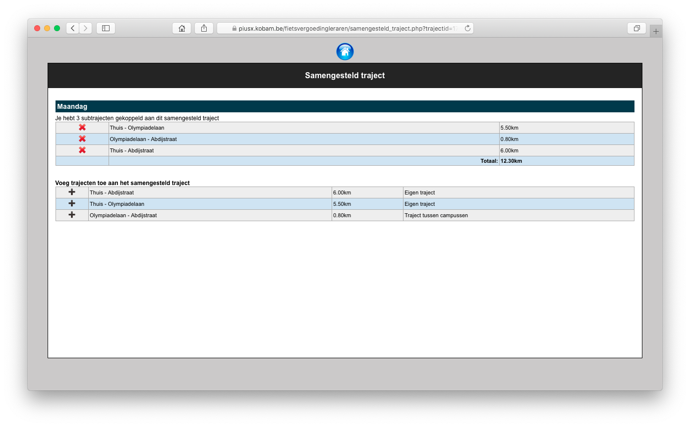
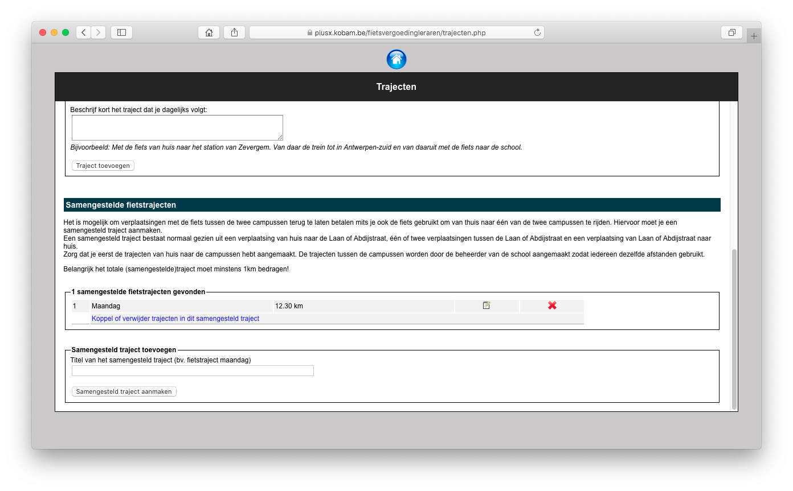
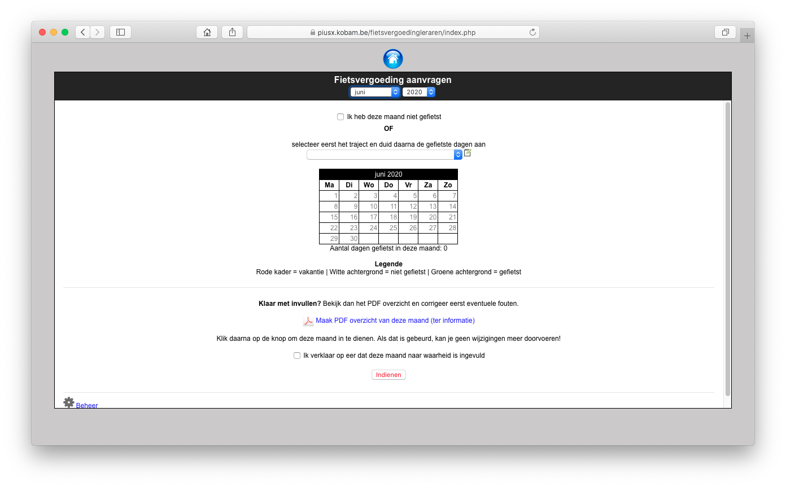

Van zodra de module Fietsvergoeding is geactiveerd, is die voor elke Toolboxgebruiker beschikbaar. Er moeten dus geen bijkomende rechten worden ingesteld voor de eindgebruikers.

Als een eindgebruiker de module voor de eerste keer opstart, krijgt die de melding dat er eerst fietstrajecten aangemaakt moeten worden. Dat kan door middel van het icoontje achter ‘Wijzig je fietstraject(en)’.

In dat scherm voeg je je persoonlijke fietstrajecten toe. De eindgebruiker geeft hier het enkelvoudig traject in. Dat wil zeggen: de afstand van thuis tot aan de school. Heeft een eindgebruiker meerdere officiële verblijfsadressen, dan kan hij meerdere trajecten aanmaken. Fietst een gebruiker naar meerdere campussen, dan maakt hij voor elk traject ‘thuis - campus’ een traject aan.

## Samengestelde trajecten

Als de school meerdere campussen heeft, dan kan een eindgebruiker die op eenzelfde werkdag van de ene campus naar de andere fietst, gebruik maken van samengestelde trajecten.

Een samengesteld traject bestaat altijd uit een ‘normaal’ traject van thuis tot aan een eerste campus, een traject (of meerdere trajecten) tussen campussen en een traject van de laatste campus naar huis. Op die manier wordt het verkeer tussen de campussen ook vergoed. Om een samengesteld traject te kunnen aanmaken, moeten eerst de enkelvoudige trajecten aangemaakt worden. 

Een eindgebruiker kan die samengestelde trajecten een zelfgekozen naam geven, bv. Fietstraject Maandag.

## Invullen en indienen

In het hoofdscherm selecteert de eindgebruiker eerst een traject. Vervolgens selecteert hij de dag of dagen waarop hij dat traject heeft afgelegd.

Als de school heeft ingesteld dat er digitaal mag worden ingediend, dan vinkt de eindgebruiker het vinkje ‘ik verklaar op eer dat deze maand naar waarheid is ingevuld’ aan en klikt op de knop 'Indienen'. Er wordt normaals gevraagd om bevestiging. De PDF is in dit geval louter informatief.

Als de school heeft gekozen om niet digitaal in te dienen, dan drukt de eindgebruiker de PDF af, ondertekent die en brengt die binnen op het verwerkende secretariaat. Van zodra de maand digitaal is ingediend, zijn wijzigingen niet meer mogelijk.

Moet de gebruiker een document inleveren, dan mag hij na het afdrukken van de PDF en het verwerken ervan door het secretariaat, geen wijzigingen meer doorvoeren. Anders dient een nieuw document afgedrukt te worden.

Een gebruiker kan ook aanduiden dat hij een maand niet heeft gefietst door het vinkje ‘ik heb deze maand niet gefietst’ aan te vinken. Dit is optioneel, maar wel handig voor de verwerking. 