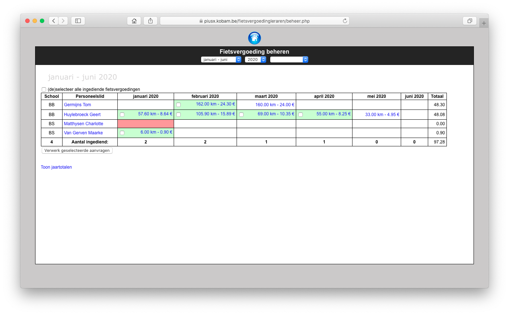

Via de Beheer-knop onderaan het invulrooster, kan de beheerder een overzicht krijgen van alle ingevulde en alle ingediende aanvragen. Ingediende aanvragen worden in het groen gemarkeerd en krijgen een vinkje. Wordt er gewerkt met papieren documenten, dan klikt de verwerker op de desbetreffende maand van de aanvrager. Op dat moment wordt het vakje groen gekleurd.

Om uit te betalen, selecteer je de gewenste vinkjes en klik je onderaan op de knop Verwerk geselecteerde aanvragen. De geselecteerde aanvragen worden overgezet naar Exact Online. Daar kunnen vervolgens de betalingsbestanden aangemaakt worden.

De verwerkte maanden worden rood gekleurd. Heeft een aanvrager aangeduid dat hij een maand niet heeft gefietst, dan wordt die maand in het licht rood aangeduid. Door op de naam van een aanvrager te klikken, kan je alle details opvragen alsook de PDF. Hier zijn ook beperkte wijzigingen mogelijk.

Het aanmaken van de fiscale fiches en XML bestanden voor Belcotax, verloopt via de module Woon-werkverkeer