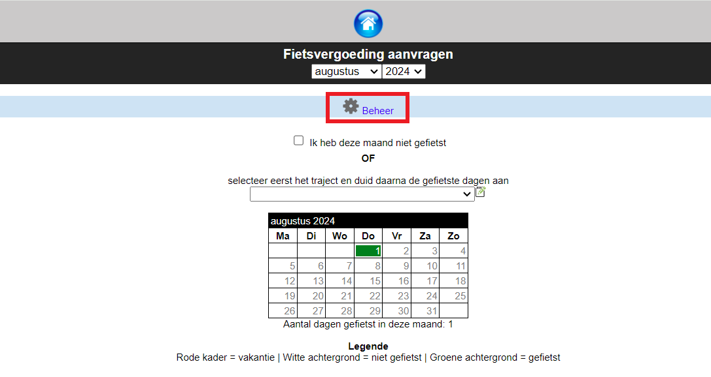
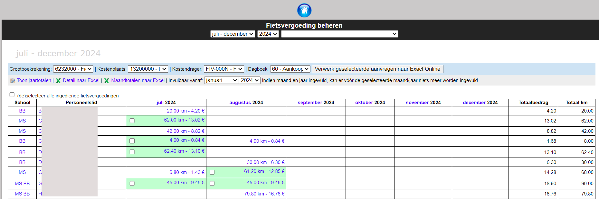

Iemand met het gebruikersrecht 'Fietsvergoeding Beheer' krijgt in de module Fietsvergoeding bovenaan nog een extra knop 'Beheer' te zien. *Klik [hier](/gebruikersbeheer) voor meer info over het toekennen van gebruikersrechten in de module Gebruikersbeheer.* Via die knop kan de beheerder een overzicht krijgen van alle lopende en alle ingediende aanvragen. 

- **Situatie 1: Personeelsleden dienen hun aanvraag digitaal in via Toolbox:** De ingediende aanvragen worden groen gemarkeerd en krijgen een checkbox die men kan aanvinken om de fietsvergoeding verder te verwerken naar Exact Online. 
- **Situatie 2: Aanvragen worden door de personeelsleden afgedrukt en op papaier ingediend:** Van zodra het personeelslid zijn aanvraag op papier heeft binnengebracht, klikt de verwerker in de desbetreffende maand in het witte vak (op het aantal kilometer en het bedrag) bij de aanvrager. Op dat moment kleurt het vak groen en kan de aanvraag verder boekhoudkundig verwerkt worden.

:::caution opmerking
Heeft een personeelslid zijn aanvraag per ongeluk te vroeg digitaal afgesloten, dan kan een beheerder die terug vrijgeven door opnieuw in het groene vak te klikken. Het vak kleurt terug wit en het personeelslid kan opnieuw wijzigingen aanbrengen voor die maand. 
::: 

Om de fietsvergoedingen uit te betalen, selecteer je de gewenste vakjes en klik je onderaan op de knop 'Verwerk geselecteerde aanvragen'. De geselecteerde aanvragen worden overgezet naar Exact Online. Daar kunnen vervolgens de betaalbestanden aangemaakt worden. 

De verwerkte maanden worden rood gekleurd. Heeft een aanvrager aangeduid dat hij een maand niet heeft gefietst, dan wordt die maand in het lichtrood aangeduid. Door op de naam van een aanvrager te klikken, kan je alle details opvragen alsook de PDF. Hier zijn ook beperkte wijzigingen mogelijk.

Het aanmaken van de fiscale fiches en XML bestanden voor Belcotax verloopt via de module Woon-werkverkeer.

### Meerdere instellingsnummers met andere boekhoudkundige parameters
Indien een school meerdere instellingsnummers heeft, worden die vooraan getoond in de vorm van een afkorting. Die afkorting kan de school zelf bepalen in de module Instellingen > Instellingsnummers. Door te klikken op een afkorting, worden alle aanvragen voor dat instellingsnummer ineens geselecteerd. Bovenaan zie je de boekhoudkundige parameters die standaard zijn ingesteld in de module Instellingen. Die kan je hier nog wijzigen. Werk je voor elk instellingsnummer met een andere kostenplaats, dan selecteer je eerst alle aanvragen van instellingsnummer A. Die zet je over met de overeenkomstige boekhoudkundige parameters. Daarna selecteer je alle aanvragen voor instellingsnummer B en wijzig je de boekhoudkundige parameters alvorens te verwerken naar Exact Online. 

