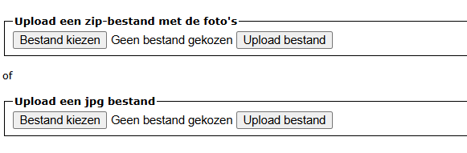
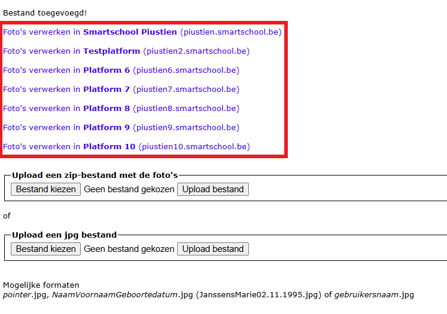
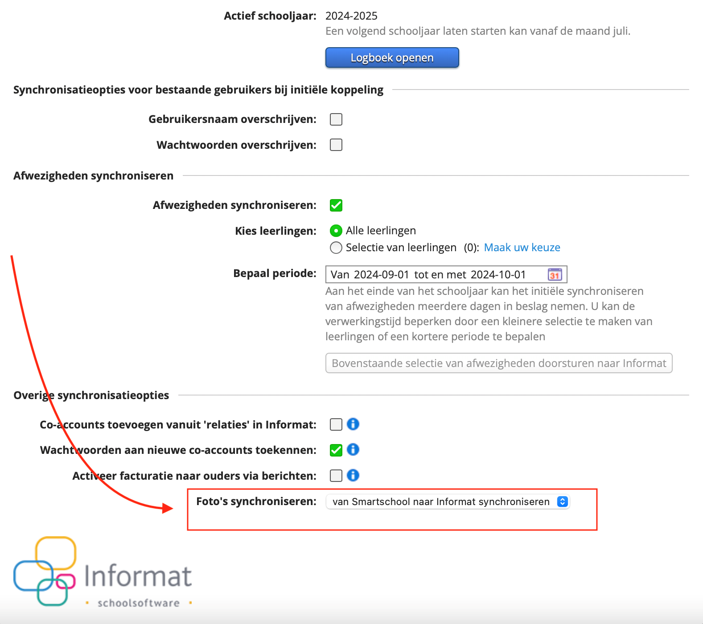

<ImageTitle img="portrait.png">Foto's fotograaf naar Smartschool</ImageTitle>

Is de fotograaf op school langsgeweest en heb je de foto's ontvangen van de leerlingen? Dan kan je die op een eenvoudige manier via Toolbox synchroniseren met Smartschool. 

Je kan individuele foto's opladen of je kan ineens een zip-bestand opladen met een hele reeks foto's. 

### Foto's opladen in Toolbox

- Klik in de module helemaal bovenaan op <LegacyAction img="pluscircle.png" text="Foto's uploaden"/> om de foto's toe te voegen.

- Klik vervolgens op 'Bestand kiezen'. 
    - Kies de eerste optie om een zip-bestand met meerdere foto's op te laden.
    - Kies de tweede optie om een afzonderlijk bestand op te laden. 
    
    
    De foto's moeten steeds als JPG-bestand worden opgeladen. Dat kan in één van volgende formaten:
    - pointer.jpg
    - NaamVoornaamGeboortedatum.jpg (bv. JanssensMarie02.11.1995.jpg) 
    - gebruikersnaam.jpg

- Klik op 'Upload bestand' om het gekozen bestand te uploaden in Toolbox.

### Foto's synchroniseren met Smartschool 

Na het uploaden van een (reeks) fotobestand(en) kan je kiezen met welk Smartschoolplatform je de foto's wil synchroniseren. 

  

:::danger opgelet
Om de foto's vanuit Toolbox met Smartschool te kunnen synchroniseren, moet ook in **Informat** de instelling m.b.t. de synchronisatie van foto's correct staan. Daar moet ingesteld zijn: 'Van Smartschool naar Informat' en niet andersom. Anders zal de synchronisatie vanuit Toolbox een foutmelding geven, omdat Smartschool verwacht dat de sync vanuit Informat zal plaatsvinden. (*zie screenshot hieronder*)
:::

  

