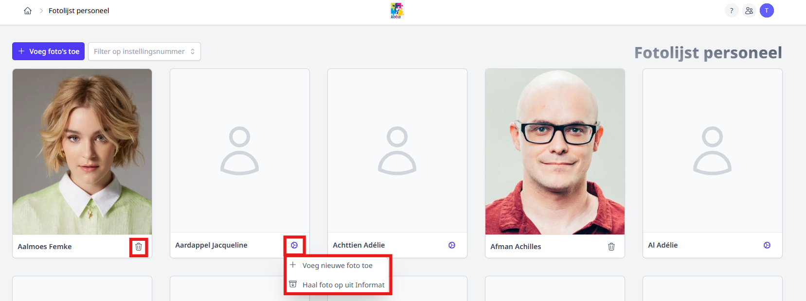

<ImageTitle img="fotolijstLeraren.png">Fotolijst leraren</ImageTitle>

De fotolijst in Toolbox geeft een overzicht van alle personeelsleden die opgehaald werden via de synchronisatie met Informat met daarbij een foto. Van zodra de module is geactiveerd, kunnen alle personeelsleden in Toolbox de fotolijst raadplegen. Hiervoor zijn geen bijkomende rechten noodzakelijk. De beschikbare foto's zullen ook getoond worden in de module Adresboek en in het persoonlijk Toolbox-profiel van het personeelslid. 

Indien je gebruik maakt van de **Toolbox voor externen**, bv. voor CLB-medewerkers, leerondersteuners, ... kunnen ook die externe personen de fotolijst raadplegen in Toolbox. In tegenstelling tot personeelsleden, moeten voor externen wel gebruikersrechten worden toegekend om toegang te krijgen tot de module. Dat is het gebruikersrecht 'fotolijst_leraren'. Met dit recht kunnen externen de fotolijst raadplegen. Ze komen echter NIET zelf voor in het overzicht. Deze functionaliteit is momenteel (nog) niet voorzien. 

Om foto's toe te kunnen voegen zijn er ook bijkomende gebruikersrechten noodzakelijk. Een beheerder kan via de module [Gebruikersbeheer](/gebruikersbeheer) het recht 'fotolijst_leraren_beheer' toekennen. Personeelsleden met dit recht kunnen op verschillende manieren foto's toevoegen. 

## Foto's individueel toevoegen

Klik bij het betreffende personeelslid rechtsonder op het tandwieltje om een foto toe te voegen of op het vuilnisbakje om een foto te verwijderen. Net het verwijderen kan je een andere foto toevoegen.  Bij het toevoegen kan je kiezen om een bestand van op je computer te gebruiken of de foto uit Informat op te halen. Die laatste koppeling werkt uiteraard alleen wanneer er in Informat een foto werd toegevoegd. 

Indien je kiest om zelf een bestand toe te voegen, selecteer je het gewenste bestand op je computer en klik je vervolgens op '+ Upload'. 

## Foto's in bulk toevoegen

Met behulp van de functionaliteit '+ Voeg foto's toe' bovenaan, kan je meerdere foto's tegelijk toevoegen.

Klik op 'Selecteer' om het bestand met foto's op je computer te selecteren en klik vervolgens op '+ Upload'. 

Upload een zip-bestand met de foto's in de vorm pointer.jpg, achternaamvoornaam.jpg of voornaamachternaam.jpg. Maak een zip-bestand van de foto's en niet van de map waarin de foto's zitten! Hoe doe je dat? 
- Open de map met foto's
- Selecteer de foto's
- Klik met de rechtermuisknop
- Kies voor 'Comprimeren naar ZIP-bestand'

## FAQ
### Er staan personen in de lijst die geen actief personeelslid meer zijn. Hoe haal ik deze personen uit de fotolijst?
Toolbox haalt alle personeelsleden uit Informat met behulp van de module 'Synchronisatie leraren'. Wanneer je het betreffende personeelslid in Informat op 'Niet actief' zet en vervolgens opnieuw synchroniseert in Toolbox, komt die persoon niet langer voor in het overzicht. 
