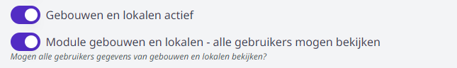
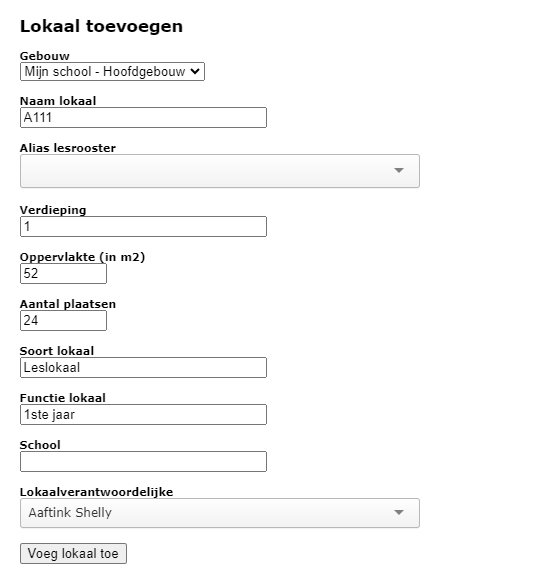

--- 
title: Gebouwen en lokalen
hide_title: true
slug: /gebouwen_lokalen
---

<ImageTitle img="school.png">Gebouwen en lokalen</ImageTitle>

De module Gebouwen en lokalen is in eerste instantie ontwikkeld om de items uit de module [Inventaris](/inventaris) aan een lokaal te kunnen toewijzen. Ondertussen heeft deze module al wat extra functies gekregen.

## Module activeren / Gebruikersrechten

Om een module in Toolbox te kunnen gebruiken, moet ze eerst en vooral geactiveerd worden. Ga hiervoor naar de module **Instellingen => Modules**. Voor de module 'Gebouwen en lokalen' heb je daar twee mogelijkheden. 
- De eerste optie 'Gebouwen en lokalen actief' moet sowieso aangezet worden. 
- Indien je de tegel ook in 'Alleen lezen' versie ter beschikking wil stellen van alle Toolboxgebruikers ineens, kan je ook de tweede optie activeren.  

    

Om in de module te kunnen werken, moet het gebruikersrecht **Gebouwen_beheer** toegekend worden aan de juiste personeelsleden. Ga hiervoor naar de module [Gebruikersbeheer](/gebruikersbeheer) en gebruik één van de bovenste twee opties. 

## Voorbereiding: vestigingen en gebouwen

Om de module optimaal te kunnen gebruiken, is het belangrijk om eerst Vestigingen en Gebouwen aan te maken. Vervolgens kan je lokalen toevoegen en die aan een Gebouw koppelen.

Een vestiging is een locatie (adres). Op één vestiging kunnen één of meerdere Gebouwen staan. 

Via de knop bovenaan <LegacyAction img="pluscircle.png" text="vestiging toevoegen"/> kan je een vestiging aanmaken. Daar vul je het adres in. Eens aangemaakt, klik je op het huisje <LegacyAction img="school.png"/> vóór het adres. Zo kom je in het onderdeel Gebouwen terecht. Daar maak je op dezelfde manier minstens één gebouw per vestiging aan (bv. hoofdgebouw, sporthal, Blok A, ...).

Als dat is gebeurd, kan je de lokalen toevoegen via de knop <LegacyAction img="klaslokaal.png"/>.

## Lokalen toevoegen

Elk lokaal is gekoppeld aan een gebouw. Dat gebouw kan je kiezen uit de lijst. Vervolgens kan je nog bijkomende parameters invullen: de naam van het lokaal, verdieping, wat voor soort lokaal het is (berging, bureel, gang, leslokaal, sanitair, ....). Bij de functie kan je opgeven waarvoor het lokaal effectief gebruikt wordt: bureel ICT, Boekhouding, Labo chemie, Computerlokaal, ...

Je kan eventueel nog opgeven of een lokaal aan een bepaalde school is gekoppeld. Dit is een stukje tekst en kan je vrij kiezen. Denk hierbij aan Middenschool of Bovenbouw of Internaat of ...

Aan een lokaal kan je ook een verantwoordelijk personeelslid koppelen alsook de oppervlakte opgeven. Verder kan je nog opgeven hoeveel plaatsen er in het lokaal beschikbaar zijn. 

## Acties in het menu 'Lokalen'

- Gebruik dit icoon <LegacyAction img="edit.png"/> om de info m.b.t. het lokaal te wijzigen.

- Met dit icoon <LegacyAction img="detail.png"/> krijg je een overzicht van alle items en netwerkoutlets in dit lokaal. Dit is op voorwaarde dat de items gekoppeld zijn aan dit lokaal in de module [Inventaris](/inventaris).
- Als je gebruik maakt van de module [Lessenrooster](/lessenrooster) dan kan je vanuit de lokalenlijst het lesrooster voor dat lokaal opvragen (en dus ook wanneer het lokaal vrij is) met behulp van dit icoon <LegacyAction img="tabel.png"/>. Hiervoor wordt standaard naar de naam van het lokaal gekeken. Als deze naam afwijkt van de gebruikte naam in het lesrooster, kan je kiezen om een 'Alias lesrooster' voor dat lokaal in te vullen. Indien ingevuld, wordt de koppeling hierop gemaakt.
- In de kolom 'Zichtbaar in reservatie' kan je aanvinken <LegacyAction img="vinkjeGroenRond.png"/> of een lokaal zichtbaar moet zijn in de module 'Lokalen reserveren'. In die laatste module kan je verder instellen op welke momenten het betreffende lokaal reserveerbaar moet zijn. 
- Gebruik dit icoon <LegacyAction img="remove.png"/> om het lokaal volledig te verwijderen uit de lijst. 
- Via <LegacyAction img="qr.png" text="QR codes"/> kan je voor de geselecteerde lokalen een QR code afdrukken. Via de module **Instellingen => Gebouwen en lokalen** kan je aangeven welk formaat de etiketten hebben en welke gegevens er op het label met de QR code getoond moeten worden. Daarnaast kan je in de instellingen ook aangeven welke informatie er getoond moet worden wanneer de QR code van het lokaal wordt gescand.

    

