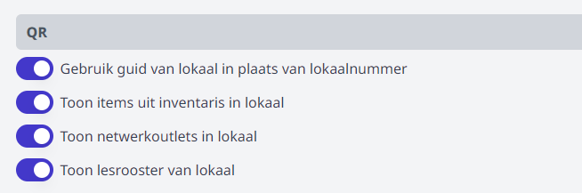
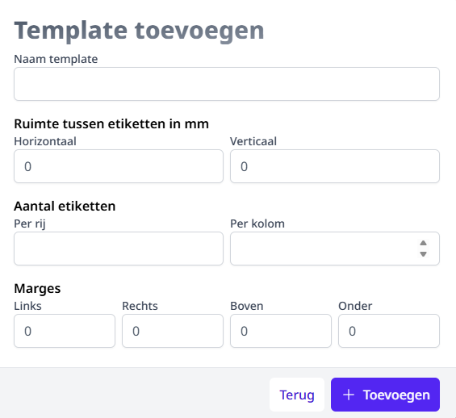

--- 
title: Gebouwen en lokalen
hide_title: true
slug: /gebouwen_lokalen
---

<ImageTitle img="school.png">Gebouwen en lokalen</ImageTitle>

De module Gebouwen en lokalen is in eerste instantie ontwikkeld om de items uit de module [Inventaris](/inventaris) aan een lokaal te kunnen toewijzen. Ondertussen heeft deze module al wat extra functies gekregen.

## Module activeren / Gebruikersrechten

Om een module in Toolbox te kunnen gebruiken, moet ze eerst en vooral geactiveerd worden. Ga hiervoor naar de module **Instellingen => Modules**. Voor de module 'Gebouwen en lokalen' heb je daar twee mogelijkheden. 
- De eerste optie 'Gebouwen en lokalen actief' moet sowieso aangezet worden. 
- Indien je de tegel ook in 'Alleen lezen' versie ter beschikking wil stellen van alle Toolboxgebruikers ineens, kan je ook de tweede optie activeren.  

    

Om in de module te kunnen werken, moet het gebruikersrecht **Gebouwen_beheer** toegekend worden aan de juiste personeelsleden. Ga hiervoor naar de module [Gebruikersbeheer](/gebruikersbeheer) en gebruik één van de bovenste twee opties. 

## Voorbereiding: vestigingen en gebouwen

Om de module optimaal te kunnen gebruiken, is het belangrijk om eerst Vestigingen en Gebouwen aan te maken. Vervolgens kan je lokalen toevoegen en die aan een Gebouw koppelen.

Een vestiging is een locatie (adres). Op één vestiging kunnen één of meerdere Gebouwen staan. 

In de tab Vestigingen, via de knop bovenaan **Toevoegen** kan je een vestiging aanmaken. Daar vul je het adres in. Vervolgens kan je op dezelfde manier in de tab Gebouwen een gebouw aan maken, en als laatste in de tab Lokalen een lokaal aan maken.

## Lokalen toevoegen

Elk lokaal is gekoppeld aan een gebouw. Dat gebouw kan je kiezen uit de lijst. Vervolgens kan je nog bijkomende parameters invullen: de naam van het lokaal, verdieping, wat voor soort lokaal het is (berging, bureel, gang, leslokaal, sanitair, ....). Bij de functie kan je opgeven waarvoor het lokaal effectief gebruikt wordt: bureel ICT, Boekhouding, Labo chemie, Computerlokaal, ...

Je kan eventueel nog opgeven of een lokaal aan een bepaalde school is gekoppeld. Dit is een stukje tekst en kan je vrij kiezen. Denk hierbij aan Middenschool of Bovenbouw of Internaat of ...

Aan een lokaal kan je ook een verantwoordelijk personeelslid koppelen alsook de oppervlakte opgeven. Verder kan je nog opgeven hoeveel plaatsen er in het lokaal beschikbaar zijn. 

    

## Acties in het menu 'Lokalen'

- Gebruik op het **potlood** icoon om de info m.b.t. het lokaal te wijzigen.

- Klik op de **naam** van het lokaal voor een overzicht van alle items en netwerkoutlets in dit lokaal. Dit is op voorwaarde dat de items gekoppeld zijn aan dit lokaal in de module [Inventaris](/inventaris) en dat de instellingen *Toon items uit inventaris in lokaal* en *Toon netwerkoulets in lokaal* onder QR aan staan.
- In de kolom 'Reserveerbaar' kan je aanvinken of een lokaal zichtbaar moet zijn in de module 'Lokalen reserveren'. In die laatste module kan je verder instellen op welke momenten het betreffende lokaal reserveerbaar moet zijn. 
- Gebruik het **vuilbak** icoon om het lokaal volledig te verwijderen uit de lijst. 

### Lokalen exporteren
- Via de knop **Exporteren** kan je op twee manier je lokalen gaan exporteren:

- **Excel:** Via de Excel-export kan je een overzicht van alle lokalen inclusief details downloaden als Excel-bestand.
- **QR:** Via de QR-export genereert u etiketten voor de lokalen. Hebt u geen lokalen geselecteerd dan worden alle lokalen geëxporteerd, en anders enkel de selectie. In de instellingen kan je aangeven welke informatie er getoond moet worden wanneer de QR code van het lokaal wordt gescand.
    
    

Via het **QR exporteer menu** kunt u kiezen welke gegevens er op het label met de QR code getoond moeten worden en welke [etiketten template](#etiketten-templates ) u  wilt gebruiken. Dit op voorwaarde dat u al eerder een etiketten template aanmaakte. Zoniet klik dan op het **tandwiel** icoon om een etiketten template aan te maken. 

    

### Etiketten templates
Via de Knop **Toevoegen** kan u etiketten templates aanmaken. Gebruik het **potlood** icoon om je etiketten template te bewerken. Met het vuilbak icoon kan je een etiketten template **verwijderen**.
    
In het invul formulier kan je de info van je etiketten papier ingeven.

    
