<ImageTitle img="gebruikersbeheer.png">Gebruikersbeheer</ImageTitle>

## 1. Personeelsleden

Een personeelslid kan pas toegang krijgen tot Toolbox wanneer het is ingegeven in het administratief pakket (Informat of Wisa). Vervolgens moet het personeelslid gesynchroniseerd worden met Toolbox. Meer info vind je bij [Synchronisatie leraren](/synchronisatie/synchronisatie_leraren/).

Volgende modules zijn voor alle personeelsleden onmiddellijk toegankelijk wanneer de module geactiveerd is in de instellingen van Toolbox:
- Fietsvergoeding 
- Openbaar vervoer 
- Onkosten
- Ziektepapieren
- Activiteiten
- Adresboek 
- Fotolijst
- Mijn afwezigheden
- Paswoorden (van leerlingen) resetten 

Voor de meeste modules in Toolbox moeten er expliciet rechten worden toegekend aan de gebruikers. Dat kan via de module **Gebruikersbeheer**.

:::caution opgelet
Enkel een beheerder in Toolbox heeft toegang tot de module Gebruikersbeheer. Kom te weten wie beheerder is in jouw Toolbox door te klikken op het vraagteken in de rechterbovenhoek van de startpagina en vraag aan (één van deze) perso(o)n(en) om je toegang te geven. Een beheerder mag echter niet zomaar iedereen toegang geven tot alle modules. Hiervoor is ook steeds de goedkeuring van de directie of de afgevaardigd bestuurder noodzakelijk.  
:::

:::info noot
Wanneer een personeelslid uit dienst gaat en het wordt in Informat op non-actief gezet, dan worden (na synchronisatie) onmiddellijk alle rechten op Toolbox-modules ontnomen.
:::

### a. Personeelslid/-leden aan gebruikersrecht koppelen

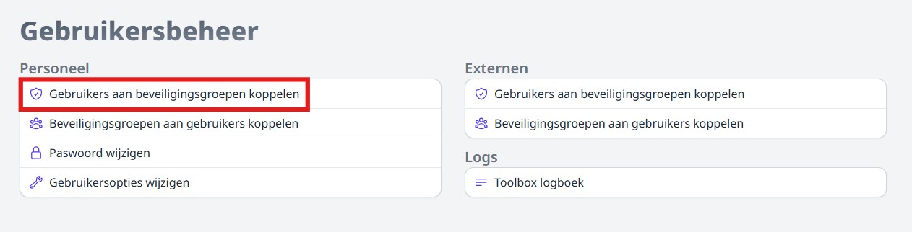

Selecteer bovenaan het gebruikersrecht dat je wil toekennen. Links op het scherm staan de personeelsleden die reeds rechten hebben voor de module, rechts diegenen die geen rechten hebben. Selecteer één of meerdere personen en zet ze d.m.v. de blauwe pijlen in de juiste kolom. De aanpassingen worden automatisch opgeslagen.

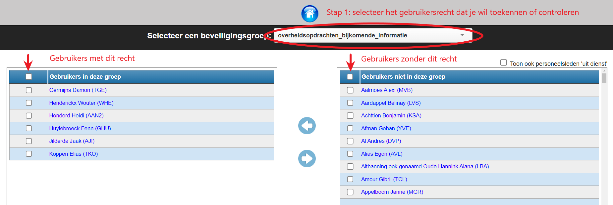
*Klik op de afbeelding om te vergroten.*

### b. Gebruikersrecht(en) aan personeelslid koppelen

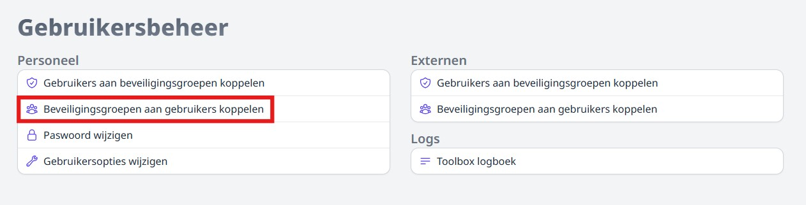

Selecteer bovenaan het personeelslid waaraan je gebruikersrechten wil toekennen. Links op het scherm staat een overzicht van alle rechten waar de geselecteerde gebruiker reeds over beschikt, rechts die waar de gebruiker (nog) niet over beschikt. Selecteer één of meerdere modules en zet ze d.m.v. de blauwe pijlen in de juiste kolom. De aanpassingen worden automatisch opgeslagen.

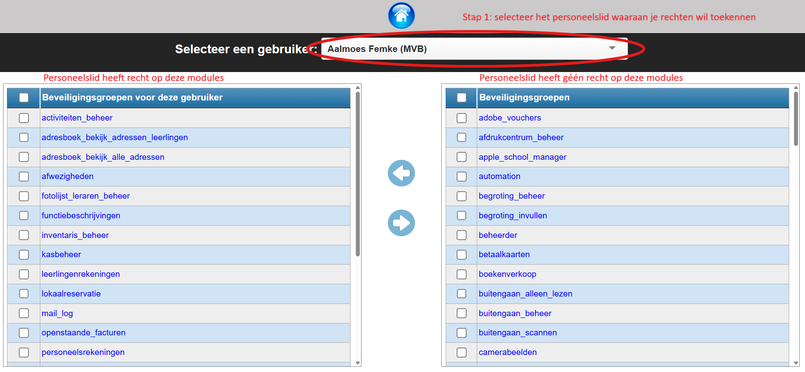
*Klik op de afbeelding om te vergroten.*

### c. Wachtwoord van een gebruiker resetten

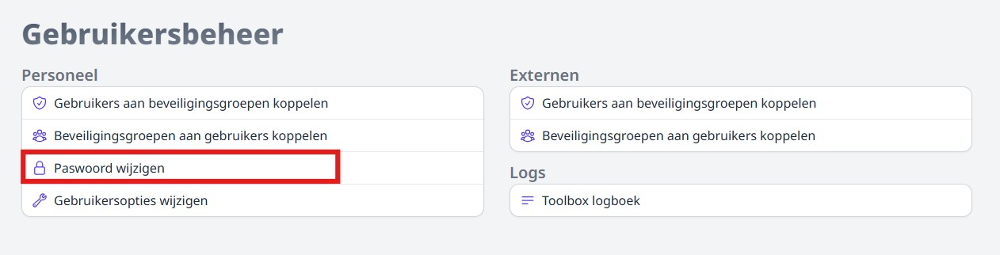

Wanneer een gebruiker zijn paswoord niet meer kent, kan een beheerder in Toolbox het via deze weg resetten. Gebruik hiervoor het origineel paswoord dat je terugvindt in de module 'Synchronisatie leraren'. Daar kan je een nieuwe PDF met gebruikersnaam en wachtwoord afdrukken via de optie 'PDF afdrukken'. 

Voer dit paswoord in bij het gebruikersbeheer en klik vervolgens op 'Paswoord wijzigen'. De gebruiker kan nu opnieuw inloggen met deze gegevens en het standaardpaswoord onmiddellijk wijzigen in zijn persoonlijk profiel bovenaan rechts in Toolbox.

*Standaardpaswoord wijzigen in het gebruikersbeheer (door beheerder):*
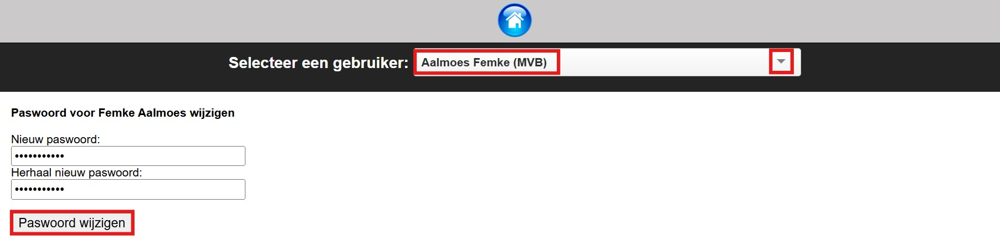

*Inloggen en paswoord meteen wijzigen (door personeelslid):*
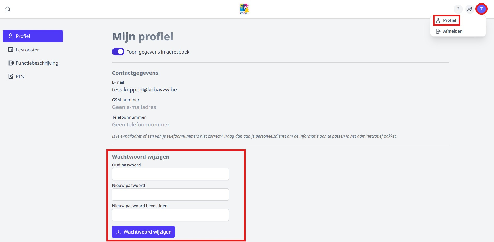

### d. Gebruikersopties wijzigen

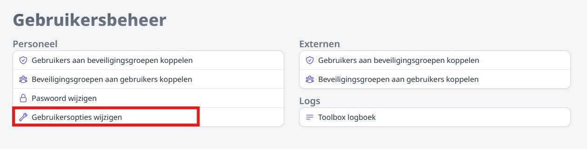

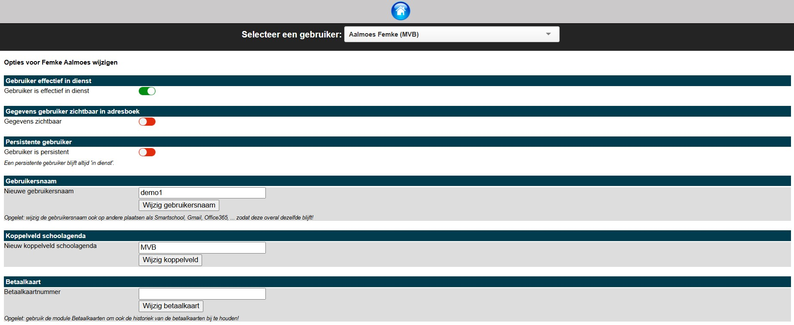
*Klik op de afbeelding om te vergroten.*

Een beheerder kan per gebruiker een aantal gebruikersopties wijzigen. Zo kan men:
- een personeelslid met de status **'effectief in dienst'** eventueel op **'niet effectief in dienst'** zetten. Dit kan handig zijn voor personeelsleden die bv. enkel administratief op de school ingeschreven zijn, bv. staf- of regiomedewerkers. Als zij in Toolbox de status 'Niet effectief in dienst' krijgen, worden zij vanuit Toolbox niet verder meegenomen naar andere synchronisaties zoals bv. Office 365.   
- de gegevens van een gebruiker voor alle personeelsleden zichtbaar maken in de module [**Adresboek**](/adresboek). Opgelet! Leraren kunnen via hun persoonlijk profiel kiezen of ze deze gegevens willen tonen aan collega's. Houd rekening met de regelgeving rond privacy en deel nooit zomaar persoonlijke gegevens zonder de toestemming van het personeelslid in kwestie. 
- een gebruiker **'persistent'** maken. Zo blijft die in Toolbox altijd 'in dienst' en wordt die status niet overschreven na een nieuwe synchronisatie met informat wanneer het personeelslid in Informat op non-actief werd gezet. Dit kan handig zijn voor bv. regiomedewerkers die enkel administratief zijn ingeschreven in Informat. 
- de **gebruikersnaam** van een personeelslid wijzigen. Dat kan eveneens via de module [Synchonisatie leraren](/synchronisatie/synchronisatie_leraren/#gebruikersnamen-controleren-enof-wijzigen).
- het **koppelveld met de schoolagenda** wijzigen. Dit veld is nodig om de leraren uit het roosterprogramma (Untis, EDT, Mondriaan, MyRo) te koppelen aan de overeenkomstige leraren uit Toolbox. Meer informatie over dit veld kan je terugvinden bij het onderdeel over de module [Lessenrooster](/lessenrooster/uurrooster_beheren/).
- Wanneer men de **Functie** van het personeelslid invult, zal die getoond worden in de modules [Adresboek](/adresboek) en [Fotolijst leraren](/fotolijst). De functie wordt eveneens mee overgenomen in de synchronisatie met Office 365.

    **Adresboek**
    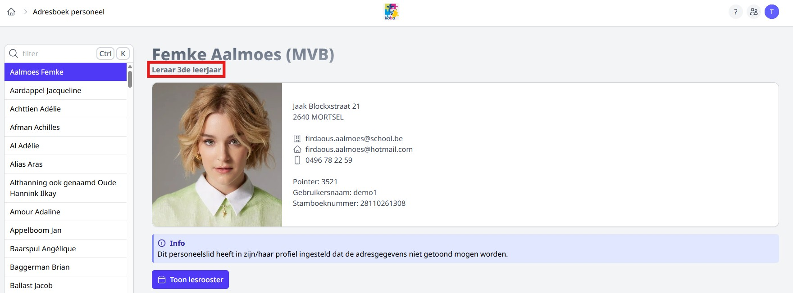

    **Fotolijst**
    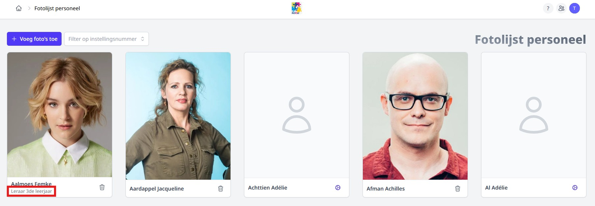

## 2. Externen  

Het is mogelijk om externen toegang te geven tot Toolbox. Dat is niet de schooltoolbox, maar een aparte Toolbox voor externen. Meer info hierover vind je bij het onderdeel [Synchronisatie externen](/synchronisatie/synchronisatie_externen/).

Voor bepaalde modules is het mogelijk om ook voor externen gebruikersrechten toe te kennen. Dat doe je in de module Gebruikersbeheer via het rechtse onderdeel.

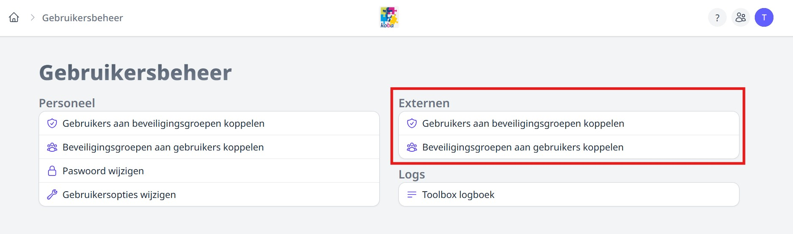

### a. Externe aan gebruikersrecht koppelen

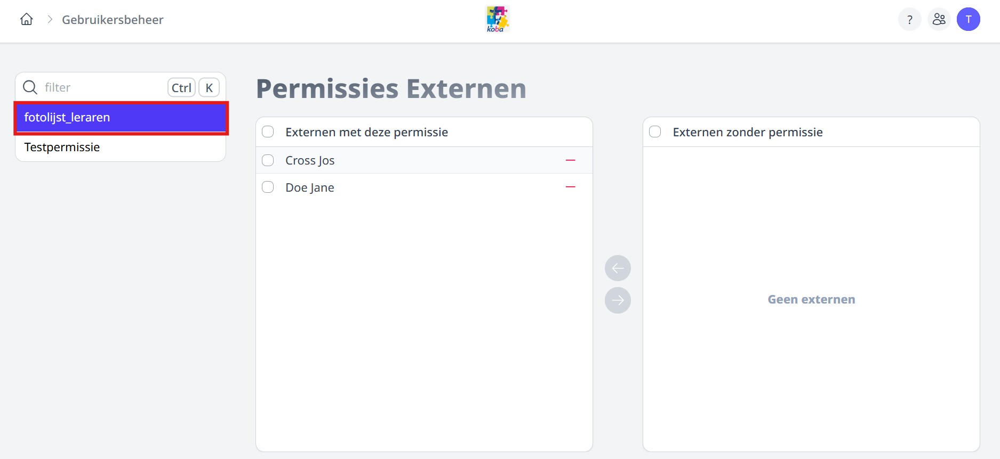

Selecteer in de linkerkolom het gebruikersrecht dat je wenst toe te kennen en zet vervolgens de betreffende externen in de gewenste kolom met behulp van de pijltjes.

### b. Gebruikersrecht(en) aan externe koppelen

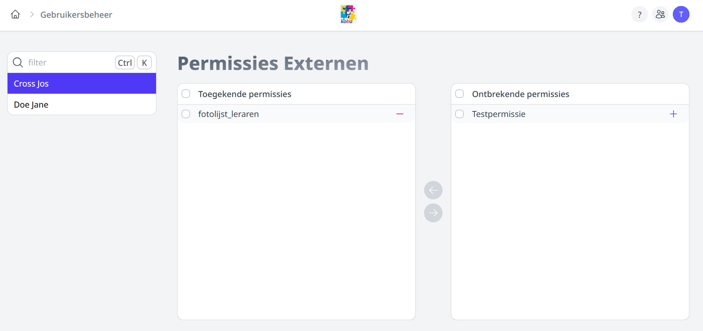

Selecteer in de linkerkolom de externe waaraan je gebruikersrechten wil toekennen. Selecteer vervolgens de nodige gebruikersrechten en zet ze in de juiste kolom met behulp van de pijltjes.

## 3. Toolbox logboek

Via het logboek kan je voor de inlogpogingen alsook voor een aantal andere modules de logs van activiteiten in Toolbox op een bepaalde datum of voor een bepaalde periode opvragen. 

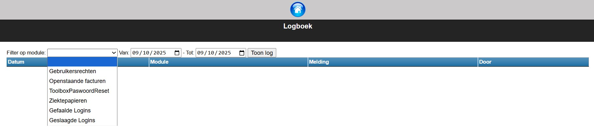

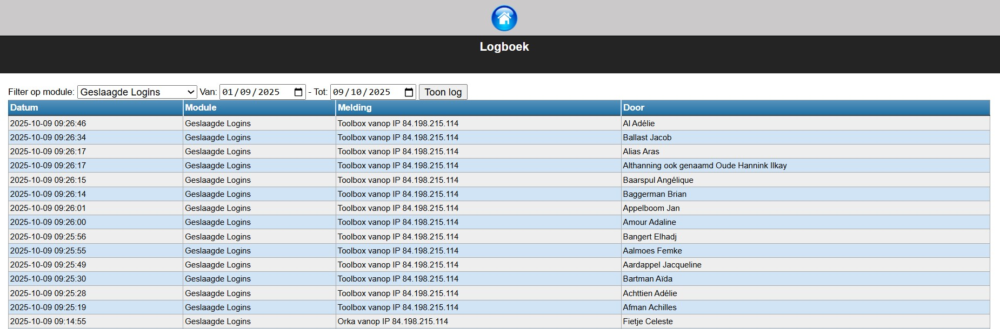