## 1. Inloggen

De beheerder kan instellen op welke manier de eindgebruiker kan inloggen op Toolbox:

- Toolbox gebruikersnaam en paswoord
- Smartschool account
- Office 365 account
- Google Workspace

Naar gelang de instelling door de beheerder zijn er één of meer opties beschikbaar. 

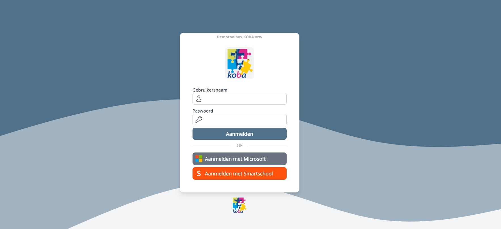

### Gebruikersnaam en paswoord

Elke gebruiker die via de module [Synchronisatie Leraren](/synchronisatie/synchronisatie_leraren/) wordt ingelezen vanuit Informat of Wisa, krijgt automatisch een gebruikersnaam en paswoord binnen Toolbox. Dat paswoord kan via de PDF in deze module worden opgevraagd.

Deze optie kan worden uitgeschakeld in de module 'Instellingen > Toolbox > Loginvelden verbergen' zodat gebruikers enkel via hogervermelde 'single sign on' opties kunnen inloggen op Toolbox.

In de instellingen kan je ook bepalen of personeel dat ondertussen uit dienst is nog mag inloggen.

### Smartschool account

De loginpagina van Toolbox kan worden ingesteld zodat er via de [Smartschool](/synchronisatie/synchronisatie%20Smartschool/) account kan worden ingelogd. Er worden meerdere platformen ondersteund. Belangrijk hierbij is dat de gebruikersnamen in Smartschool en Toolbox overeen komen. Bijkomend kan een validatie gebeuren op 'intern nummer'. Die bijkomende validatie kan ook uitgeschakeld worden.

### Office 365

Het is ook mogelijk om via de Office 365 account in te loggen. Hiervoor moeten het domein/domeinen waarmee de gebruiker mag inloggen, worden ingesteld. Ook hier moeten de gebruikersnamen van Office 365 overeen komen met die van Toolbox.

In de module 'Instellingen > Office365 > Oauth' kan je bepalen vanuit welk domein of domeinen (scheiden door komma's) gebruikers mogen inloggen.

### Google Workspace

Net zoals de login via Office kunnen gebruikers inloggen via hun Google account van de school. Ook hier moet je opgeven welke domeinen toegelaten zijn. Dat doe je in de module 'Instellingen > Google Workspace'.

## 2. Navigeren

De homepage van Toolbox bestaat uit een aantal tegels. Elke tegel is een aparte module. Naar gelang de toegekende gebruikersrechten heeft een personeelslid al dan niet toegang tot een bepaalde module.

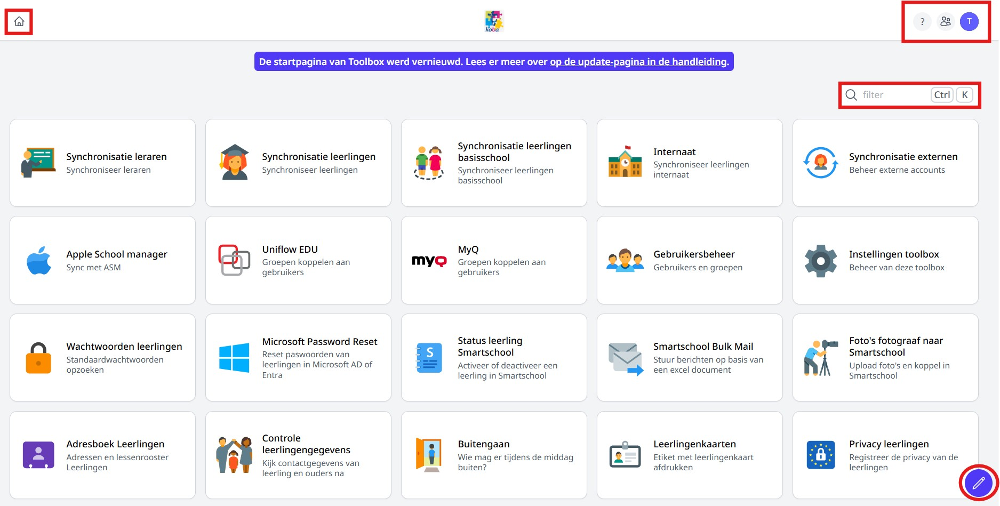

### Module zoeken en openen 

Een module kan je openen door er eenvoudigweg op te klikken. 
Wanneer je een groot aantal beschikbare modules op je homepage hebt staan, kan je snel een module terugvinden door rechtsboven in het tekstveld 'Filter' een zoekopdracht in te geven. Er wordt gezocht op naam van de module en op de omschrijving eronder. 

### Homepage personaliseren

Via het potlood rechts onderaan kom je in de modus waarmee je je startpagina kan personaliseren. Op elke module verschijnen nu enkele icoontjes: 

- Duimspijker: hiermee kan je de module vastpinnen waardoor ze helemaal bovenaan komt te staan. 
- Twee pijltjes: hiermee kan je de grootte van de module instellen. 
- Op vastgepinde modules bovenaan zie pijltjes links en rechts. Daarmee kan je de modules van plaats wisselen. 

Om deze modus te verlaten en de wijzigingen te bewaren klik je rechts onderaan op het blauwe kruisje. 

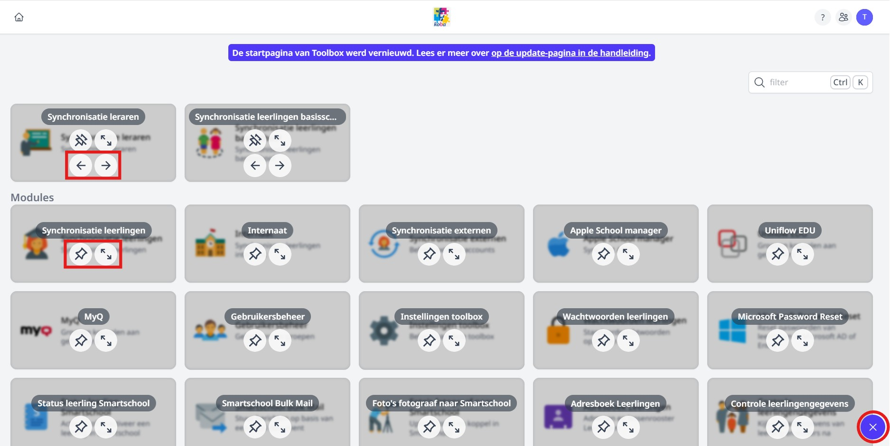

### Toolbox handleiding & helpdesk 
Via het vraagteken rechtsboven op de startpagina heb je toegang tot de helpdesk en de handleiding van Toolbox. De handleiding van Toolbox is zeer uitgebreid en 

De support van Toolbox verloopt volledig via de **digitale helpdesk**. Bij een vraag over Toolbox kan je in eerste instantie terecht bij de beheerder in jouw eigen Toolbox. Kan die persoon je niet helpen? Maak dan een ticket aan via de helpdesk. 

Toolbox verleent ook **telefonisch support**. Wil je hier gebruik van maken? Maak ook dan eerst een ticket aan bij de helpdesk en geef al een korte omschrijving van de vraag of het probleem. Laat je contactgegevens achter met de vraag om je telefonisch te contacteren. Je zal op zeer korte termijn een telefoontje mogen verwachten van het Toolbox-team. 

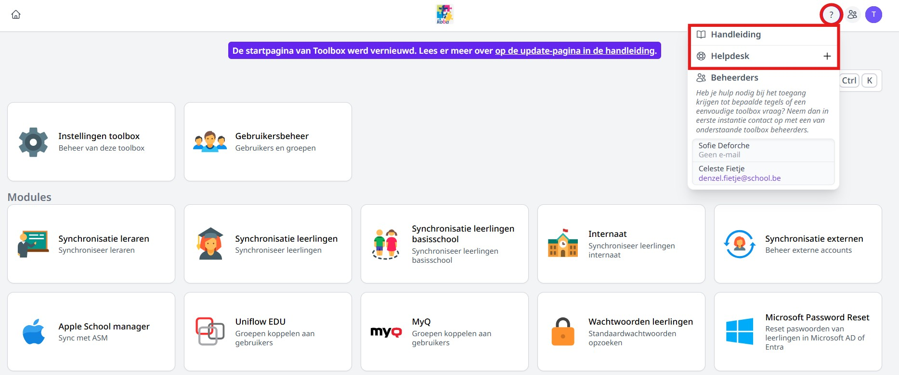

- Om een **nieuw ticket** aan te maken, klik je op het plusteken bij 'Helpdesk'. 
- Vul de onderstaande velden aan en voeg eventueel een **bestand** toe. Dat kan eender welk bestand zijn: een foto, pdf, Word-document, ...
- Klik vervolgens op **'Ticket aanmaken'**. 

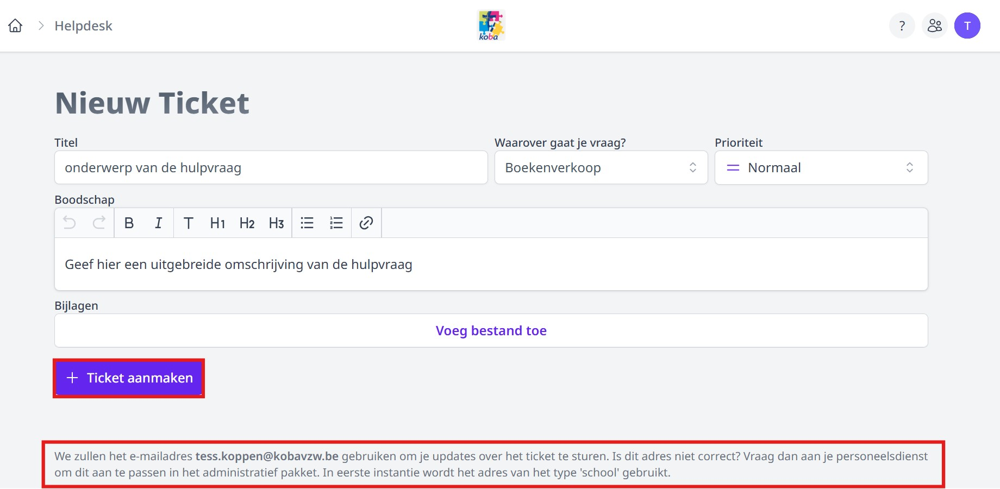

Het antwoord op je ticket kan je opvolgen in Toolbox bij het vraagteken. Openstaande tickets worden onmiddellijk bij het vraagteken weergegeven. Indien er in Informat een e-mailadres beschikbaar is van de gebruiker, dan wordt een antwoord op een ticket ook verstuurd via **e-mail**. Toolbox kiest prioritair het e-mailadres van het type 'School'. Bij het opstellen van een nieuw ticket zie je helemaal onderaan welk e-mailadres gebruikt zal worden om updates over het ticket te versturen. Is dat adres niet correct? Neem dan contact op met je personeelsdienst en vraag om het e-mailadres aan te passen in het administratief pakket (Informat). 

### Beheerders in Toolbox 
Via het vraagteken rechtsboven op de startpagina kan je nakijken wie beheerder is in jouw Toolbox. Beheerders hebben toegang tot de module Instellingen in Toolbox en kunnen ook gebruikersrechten toekennen. Deze personen zijn ook het eerste aanspreekpunt bij vragen over Toolbox. 

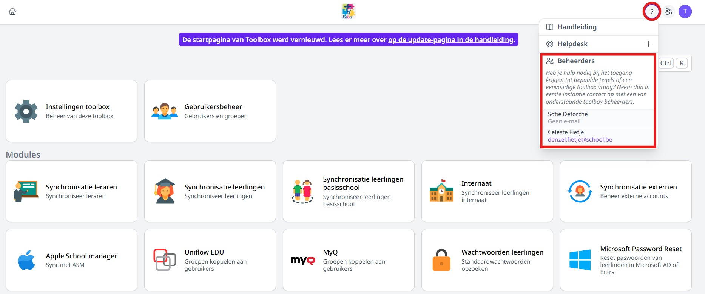

### Contactpersonen

Een beheerder in Toolbox ziet rechts bovenaan op de homepage drie icoontjes in plaats van twee. Via het middelste icoontje kan een beheerder de contactpersonen van de school beheren. 

Iedereen die voorkomt in die lijst van contactpersonen zal ook de **Toolbox-nieuwsbrief** ontvangen. 

We vragen uitdrukkelijk om minimaal één keer per schooljaar (begin september) deze lijst na te kijken en te updaten. 

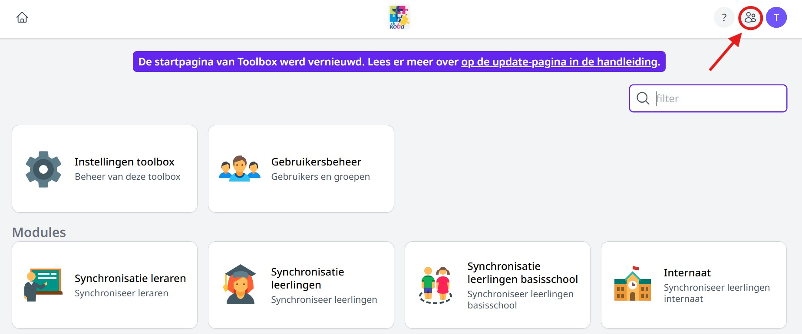

- Indien er in de school-Toolbox meerdere instellingsnummers beschikbaar zijn, kan je per instellingsnummer de contactpersonen ingeven. Links zie je de beschikbare scholen. Klik op de naam van de school om de contactpersonen voor die school/dat instellingsnummer te bekijken of aan te passen. 
- Via het **plusteken** kan je contactpersonen toevoegen. Per functie kunnen er meerdere contactpersonen toegevoegd worden. 
- Via het **potloodje** kan je de gegevens van een contactpersoon wijzigen.
- Via het **vuilnisbakje** kan je een contactpersoon verwijderen. 
- Indien er een bepaalde functie in jouw school niet bestaat, dan klik je op **'Functie niet aanwezig'**. Dit kan later nog gewijzigd worden, wanneer de functie toch ingericht zal worden. 

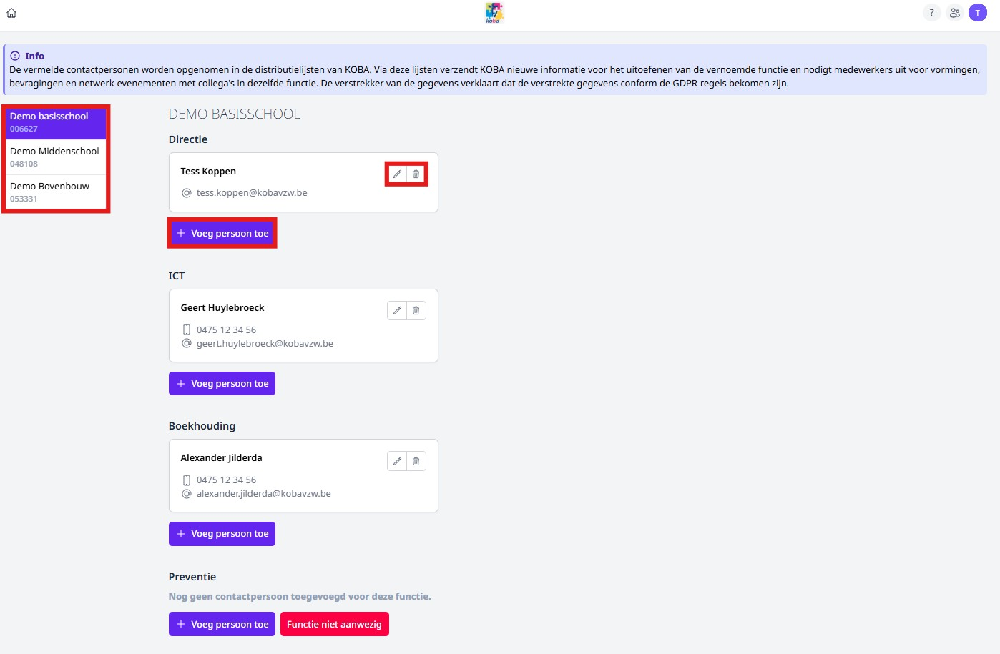

### Persoonlijk profiel

Elke gebruiker kan in Toolbox rechts bovenaan zijn persoonlijk profiel raadplegen.

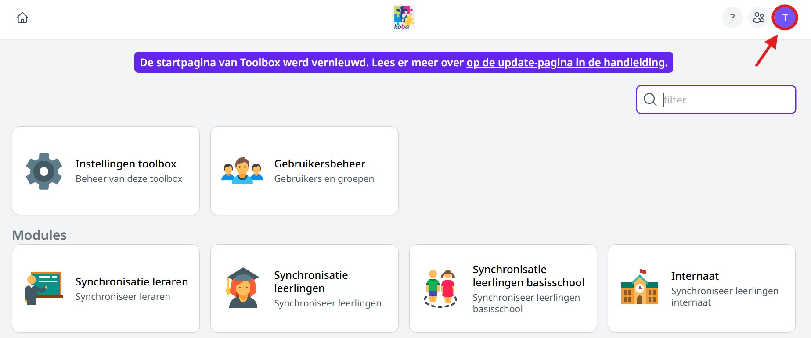

Welke gegevens beschikbaar zijn in het persoonlijk profiel, is afhankelijk van welke modules er in gebruik zijn op de school. 

#### 1. Profiel

- Een gebruiker kan zelf aangeven of zijn persoonsgegevens getoond mogen worden in de module [Adresboek](/adresboek/adresboek%20personeel/).
- Indien de school gebruik maakt van de module [Afdrukcentrum](/afdrukcentrum) wordt in het persoonlijk profiel de pincode voor het kopieersysteem getoond en eventueel de (klas)groepen waarvoor de gebruiker kopieën kan maken.
- Vervolgens worden de **contactgegevens** van de gebruiker getoond. Die gegevens zijn afkomstig uit het administratief pakket (Informat). Indien deze gegevens niet correct zijn, neem dan contact op met je personeelsadministratie met de vraag om de nodige wijzigingen door te voeren in het administratief pakket. Na een synchronisatie met Toolbox, zullen de gegevens in het persoonlijk profiel geüpdatet worden. 
- Een gebruiker kan hier ook zijn **paswoord wijzigen**. Dit doe je best meteen na een eerste aanmelding in Toolbox via Gebruikersnaam en Paswoord. Bij het inloggen via single sign on met O365, Google of Smartschool is dat niet nodig. 
- Tot slot kan een gebruiker aangeven of die **notificaties** wil ontvangen in de browser of op de smartphone. Voorlopig werkt dit enkel voor de modules [Activiteiten](/activiteiten) en [Onkosten](/onkosten). Indien geactiveerd, ontvangt de goedkeurder een notificatie bij het indienen van de aanvraag. Ook de aanvrager kan een notificatie krijgen wanneer de aanvraag wordt goed- of afgekeurd. Dit moet ingesteld worden door de gebruiker zelf op het gewenste apparaat. Wil men op meerdere apparaten notificaties ontvangen (bv. op laptop én smartphone), dan moet dat op elk apparaat afzonderlijk ingesteld worden. Deze functionaliteit werkt ook wanneer Toolbox niet geopend is. 
    - Voor iPhone: Voeg eerst Toolbox toe als pictogram aan je startscherm om de notificaties te kunnen ontvangen. Open hiervoor jouw Toolbox in Safari en klik onderaan op het deel-icoontje (vierkant met pijltje omhoog). Scroll vervolgens naar beneden en kies voor 'Zet op beginscherm'. 
    - Voor Android: Surf naar je Toolbox, druk op de 3 puntjes naas de adresbalk en selecteer "Toevoegen aan startscherm". Je kan dan een snelle link maken, of afhankelijk van je toestel krijg je ook de optie om te installeren. Neem in dat geval de optie installeren. 

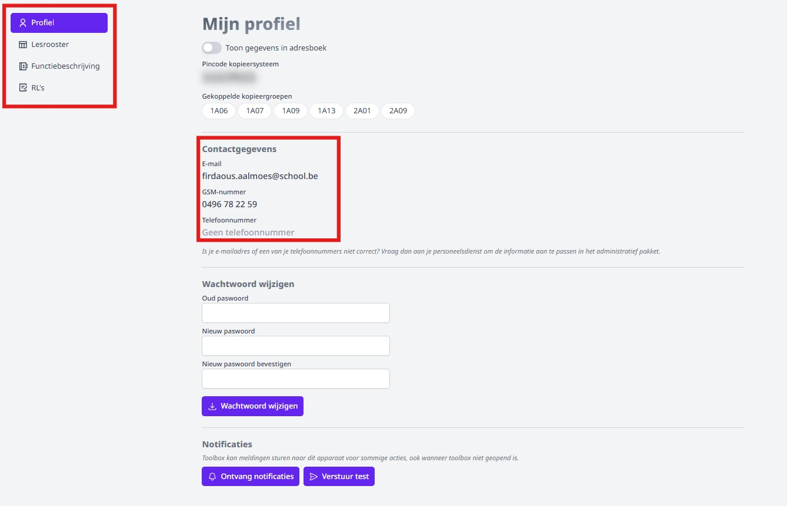

#### 2. Lesrooster

Indien de school een rooster heeft opgeladen in de module [Lessenrooster](/lessenrooster) en er is een rooster beschikbaar voor deze gebruiker, dan wordt dat getoond in het persoonlijk profiel. 

Ook wachten en toezichten die zijn ingegeven in de module [Wacht- en toezichtbeurten](/wacht_toezicht) worden hier weergegeven.

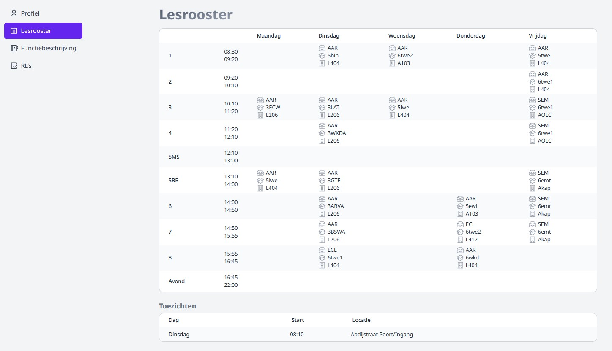

#### 3. Functiebeschrijving

Indien de school gebruik maakt van de module [Functiebeschrijvingen](/functiebeschrijvingen) en er is een functiebeschrijving opgemaakt voor deze gebruiker, dan wordt die getoond in het persoonlijk profiel.

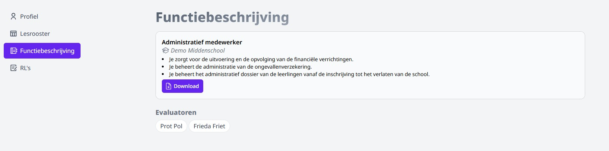

#### 4. RL's

Indien de school gebruik maakt van de module [RL's](/rl) en er is een RL opgeladen en gepubliceerd voor deze gebruiker, dan wordt die getoond in het persoonlijk profiel.

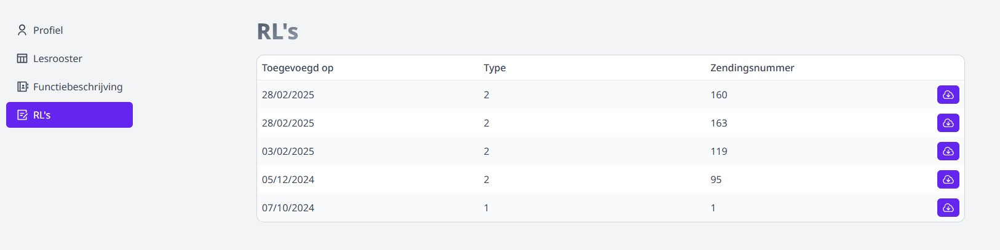

#### 5. Documenten

Indien de school gebruik maakt van de module [Personeelsdossiers](/personeelsdossiers) en er zijn zichtbare documenten aanwezig voor deze gebruiker, dan worden deze getoond in het persoonlijk profiel.

Door op het icoontje rechts naast het document te klikken kan je het document bekijken of downloaden.

### Aantal transacties

Op het startscherm van Toolbox wordt er voor een aantal modules in de rechterbovenhoek van de tegel in een rode bol een aantal weergegeven.
Dit aantal wijst op:
- Modules Leerlingenrekeningen & personeelsrekeningen: aantal facturen nog over te zetten naar Exact Online
- Module Webshop: aantal betaalde bestelling die nog overgezet moeten worden naar Exact Online
- Module Kas: Aantal transacties nog over te zetten naar Exact Online
- Module Activiteiten: Aantal nog goed te keuren activiteiten
- Module Onkosten: Aantal nog goed te keuren onkosten

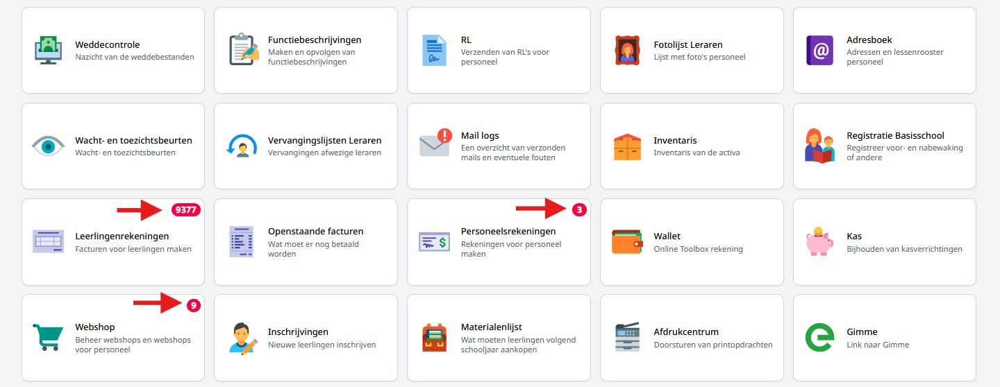

