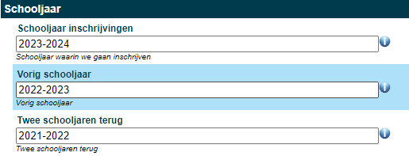
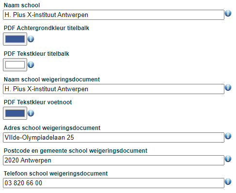
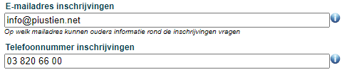
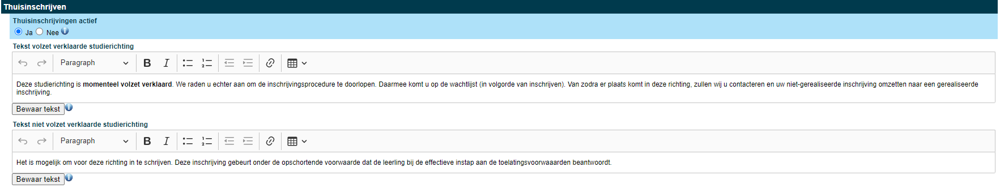

      
Alvorens je aan de slag kan met de module Inschrijvingen moeten er eerst een aantal zaken worden ingesteld in de module Instellingen. Opgelet! Enkel een Toolbox-beheerder heeft toegang tot deze module.

Enkel onderstaande velden moeten ingevuld worden om de module Inschrijvingen te kunnen gebruiken.

