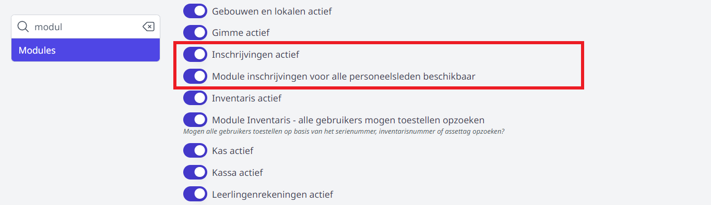

Rechten voor een module worden toegekend via de module [Gebruikersbeheer](/gebruikersbeheer). De gebruikersrechten voor de module Inschrijvingen zijn opgesplitst in **Inschrijvingen beheer** en **Inschrijvingen gebruik**.

### Inschrijvingen beheer

Het recht **Inschrijvingen beheer** laat toe om een aantal beheerstaken te kunnen uitvoeren, zoals het aanpassen van de algemene instellingen van de module, het aanmaken studierichtingen, instellen van quota, toevoegen van documenten, keuzevakken, samenstellen van nieuwe pagina's (zoals het intakeformulier) per studierichting, thuisinschrijvingen aan- en uitzetten, …

### Inschrijvingen gebruik

Voor de eindgebruiker is het recht **Inschrijvingen gebruik** voldoende. Gebruikers met dit recht kunnen nieuwe inschrijvingen ingeven, thuisinschrijvingen voltooien, eigen leerlingen herinschrijven, overzichten van de inschrijvingen opvragen en opvolgingsacties toevoegen.

Moeten er op de school veel personeelsleden gebruik kunnen maken van de module Inschrijvingen, bv. om op 30/6 de eigen leerlingen opnieuw in te schrijven tijdens het oudercontact, dan kan men het recht 'Inschrijvingen gebruik' achterwege laten en ervoor kiezen om de *'Module inschrijvingen voor alle personeelsleden beschikbaar'* te maken. Door deze optie via de module **Instellingen => Modules** te activeren, wordt de module Inschrijvingen ineens actief voor alle personeelsleden zonder extra gebruikersrechten te moeten toekennen. Zij hebben hiermee ook meteen de hogervermelde toegangen die horen bij het recht 'Inschrijvingen gebruik'. 

