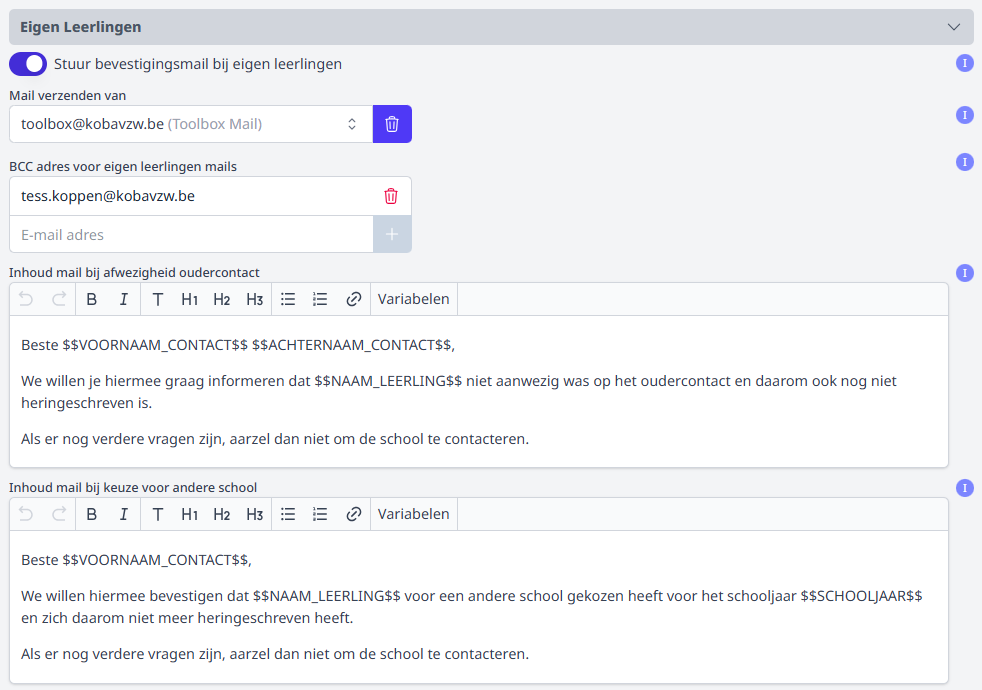

      
Alvorens je aan de slag kan met de module Inschrijvingen moeten er eerst een aantal algemene zaken worden ingesteld. Dat kan rechtstreeks in de module Inschrijvingen door iemand met het gebruikersrecht **Inschrijvingen_beheer**. Klik op het tandwiel rechts bovenaan om de instellingen te openen.

## 1. Algemene gegevens betreffende schooljaar en school

Allereerst vul je een aantal algemene en schoolspecifieke gegevens in. 

## 2. Thuis aanmelden

Indien leerlingen thuis moeten kunnen aanmelden voor bepaalde studierichtingen, moet het thuisaanmelden eerst algemeen in de instellingen geactiveerd worden. Daarna moet er per aparte studierichting nog worden aangegeven of het thuisaanmelden voor die bepaalde studierichting effectief wordt opengesteld. Het is dus mogelijk om voor bepaalde richtingen wel thuis aan te melden en voor andere niet. 

Je kan ineens voor alle studierichtingen de mogelijkheid om thuis aan te melden stopzetten, door deze knop in de instellingen uit te zetten. 

Verder kan je de teksten bij volzetverklaring of niet-volzetverklaring aanpassen.

Tot slot kan je ook instellen dat eenzelfde leerling geen twee keer thuis kan aanmelden door de thuisaanmelding o.b.v. hetzelfde rijksregisternummer te blokkeren. 

## 3. E-mailberichten naar eigen leerlingen

Het is mogelijk om via e-mail een bevestiging te versturen van de herinschrijving van eigen leerlingen. Deze setting kan bovenaan worden aangezet door de schuifknop aan te klikken. 

Per herinschrijvingsstatus kan er een apart bericht worden gedefinieerd. Door middel van de knop 'Variabelen' kan je de gewenste variabele selecteren en toevoegen aan het bericht. Wanneer een status wordt aangepast, wordt het bericht dynamisch samengesteld en worden de variabelen vervangen door de overeenkomstige gegevens van de leerling en de inschrijving. 

Onderaan kan je opgeven vanuit welk e-mailadres de mail verstuurd moet worden. 

Om de mails te kunnen versturen, moeten de e-mailsettings worden ingevuld in de module Instellingen > E-mail. Deze module is enkel toegankelijk voor Toolbox-beheerders. Om na te gaan wie beheerder is in een Toolbox, klik in het startscherm op het vraagteken rechts bovenaan.

## 4. Resultaten van deliberaties 

Het is mogelijk om vanuit Smartschool de resulaten van de deliberaties op te laden. Dit bestand is in Smartschool terug te vinden via 'Ga naar => Deliberatie => Beheer => Deliberatiegegevens exporteren'.

De resultaten van de deliberaties worden weergegeven bij het herinschrijven van de [eigen leerlingen](/inschrijvingen/inschrijven/herinschrijven/). Op die manier kan men makkelijk nagaan of een leerling de passende studiekeuze maakt voor volgend schooljaar. 

## 5. Statussen

De statussen die hier aangemaakt worden, zal je later kunnen selecteren in de verschillende [overzichten van de inschrijvingen](/inschrijvingen/verwerking/opvolging_verwerking/). Het betreft een interne status die weergeeft welke acties er ondernomen zijn voor een bepaalde inschrijving. Bv. een leerling op de wachtlijst werd telefonisch gecontacteerd of via mail. 

