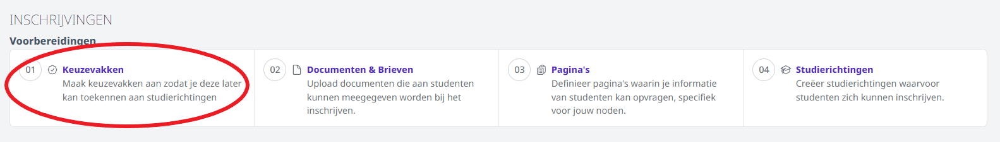

 
Via deze weg stel je alle mogelijke keuzevakken in. Selecteer eerst het schooljaar waarvoor je het keuzevak wil toevoegen. Automatisch wordt het schooljaar getoond dat werd ingesteld in de module Instellingen > Inschrijvingen. Dit kan je hier nog wijzigen. Klik vervolgens op 'Keuzevak toevoegen'.  

<Thumbnails img={[
    require('./inschrijvingen_keuzevakken2.png').default, 
]} />

Geef je keuzevak een naam, code en stel eventueel een quota in. Het quota is niet verplicht. 

Het keuzevak is op dit ogenblik nog niet gekoppeld aan een jaar of studierichting. Als een keuzevak slechts in één jaar of richting voorkomt, volstaat het om enkel de naam op te geven. Indien je wil werken met quota en/of een keuzevak komt in meerdere jaren of studierichtingen voor, kan je het jaar of de studierichting in de naam verwerken.

Je hebt ook de mogelijkheid om een opmerking toe te voegen. Deze opmerking wordt getoond tijdens het inschrijvingsproces. Je kan hier relevante info noteren voor de personeelsleden die helpen met de inschrijvingen. 

:::caution OPGELET
Indien je werkt met quota telt elke inschrijving mee, ongeacht de studierichting waaraan dit keuzevak gekoppeld is. Wanneer je een keuzevak (bv. CLIL geschiedenis) in meerdere jaren of studierichtingen aanbiedt, maak je per jaar of per studierichting een apart keuzevak aan. 
:::
<Thumbnails img={[
    require('./inschrijvingen_keuzevakken3.png').default, 
]} />

Alle keuzevakken worden per schooljaar getoond in een handig overzicht. Daar zie je de benaming, code, opmerkingen en quota. Je kan een keuzevak wijzigen door vooraan op het potloodje klikken. Een keuzevak kan via het vuilbakje volledig verwijderd worden zolang er nog geen inschrijvingen aan gekoppeld zijn. 

  