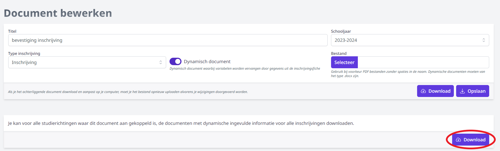

De module Inschrijvingen biedt de mogelijkheid om eigen documenten en brieven op te laden. Bv. bevestiging van de inschrijving, info over de eerste schooldag, document i.v.m. privacy, specifieke info over de studierichting ... Door middel van dynamische variabelen is het mogelijk om deze documenten te personaliseren of antwoorden uit de pagina's te gebruiken. De documenten kunnen na het afronden van de inschrijving worden afgedrukt en meegegeven. Je kan ze ook onmiddellijk versturen via e-mail indien deze optie is ingeschakeld via <LegacyAction img="beheer.PNG" text="Beheer"/> => Algemeen => Afzender bij mailen documenten. 

Selecteer eerst het schooljaar waarvoor je het document of de brief wil toevoegen. Automatisch wordt het schooljaar getoond dat werd ingesteld bij <LegacyAction img="beheer.PNG" text="Beheer"/>. Dit kan je hier nog wijzigen. 

Klik vervolgens op 'Document toevoegen'.  
  

<Thumbnails img={[
    require('./documenten_brieven2.png').default, 
]} />

Vooraleer je het document kan opladen, moet het opgemaakt zijn. Je kan zowel PDF-documenten als Word-documenten opladen. Indien je werkt met Word, heb je de mogelijkheid om gepersonaliseerde documenten te maken door de volgende dynamische variabelen te gebruiken. Deze variabelen kunnen in de module Inschrijvingen eenvoudig gekopiëerd worden door erop te klikken en vervolgens in je Word-document te plakken. 

  

Je kan ook antwoorden uit de gepersonaliseerde pagina's toevoegen aan een Word-document. Hiervoor maak je eveneens gebruik van dynamische variabelen. Die vind je terug bij de [pagina's](/inschrijvingen/opstart_config/pagina/#dynamische-variabelen-gebruiken-in-documenten-en-brieven) en kan je ook kopiëren en in het document plakken. 

- **Titel**: Geef het document een duidelijke titel waardoor je het later makkelijk kan opzoeken en kan koppelen aan een bepaald jaar of een bepaalde studierichting.
- **Schooljaar**: Indien je in de vorige stap het verkeerde schooljaar hebt geselecteerd, kan je dat hier nog wijzigen. 
- **Type inschrijving**: Geef aan of je dit document ter beschikking wil stellen voor nieuwe inschrijvingen (type = inschrijving) of voor de herinschrijving van eigen leerlingen (type = eigen leerling). Op die manier kan je een uitgebreid document opmaken voor de bevestiging van de inschrijving van nieuwe leerlingen, waarin ook de persoonsgegevens van die leerling en de leerplichtverantwoordelijken worden vermeld. Voor herinschrijvingen van eigen leerlingen in diezelfde studierichting volstaat meestal een bevestiging van de studierichting en de eventuele keuzevakken. Je moet wel steeds een keuze maken. Wil je een document zowel voor nieuwe inschrijvingen als voor eigen leerlingen gebruiken, dan voeg je het twee keer toe met telkens een ander type inschrijving. 
- **Dynamisch**: Indien je gebruikt hebt gemaakt van de variabelen, geef je aan dat het een dynamisch document is. Zo wordt het later dynamisch samengesteld en zullen de variabelen vervangen worden door de overeenkomstige gegevens uit de inschrijving.
- **Bestand**: Wanneer je document is opgemaakt en opgeslagen, kan je het hier opladen door onder 'Bestand' te klikken op 'Selecteer'. 
- **Toevoegen**: Als alle velden zijn ingevuld, kleurt de Toevoegen-knop blauw-paars. Klik hierop om het document toe te voegen.

Alle toegevoegde documenten en brieven worden samengebracht in een handig overzicht per schooljaar. Met behulp van de icoontjes vooraan kan je de titel van het document wijzigen, het document volledig verwijderen (op voorwaarde dat het nog niet gekoppeld is aan een studierichting) of het document downloaden. Het vinkje achteraan geeft weer of een document al dan niet dynamisch is opgemaakt. Verder kan je ook nog terugvinden of het een document is voor nieuwe inschrijvingen of voor de herinschrijving van eigen leerlingen. 

Wil je wijzigingen aanbrengen aan het document zelf, dan moet je het volledig verwijderen, het bestand aanpassen en opnieuw opladen. 

## Dynamische documenten in bulk afdrukken

Wil je na de inschrijvingsronde bepaalde dynamisch samengestelde documenten in bulk afdrukken? Dat kan via de bijhorende downloadknop. De documenten zullen per studierichting in een aparte map gegroepeerd worden.  

