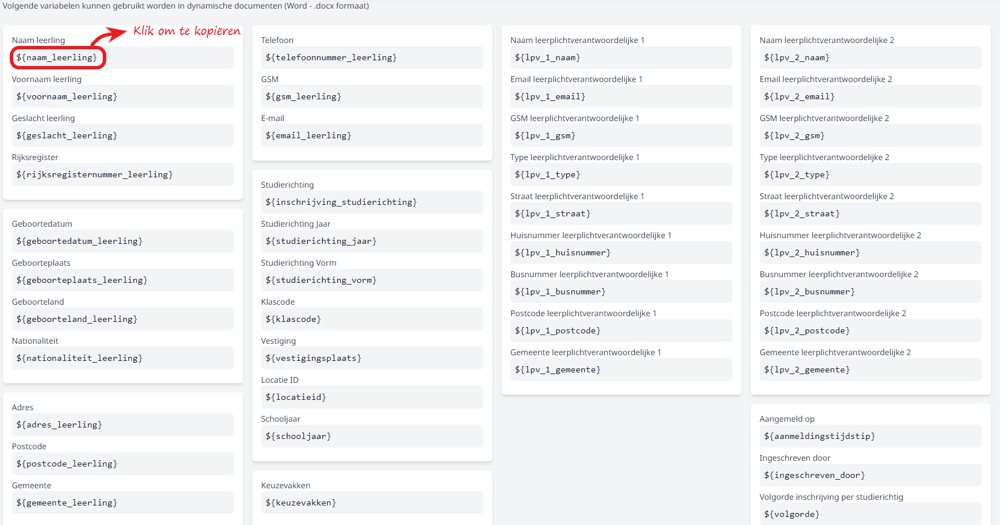
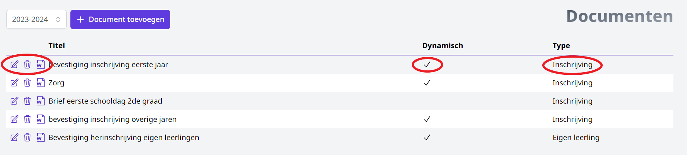

De module Inschrijvingen biedt de mogelijkheid om eigen documenten en brieven op te laden. Bv. bevestiging van de inschrijving, info over de eerste schooldag, document i.v.m. privacy, specifieke info over de studierichting ... Door middel van dynamische variabelen is het mogelijk om deze documenten te personaliseren of antwoorden uit de pagina's te gebruiken. De documenten kunnen na het afronden van de inschrijving worden afgedrukt en meegegeven. Je kan ze ook onmiddellijk versturen via e-mail indien deze optie is ingeschakeld via <LegacyAction img="beheer.PNG" text="Beheer"/> => Algemeen => Afzender bij mailen documenten. 

Selecteer eerst het schooljaar waarvoor je het document of de brief wil toevoegen. Automatisch wordt het schooljaar getoond dat werd ingesteld bij <LegacyAction img="beheer.PNG" text="Beheer"/>. Dit kan je hier nog wijzigen. Klik vervolgens op 'Document toevoegen'.  

<Thumbnails img={[
    require('./documenten_brieven2.png').default, 
]} />

Je kan zowel PDF-documenten als Word-documenten opladen. Indien je werkt met Word, heb je de mogelijkheid om gepersonaliseerde documenten te maken door de volgende dynamische variabelen te gebruiken. Deze variabelen kunnen gekopiëerd worden door erop te klikken en vervolgens in je document te plakken.  

  

Je kan ook antwoorden uit de gepersonaliseerde pagina's toevoegen aan een Word-document. Hiervoor maak je eveneens gebruik van dynamische variabelen. Die vind je terug bij de [pagina's](/inschrijvingen/opstart_config/pagina/#dynamische-variabelen-gebruiken-in-documenten-en-brieven) en kan je ook kopiëren en in het document plakken. 

Wanneer je document is opgemaakt en opgeslagen, kan je het hier opladen door te klikken op 'Selecteer'. Indien je gebruikt hebt gemaakt van de variabelen, geef je aan dat het een dynamisch document is. Zo wordt het later dynamisch samengesteld en zal het de variabelen vervangen door de overeenkomstige gegevens uit de inschrijving.

De titel van het document geeft je later de mogelijkheid om het makkelijk op te zoeken en te kunnen koppelen aan een bepaald jaar of bepaalde studierichting. Achteraan kan het schooljaar waarvoor je het document wil gebruiken nog worden aangepast.   

Alle toegevoegde documenten en brieven worden samengebracht in een handig overzicht per schooljaar. Met behulp van de icoontjes vooraan kan je de titel van het document wijzigen, het document volledig verwijderen (op voorwaarde dat het nog niet gekoppeld is aan een studierichting) of het document downloaden. Het vinkje achteraan geeft weer of een document al dan niet dynamisch is opgemaakt. 

Wil je wijzigingen aanbrengen aan het document zelf, dan moet je het volledig verwijderen, het bestand aanpassen en opnieuw opladen. 

