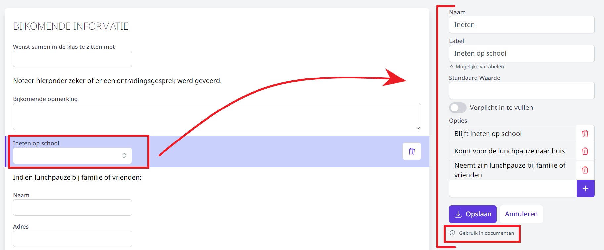

De school kan eigen pagina's samenstellen volgens het principe van Forms om zo de gewenste gegevens van de leerling op te vragen. Deze pagina's kunnen volledig op maat van de school worden ingesteld met tekstvelden, checkboxen, ja/nee-velden, verplichte en niet-verplichte velden,… en vormen zo een volwaardige vervanger voor het intakeformulier. 

Selecteer eerst het schooljaar waarvoor je een nieuwe pagina wil aanmaken. Automatisch wordt het schooljaar getoond dat werd ingesteld bij <LegacyAction img="beheer.PNG" text="Beheer"/>. Dit kan je hier nog wijzigen. Geef de nieuwe pagina een naam en klik vervolgens op 'Pagina toevoegen'.  

<Thumbnails img={[
    require('./pagina2.png').default, 
]} />

Je kan verschillende soorten velden toevoegen. Aan één pagina kan je meerdere velden toevoegen. Aan een studierichting kan je in een volgende stap ook meerdere pagina's koppelen.

<Thumbnails img={[
    require('./pagina3.png').default, 
]} />

Klik op 'Veld toevoegen' en kies het soort veld dat je wil toevoegen. Eens je een veld hebt gekozen, kan je dit rechts verder instellen. Je kan een veld achteraf steeds nog aanpassen of verwijderen door erop te klikken. Verwijderen doe je door op het vuilbakje te klikken. Je kan de velden ook van plaats verwisselen door een veld aan te klikken en naar de gewenste plaats te slepen. 

## Vaste tekst

Elk soort veld wordt pas toegevoegd aan de pagina nadat je op opslaan hebt geklikt. 

 
## Tekstveld (enkele lijn of meerdere lijnen)

 
## Dropdown

Als je bij een dropdown-veld een standaardwaarde invult, wordt deze optie standaard getoond bij de inschrijvingen. Door op de pijltjes achteraan te klikken, kan je tijdens het inschrijvingsproces een andere optie selecteren. Deze en andere knoppen (bv. ja/nee-knop) zijn bij het instellen van de pagina nog niet actief. 

Een optie wordt pas toegevoegd als je achteraan op de blauwe <LegacyAction img="plus.png"/> klikt. 

Door een veld verplicht te maken, wordt er naast de vraag een * weergegeven. Bij het doorlopen van het inschrijvingsproces kan men niet doorklikken naar een volgende pagina of de inschrijving afronden zolang het verplicht veld niet is ingevuld.  

Je kan opties terug verwijderen door achteraan op het vuilbakje te klikken. 

 
## Ja/nee-veld

## Keuzevakjes

## Dynamische variabelen gebruiken in documenten en brieven

Je kan eigen documenten en brieven opladen via [documenten en brieven](/inschrijvingen/opstart_config/documenten_brieven/). Bv. bevestiging van de inschrijving, info over de eerste schooldag, document i.v.m. privacy, specifieke info over de studierichting ... Deze documenten kunnen na het afronden van de inschrijving worden afgedrukt en meegegeven. Je kan ze ook onmiddellijk versturen via e-mail indien deze optie is ingeschakeld via <LegacyAction img="beheer.PNG" text="Beheer"/> => Algemeen => Afzender bij mailen documenten. Door middel van dynamische variabelen is het mogelijk om deze documenten te personaliseren en ook antwoorden uit de pagina's te gebruiken. 

Om gegevens uit de pagina's te gebruiken, klik je op de vraag waarvan je het antwoord in het document wil tonen. Rechts verschijnen de instellingen voor die vraag. Daaronder kan je klikken op 'Gebruik in documenten'. 

In de pop-up kan je kiezen welke items m.b.t. deze vraag je wil gebruiken in het document. Klik de dynamische variabele aan om die te kopiëren. Vervolgens kan je die plakken in het Word-document. 

## Overzicht pagina's
 
Alle pagina's worden samengebracht in een handig overzicht per schooljaar. Zolang er nog geen inschrijvingen aan een pagina gekoppeld zijn, kan de pagina nog gewijzigd of verwijderd worden. Wijzigen kan door op de naam van de pagina te klikken. Om te verwijderen klik je op het vuilbakje achteraan. 

