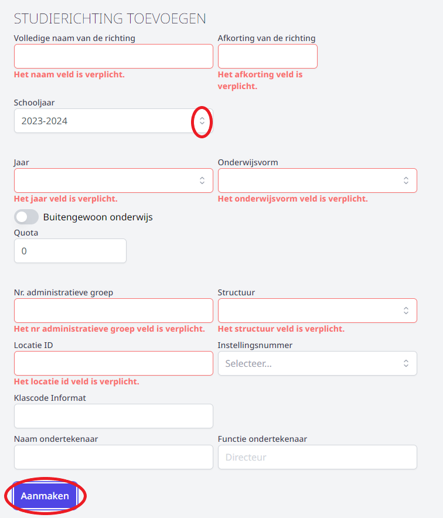
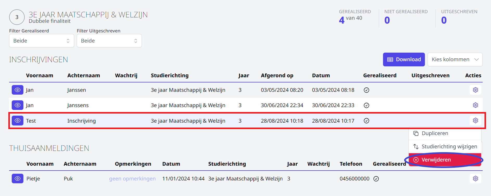

Alle mogelijke studierichtingen waarvoor men moet kunnen inschrijven, kan je hier aanmaken. Na het aanmaken van de studierichting, kan je keuzevakken, pagina's en documenten koppelen en aangeven of thuisaanmelden mogelijk is voor een bepaalde richting. 

Selecteer eerst het schooljaar waarvoor je een studierichting wil aanmaken. Automatisch wordt het schooljaar getoond dat werd ingesteld in de module Instellingen > Inschrijvingen. Dit kan je hier eventueel nog wijzigen. 

<Thumbnails img={[
    require('./richting2.jpg').default, 
]} />

Vul de gegevens van de studierichting in. Voor sommige velden kan je gebruik maken van een keuzelijst via de pijltjes. 

- **Jaar:** Het studiejaar

- **Quota:** Net zoals bij de keuzevakken, kan je ook per studierichting quota opgeven. Dit is echter niet verplicht. Indien de keuzevakken nog niet volzet zijn, maar de studierichting wel, kan er niet meer worden ingeschreven. 

:::caution belangrijke info i.v.m. quota
Wanneer het quota bereikt is, wordt elke volgende inschrijving toegevoegd aan de wachtlijst. Wanneer je het quota verhoogt en de inschrijvingen op de wachtlijst NIET realiseert, zal elke nieuwe inschrijving nog steeds aan de wachtlijst worden toegevoegd, ongeacht het verhoogde quota. Het is dus belangrijk om (na het verhogen van het quota) de inschrijvingen op de wachtlijst te realiseren. Vanaf dan zullen nieuwe inschrijvingen terug meteen gerealiseerd kunnen worden. 
:::

- **Nr. administratieve groep:** Het officieel nummer van de studierichting, bepaald door het ministerie van onderwijs en terug te vinden op hun website [Onderwijs Vlaanderen](https://onderwijs.vlaanderen.be/nl). **Internaten** vullen hier best 0000 in, zodat zij hun inschrijvingen niet per ongeluk kunnen overzetten naar Informat. 

- **Locatie ID:** 
    - Voor de import in **Informat** moet deze ID correct ingevuld worden. De code bestaat steeds uit 3 cijfers en is terug te vinden in Informat via Algemeen > Structuur > Discimus nummer. Als dit nummer in Informat uit minder dan 3 cijfers bestaat, werk je in Toolbox met voorloopnullen. Bv. Discimus nummer 3 wordt in Toolbox 003. 
    - Voor **Wisa** is deze ID niet verplicht. In dit geval mag je een fictieve 3-cijferige code opgeven, bv. 000. 
    - **Internaten** vullen hier best 000 in, zodat zij hun inschrijvingen niet per ongeluk kunnen overzetten naar Informat.

- **Instellingsnummer:** Indien de Toolbox meerdere instellingsnummers bevat, kan men bij het veld Instellingsnummer opgeven voor welke instelling de studierichting toegevoegd moet worden. Dit is geen verplicht veld. Men kan ook overkoepelend inschrijven en de inschrijvingen later verdelen over de instellingsnummers. 
- **Klascode:** Door de klascode van Informat in te geven, worden leerlingen na de import onmiddellijk in de gekoppelde klas in Informat gezet. Dit veld kan enkel gebruikt worden als men zeker weet dat er slechts 1 klas zal zijn voor deze studierichting. 

Klik op 'Aanmaken' om de studierichting toe te voegen. 

De toegevoegde studierichting verschijnt in het overzicht. Je kan de studierichting nu verder instellen (thuisregistratie activeren, documenten en pagina's koppelen, keuzevakken toevoegen) door op de naam van de studierichting te klikken. 

## Info eigen leerlingen
In dit veld kan je info meegeven die relevant is voor de geselecteerde studierichting bij de herinschrijving van eigen leerlingen. Deze info wordt getoond in een pop-up op het moment van de herinschrijving, zodat de persoon die de herinschrijving ingeeft (klasleraar of administratief medewerker van de school) deze info kan meedelen aan de ouders en/of leerling. 

De info kan eveneens mee opgenomen worden in de bevestigingsmail van de herinschrijving. Hiervoor selecteer je de variabele 'Studierichting info eigen leerlingen' bij het opmaken van de e-mailsjablonen via het menu [Beheer](/inschrijvingen/opstart_config/instelling/) (bij het tandwieltje rechts bovenaan). 

## Thuisregistratie instellen

Open de gewenste studierichting om de thuisregistratie in te stellen. Bovenaan krijg je opnieuw de algemene gegevens van de studierichting te zien. Daaronder kan je de studierichting verder instellen.

Standaard staat de thuisregistratie op 'nee'. Moeten ouders hun kind voor deze studierichting van thuis kunnen aanmelden, dan kies je hier voor 'ja'. Ook voor de thuisregistraties kan je een quota instellen. Dat **moet niet** overeenkomen met het quota op de overeenkomstige studierichting. 

:::caution Belangrijk 
Indien het quota voor de thuisregistratie is bereikt, kunnen leerlingen NIET MEER thuis aanmelden. De studierichting verdwijnt dan uit de keuzelijst voor thuisaanmelden. Indien je wil dat leerlingen zich voor de wachtlijst kunnen registreren, vul je enkel het quota op de **studierichting** in en maak je het quota voor thuisregistratie LEEG (dus niet op 0). Van zodra het quota van de studierichting is bereikt, komen alle volgende aanmeldingen op een wachtlijst terecht. Het is dus niet nodig om het quota voor de thuisinschrijving hoger te zetten dan voor de studierichting.
:::

Verder kan je enkele teksten instellen die de ouders te zien krijgen na het thuisregistreren. In deze teksten kan je ook een link verwerken. Gebruik in dat geval de volledige url van de webpagina waarnaar je wil verwijzen. In het tekstvak zal de link niet aanklikbaar zijn, maar bij de effectieve thuisregistratie zal dat wel het geval zijn. 

Het is eveneens mogelijk om de ouders meteen een weigeringsattest te laten downloaden als de studierichting volzet is. Klik daarvoor op <LegacyAction img="buttonGrijs.png"/> bij 'Weigeringsattest downloadbaar door de ouders'. 

Een aantal zaken voor thuisaanmelden en het weigeringsattest moeten ingesteld worden in via de algemene instellingen in de module Inschrijvingen. Klik [hier](/inschrijvingen/opstart_config/instelling/) voor meer info. 

## Registraties via aanmeldsysteem

Indien de school met een aanmeldsysteem werkt, kunnen zowel de toegewezen leerlingen als de leerlingen op de wachtlijst worden geïmporteerd via de knop 'Importeer thuisaanmeldingen'. Hiervoor moet de thuisregistratie niet per se op 'ja' staan. Die zet je enkel aan wanneer leerlingen ook nog rechtstreeks bij de school van thuis kunnen aanmelden (bv. nadat de aanmeldingen via het officieel systeem zijn geïmporteerd). Bij het importeren van de aanmeldingen, kunnen meteen allerlei bijkomende gegevens (zoals rijksregisternummer, geboortedatum, adres, ...) mee worden overgenomen in de module Inschrijvingen.   

De toegevoegde aanmeldingen zijn onmiddellijk terug te vinden in het overzicht bij de thuisaanmeldingen. Van daaruit kan de inschrijving verder gefinaliseerd worden. Klik [hier](/inschrijvingen/opvolging/) voor meer info over het finaliseren van een inschrijving. Klik [hier](/inschrijvingen/inschrijven/importeren/) voor meer info over het importeren van aanmeldingen. 

## Pagina's, documenten en brieven koppelen

Vervolgens kan je pagina's en documenten koppelen indien die zijn aangemaakt.

- Hoe brieven en documenten toevoegen? Klik [hier](/inschrijvingen/opstart_config/documenten_brieven).
- Hoe pagina's samenstellen? Klik [hier](/inschrijvingen/opstart_config/pagina).

In de keuzelijst krijg je alle aangemaakte pagina's voor dat schooljaar te zien. Selecteer de gewenste pagina en voeg ze toe via het plusteken. Op deze manier kan je meerdere pagina's na elkaar aan de studierichting toevoegen. 

Gekoppelde pagina's of documenten kan je van plaats verwisselen met behulp van de pijltjes. Je kan een pagina/document ook terug verwijderen door op het vuilbakje te klikken. Door de pagina/het document hier te verwijderen, wordt het item enkel terug losgemaakt van deze studierichting. Je kan het eenvoudig opnieuw toevoegen door het opnieuw te selecteren en op het blauwe plusteken te klikken.

Een pagina/document volledig verwijderen, doe je via de instellingen van pagina's/documenten en brieven zelf. Dat kan zolang er nog geen enkele inschrijving geregistreerd is voor een studierichting waaraan deze pagina/dit document gekoppeld is. 

## Keuzevakken koppelen

Tot slot kan je nog keuzevakken aan de studierichting koppelen. Dat doe je door per keuze die de leerlingen moeten opgeven een slot aan te maken. Je geeft een naam op voor het slot en geeft via de schuifknop aan of het keuzevak al dan niet optioneel is. Indien een keuze verplicht is, kan de inschrijving niet afgerond worden zonder de keuze op te geven. Klik daarna op 'Aanmaken'. 

Nadat een slot is aangemaakt, kan je de keuzemogelijkheden koppelen. Je kan één keuzemogelijkheid aanbieden (bv. CLIL => ja of nee), maar je kan ook meerdere keuzemogelijkheden aanbieden waarbij er één vak gekozen kan/moet worden bij de inschrijving. Selecteer een keuzevak en voeg het toe via het plusteken. Daarna kan je op dezelfde manier een volgende keuzevak/slot toevoegen.

Je kan keuzevakken verwijderen door op het vuilbakje achter het vak te klikken. Je kan ook het volledige slot verwijderen door op het vuilbakje achter de naam van het slot te klikken. Je kan voor elke studierichting ook meerdere slots aanmaken. 

In onderstaand voorbeeld moet een leerling voor de studierichting 1A verplicht één keuze maken uit de opties Techniek, STEM, Maatschappij en welzijn en Wetenschappen. 

Indien men twee keuzes moet kunnen maken uit een reeks keuzevakken, moeten er 2 verschillende slots aangemaakt worden waaraan je telkens de verschillende keuzevakken koppelt. Het eerste slot kan je dan 'Keuze 1' noemen en het tweede slot 'Keuze 2'. 

## Testinschrijving

Van zodra een studierichting volledig is ingesteld, is het mogelijk om hiervoor één of meerdere testinschrijvingen te doen. Zo kan je de inschrijfprocedure en de opmaak van de pagina’s grondig uittesten. Een testinschrijving kan door de school zelf verwijderd worden en kan niet overgezet worden naar Informat. 

### Testinschrijving ingeven

De testinschrijving geef je op dezelfde manier in als een nieuwe inschrijving. Je zet echter bovenaan de optie 'Testinschrijving' aan. Klik [hier](/inschrijvingen/inschrijven/nieuwe_inschrijving/) voor meer informatie over het inschrijven van nieuwe leerlingen. 

:::info noot
Het herinschrijven van eigen leerlingen en het thuisaanmelden kan niet uitgetest worden.  
:::

### Testinschrijving raadplegen en verwijderen

Na het afronden van de testinschrijving kan je die terugvinden in de overzichten. Klik [hier](/inschrijvingen/opvolging/) voor meer info over de verschillende overzichten en de mogelijke acties. Via het oogje vooraan kan je de testinschrijving bekijken. Met behulp van het tandwieltje achteraan kan je de testinschrijving verwijderen. 

:::info noot
Enkel testinschrijvingen kunnen volledig verwijderd worden. Bij een echte inschrijving heb je enkel de mogelijkheid om de leerling terug uit te schrijven. 
:::