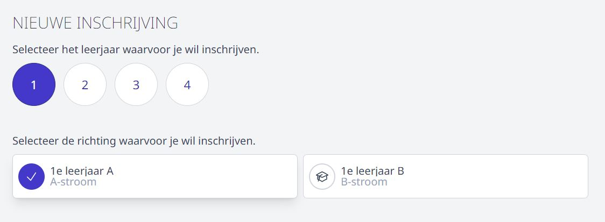

Via deze weg kan je een volledig nieuwe leerling inschrijven waarvan je nog geen gegevens hebt verzameld in Toolbox. Voor leerlingen die zich thuis reeds hebben aangemeld, handel je de inschrijving verder af via het overzicht onderaan (per studierichting, per keuzevak of globaal). 

### 1. Leerjaar en studierichting

Wanneer je hebt aangeduid voor welk leerjaar de leerling wil inschrijven, verschijnen de mogelijke studierichtingen voor dit leerjaar. Selecteer een studierichting en klik op 'Volgende'.

### 2. Leerlinggegevens

Vervolgens krijg je een **standaardpagina** te zien die **automatisch gekoppeld** is aan elke studierichting. Anders dan de pagina's die de school manueel kan aanmaken en koppelen aan een studierichting, ligt deze pagina vast en is bijgevolg **niet** op maat van de school in te stellen. Het bevat alle wettelijke leerlinggegevens die na afloop van de inschrijvingsperiode kunnen worden overgezet naar Informat. Wanneer je beschikt over een kaartlezer, kan je de identiteitskaart van de leerling uitlezen en worden de persoonsgegevens automatisch ingevuld. Bij het eerste gebruik is dat kans groot dat er gevraagd wordt om eID software te installeren. Dit doe je best al vóór je aan de slag gaat met de inschrijvingen. 

Indien een leerling geen rijksregisternummer heeft, geef je nullen op. Het volstaat om op '00000000000' daaronder te klikken. Het veld 'Rijksregisternummer' wordt vervolgens automatisch opgevuld met nullen. 

Bij inschrijvingen voor een nieuw schooljaar, staat de begindatum automatisch ingesteld op 1 september van het nieuwe schooljaar.

### 3. Keuzevakken

Indien er keuzevakken gekoppeld werden aan de gekozen studierichting, kan je die op de volgende pagina selecteren. 

### 4. Relaties
 
Vervolgens kan je relaties toevoegen. Dat doe je door te klikken op 'Nieuwe relatie'. Je kan meerdere relaties toevoegen, aangeven of het al dan niet gaat om een leerplichtverantwoordelijke, een noodnummer instellen, ... Aangezien alle gegevens van deze pagina geïmporteerd kunnen worden in Informat, zijn de soorten relatie beperkt tot de mogelijkheden die Informat aanbiedt. 

Ook voor de relaties kan je de identiteitskaart inlezen. Indien je geen kaartlezer of identiteitskaart van de relatie ter beschikking hebt en de relatie woont op hetzelfde adres als de leerling, kan je eenvoudig de adresgegevens van de leerling overnemen door onderaan te klikken op 'Kopieer adresgegevens van leerling'. 

Ook deze standaardpagina is **automatisch gekoppeld** aan elke studierichting en kan **niet** aangepast worden.

Alle toegevoegde relaties komen onder elkaar te staan. Je kan de details weergeven door op ∧ te klikken. Je kan de relatie vervolgens aanpassen of volledig verwijderen door op het vuilbakje te klikken.

Als alle relaties zijn toegevoegd, klik je op 'Volgende' om naar de volgende pagina te gaan.  

### 5. Privacy en buitengaan

Indien er in de module Inschrijvingen bij <LegacyAction img='configure.JPG'/> beheer is ingesteld dat er gevraagd wordt naar 'buitengaan' en 'privacy' zal volgend scherm getoond worden. Klik [hier](/inschrijvingen/opstart_config/instelling/#1-algemene-gegevens-betreffende-schooljaar-en-school) voor meer info hieromtrent. 

### 6. Eigen pagina's

Vanaf nu doorloop je de pagina's die de school in de module Inschrijvingen zelf heeft aangemaakt en gekoppeld aan deze studierichting. 

### 7. Samenvatting van de inschrijving

Bij afronding van de inschrijving wordt er een overzicht getoond van alle ingevulde gegevens. Die kunnen nog aangepast worden door via 'Vorige' naar de betreffende pagina te gaan om de wijziging door te voeren. 

Indien alle gegevens correct zijn ingevuld, klik je op 'Realiseer'. 

### 8. Documenten 

Tot slot krijg je een bevestiging dat de inschrijving geslaagd is. Op deze pagina kan je eveneens de documenten downloaden die aan de studierichting gekoppeld zijn. 

Indien er in de module Inschrijvingen bij <LegacyAction img='configure.JPG'/> beheer een afzender is ingesteld bij het mailen van documenten, dan zal de optie om te mailen op deze pagina beschikbaar zijn. Je kan aanduiden naar welke e-mailadressen de documenten gemaild moeten worden.

