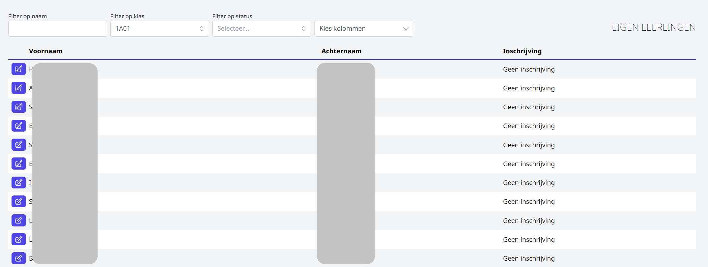

Via het onderdeel 'Eigen leerlingen inschrijven' kan je de leerlingen die in huidig schooljaar reeds ingeschreven zijn, opnieuw inschrijven voor volgend schooljaar. Op deze manier kan je bv. klasleerkrachten inschakelen die tijdens de oudercontacten rond 30/6 de leerlingen van de eigen klas opnieuw inschrijven. 

## Leerling of klas zoeken en kolommen instellen

Je kan zoeken op individuele leerling (Filter op naam) of op volledige klas (Filter op klas). Verder kan je nog filteren op status. Deze statussen zijn standaard ingesteld en kunnen niet gewijzigd worden door de school. Door te filteren op status, kan je snel zoeken welke leerlingen bv. niet aanwezig waren op het oudercontact of wie nog extra bedenktijd heeft gevraagd. 

Tot slot kan je ook nog kiezen welke kolommen er op het scherm getoond worden. 
- **Voornaam en Achternaam** van de leerling.

- **Inschrijving**: In welke studierichting de leerling is ingeschreven voor volgend schooljaar.

- **Opmerkingen:** A.d.h.v. deze kolom zie je in het overzicht de opmerkingen die bij een herinschrijving zijn toegevoegd. Bv. naar welke andere school de leerling gaat, wat de reden voor de bedenktijd is, wanneer zijn de ouders voor het laatst concontacteerd ... 

- **Buitengaan:**  Deze kolom is gelinkt aan de module [Buitengaan](/buitengaan). Als deze kolom actief is, kan je bij de 
herinschrijving meteen instellen óf en op welke dag(en) de leerling volgend schooljaar tijdens de middagpauze de school mag verlaten. Dat kan door bij de betreffende dag op het rode kruisje te klikken. Dit wordt een groen vinkje en is bijgevolg een dag waarop de leerling toestemming heeft om de school tijdens de middag te verlaten. Je kan dit eenvoudigweg ongedaan maken door terug op het groene vinkje je klikken, waardoor het opnieuw een rood kruisje wordt. De gegevens die hier worden geregistreerd, worden automatisch overgenomen in de module Buitengaan en moeten niet meer worden gesynchroniseerd of overgezet. 

  

- **Telefoonnummers:** Deze kolom is gelinkt aan het administratief pakket Informat of Wisa. Als deze kolom actief is, wordt er achteraan een <LegacyAction img="Telefoon.PNG"/> getoond. Door hier op te klikken, kan je de telefoonnummers van alle relaties uit het administratief pakket raadplegen. Dit kan handig zijn als je ouders wil opbellen van leerlingen die nog niet zijn ingeschreven voor volgend schooljaar. 

- **Klas**: De huidige klas van de leerling (in dit schooljaar).

- **Privacy**: In deze kolom kan je aangeven of gerichte beelden van een leerling al dan niet gebruikt mogen worden door de school, bv. in een brochure, op facebook, op de website, ... Door te klikken op het fototoestel <LegacyAction img="foto.PNG"/> in deze kolom, zal het icoon groen worden. Dat kan terug ongedaan gemaakt worden door nogmaals te klikken. Een groen icoon geeft aan dat de ouders toestemming geven aan de school om gericht beeldmateriaal van hun kind te gebruiken.

- **Overgezet**: Hiet kan je aanvinken of een herinschrijving is overgezet naar Informat of Wisa. In tegenstelling tot nieuwe inschrijvingen, kunnen herinschrijvingen van eigen leerlingen niet automatisch worden geïmporteerd in het administratief pakket. Deze moeten in het pakket zelf nog worden overgezet naar de nieuwe studierichting.  

- **Interne status**: Deze statussen kunnen op maat van de school worden ingesteld. Dat gebeurt via de [algemene instellingen](/inschrijvingen/opstart_config/instelling/)  in de module Inschrijvingen. Het betreft een interne status die weergeeft welke acties er ondernomen zijn voor een bepaalde inschrijving. Bv. een leerling/ouder werd telefonisch gecontacteerd of via mail.

## Leerling herinschrijven

- Klik op <LegacyAction img="wijzig.png" /> om de herinschrijving te starten. 

- De statussen bovenaan bieden de mogelijkheid om op te geven waarom een leerling (voorlopig) niet opnieuw wordt ingeschreven. Op deze statussen kan je in het algemeen overzicht filteren (niet te verwarren met de 'Interne status'). 

- Selecteer het leerjaar waarvoor je de leerling wil inschrijven. Vervolgens verschijnt er een overzicht met alle mogelijke studierichtingen binnen dat leerjaar. Selecteer de gewenste studierichting en eventueel de keuzevakken.
- Onderaan heb je nog de mogelijkheid om een opmerking toe te voegen. Indien je in het overzicht deze kolom hebt geactiveerd, zal de opmerking ook daar zichtbaar zijn. 

- De inschrijving kan onmiddellijk digitaal ondertekend worden. 

- Klik op 'opslaan' om de inschrijving af te ronden of 'annuleren' om ze af te breken. 

:::caution TER INFO
Indien de deliberatiegegevens uit Smartschool zijn opgeladen, worden die bij de herinschrijving getoond. Op die manier kan men makkelijk nagaan of een leerling de passende studiekeuze maakt voor volgend schooljaar. Lees [hier](/inschrijvingen/opstart_config/instelling/#4-resultaten-van-deliberaties) hoe je de deliberatiegegevens uit Smartschool kan exporteren en kan opladen in Toolbox via de algemene instellingen in de module Inschrijvingen.
:::

<Thumbnails img={[
    require('./herinschrijven3.png').default, 
    require('./herinschrijven5.PNG').default, 
]} />

## E-mailbericht bij herinschrijving

Het is mogelijk om bij herinschrijving een automatisch e-mailbericht te sturen ter bevestiging. Lees [hier](/inschrijvingen/opstart_config/instelling/) hoe je dit instelt. Deze optie kan bij elke herinschrijving nog terug uitgevinkt worden.  

<Thumbnails img={[
    require('./mail.png').default, 
]} />

