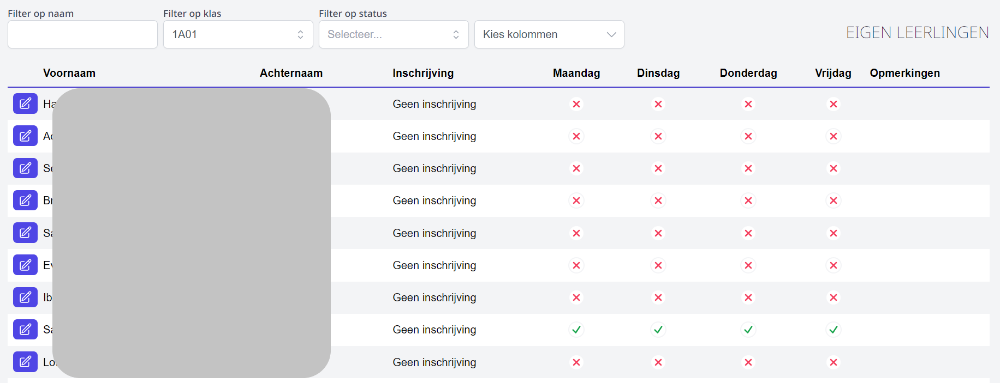

Via het onderdeel 'Eigen leerlingen inschrijven' kan je de leerlingen die in huidig schooljaar reeds ingeschreven zijn, opnieuw inschrijven voor volgend schooljaar. Op deze manier kan je bv. klasleerkrachten inschakelen die tijdens de oudercontacten rond 30/6 de leerlingen van de eigen klas opnieuw inschrijven. Je kan zoeken op individuele leerling of op volledige klas. 

