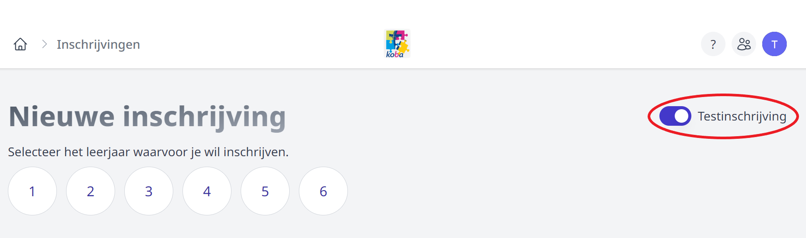
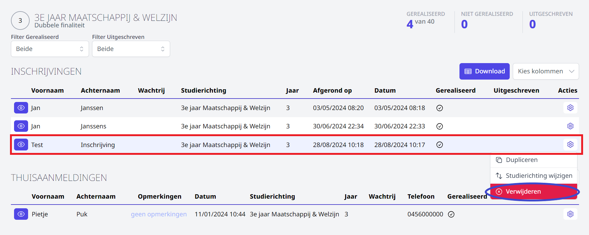

## Testinschrijving

Van zodra een studierichting volledig is ingesteld, is het mogelijk om hiervoor één of meerdere testinschrijvingen te doen. Zo kan je de inschrijfprocedure en de opmaak van de pagina’s grondig uittesten. Een testinschrijving kan door de school zelf verwijderd worden en kan niet overgezet worden naar Informat. 

### Testinschrijving ingeven

De testinschrijving geef je op dezelfde manier in als een nieuwe inschrijving. Je zet echter bovenaan de optie 'Testinschrijving' aan. Klik [hier](/inschrijvingen/inschrijven/nieuwe_inschrijving/) voor meer informatie over het inschrijven van nieuwe leerlingen. 

:::info noot
Het herinschrijven van eigen leerlingen en het thuisaanmelden kan niet uitgetest worden.  
:::

### Testinschrijving raadplegen en verwijderen

Na het afronden van de testinschrijving kan je die terugvinden in de overzichten. Klik [hier](/inschrijvingen/opvolging/) voor meer info over de verschillende overzichten en de mogelijke acties. Via het oogje vooraan kan je de testinschrijving bekijken. Met behulp van het tandwieltje achteraan kan je de testinschrijving verwijderen. 

:::info noot
Enkel testinschrijvingen kunnen volledig verwijderd worden. Bij een echte inschrijving heb je enkel de mogelijkheid om de leerling terug uit te schrijven. 
:::