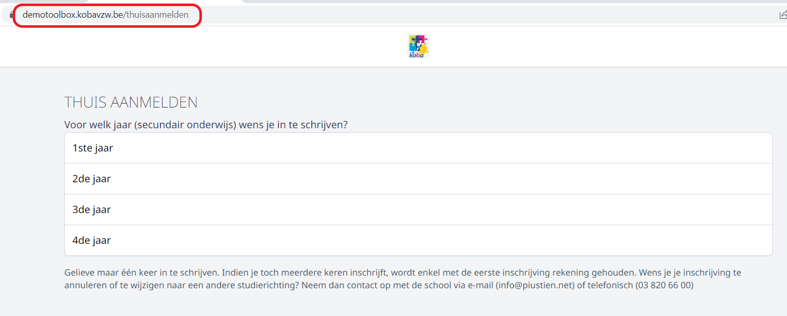
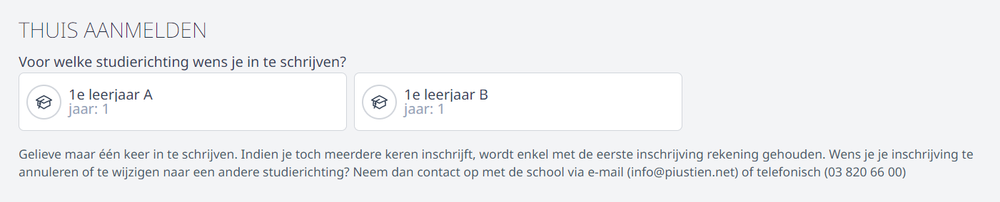
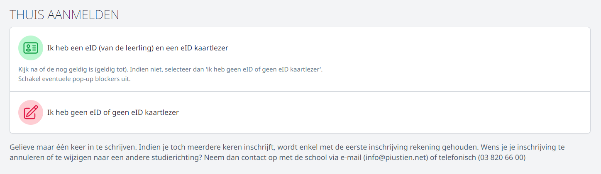
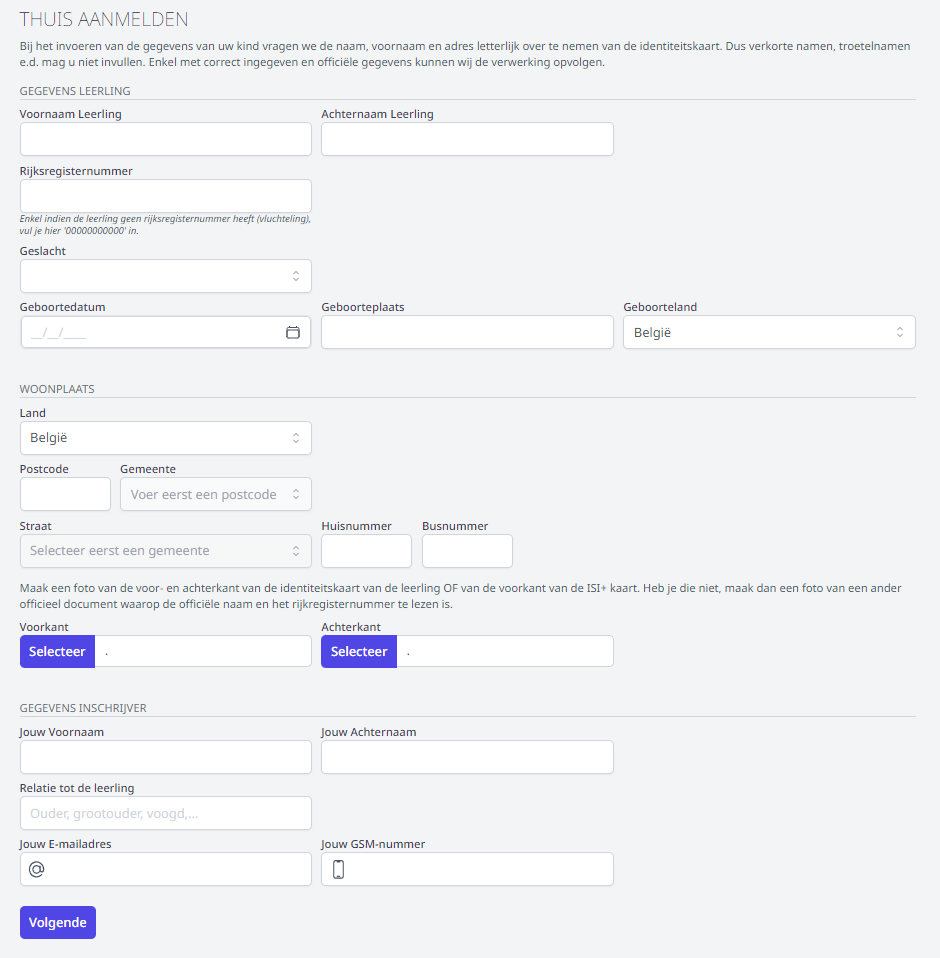

Je kan ervoor kiezen om je (toekomstige) leerlingen op voorhand thuis te laten aanmelden. Het gaat hier steeds om een aanmelding en nooit om een officiële inschrijving. 

Bij het instellen van de [studierichtingen](/inschrijvingen/opstart_config/studierichting/) kan je per studierichting aangeven of thuisregistratie al dan niet mogelijk is. Hier kan je eveneens instellen of het gaat om vrije aanmeldingen of om aanmeldingen mits een code (bv. 'Meld je aan Antwerpen'). 

Om het platform voor thuisaanmelden beschikbaar te stellen voor de ouders, kopieer je de URL bovenaan. Die URL kan je bv. op je website publiceren of via mail, Smartschool, ... aan de ouders bezorgen. 

Ouders kiezen eerst het leerjaar waarvoor men hun kind wil inschrijven. Vervolgens kan men de studierichting selecteren. 
Indien er voor deze studierichting keuzevakken gedefinieerd zijn, kunnen die via het thuis aanmelden nog **niet** gekozen worden. Dat dient te gebeuren bij het vervolledigen van de inschrijving op de school.  

<Thumbnails img={[
    require('./aanmelden4.png').default, 
]} />

Ouders kunnen ervoor kiezen om de identiteitskaart van de leerling in te lezen. Indien men niet over een eID of eID kaartlezer beschikt, kan men de gegevens manueel invullen. Men kan tijdens de aanmelding ook een foto van een officieel document toevoegen. 

Onderstaande velden moet men thuis invullen. Deze liggen vast en zijn dus niet uit te breiden met andere velden zoals bij de eigen pagina's. 

