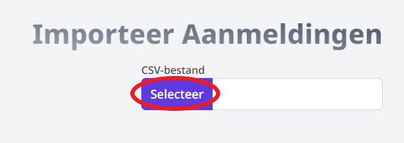
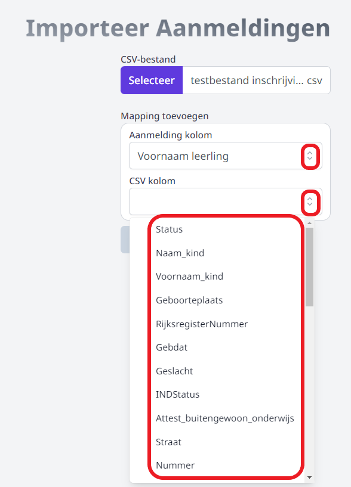
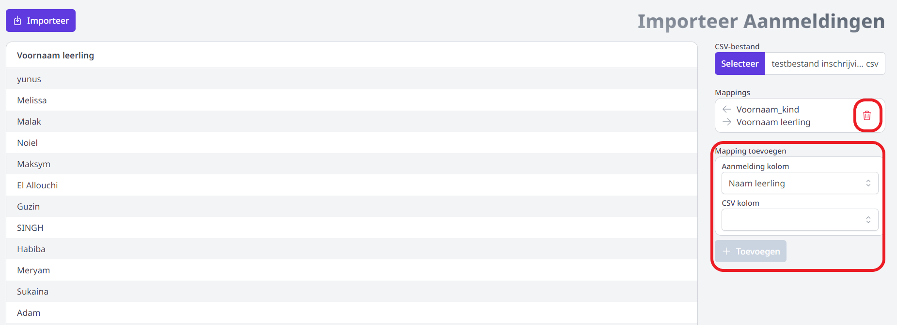
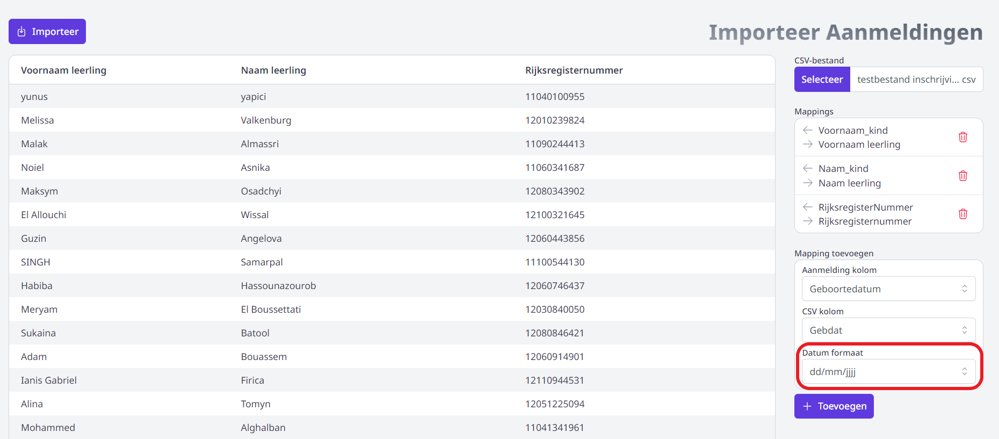
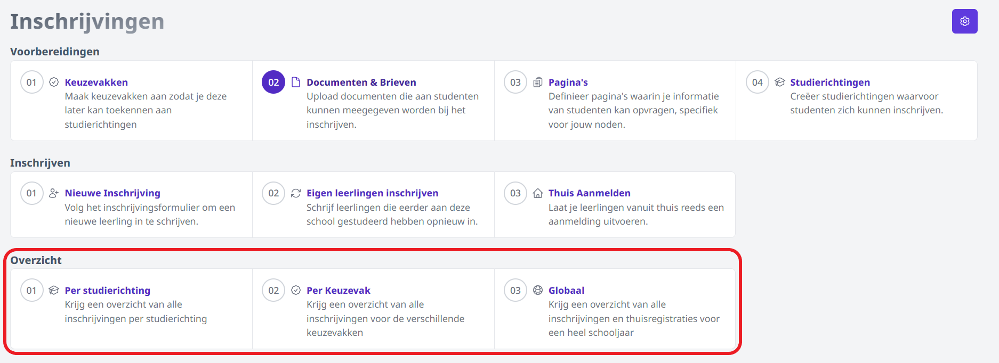

Leerlingen die zijn aangemeld via een officieel aanmeldsysteem kunnen in de module Inschrijvingen van Toolbox worden geïmporteerd. Ook de leerlingen op de wachtlijst kunnen mee ingevoerd worden, zodat die wachtlijst eenvoudig vanuit Toolbox opgevolgd kan worden. Van zodra de leerlingen zijn geïmporteerd, kan de inschrijving worden opgevolgd en eventueel verder gefinaliseerd via de **overzichten**. De aanmeldingen zijn daar steeds terug te vinden onder de rubriek 'Thuisaanmeldingen'. Via het tandwiel achteraan kan de aanmelding verder afgewerkt worden. Klik [hier](/inschrijvingen/opvolging/) voor meer info.

- Ga naar het onderdeel **Studierichtingen** en open de studierichting waarvoor je de aanmeldingen wil importeren. 
- Klik halverwege de pagina op **Importeer thuisaanmeldingen**.

    

- Klik op de knop 'Selecteer' om een bestand van op je computer te selecteren. Opgelet! Enkel CSV-bestanden worden ondersteund. Heb jij een XLS- of XLSX-bestand ontvangen. Open dan eerst het bestand rechtstreeks op je computer en sla het op als CSV-bestand (UFT-8 door komma's gescheiden). Daarna zal je het in de module Inschrijvingen kunnen uploaden. 

:::caution belangrijk
Je importeert **per studierichting**. Zorg dan ook dat je per studierichting een apart CSV-bestand gebruikt. 
:::

    

- Aangezien er verschillende officiële aanmeldsystemen bestaan, zullen niet alle scholen hetzelfde bestand ontvangen. Hierdoor kan Toolbox niet automatisch de kolommen uit het CSV-bestand matchen met de overeenkomstige velden in de module Inschrijvingen en weet het programma dus niet welke info waar terecht moet komen. Daarom moet de school zelf die koppeling nog leggen. 

    Per beschikbaar Toolbox-veld en per beschikbare kolom in het CSV-bestand kan je de match maken door achteraan te kiezen uit het dropdown-menu dat beschikbaar is via de pijltjes achteraan. Zo moet in het voorbeeld hieronder het veld 'Voornaam leerling' in Toolbox gekoppeld worden met de kolom 'Voornaam_kind' uit het CSV-bestand. Wanneer een veld en/of een kolom reeds gebruikt is, verdwijnt die uit de lijst. Minimaal moeten de Toolbox-velden 'Voornaam Leerling' en 'naam leerling' gekoppeld worden aan een kolom uit het CSV-bestand om te kunnen importeren. Verder kan/mag je zelf bepalen welke andere velden je nog wil koppelen. Alle gekoppelde info uit het CSV-bestand wordt mee overgenomen naar de inschrijving in Toolbox. Gegevens zoals rijksregisternummer, adres, geboortedatum- en plaats, ... zijn dus zeker ook interessant om te koppelen. 
- Klik op de knop Toevoegen om de koppeling te bevestigen. Daarna zal je meteen een volgende koppeling kunnen leggen.

    

- Elke koppeling kan je terug verwijderen door achteraan op het rode vuilnisbakje te klikken. Daarna worden de velden terug beschikbaar in de lijst en kunnen ze eventueel opnieuw gekoppeld worden of aan een ander veld.
s
    

- Wanneer de koppeling betrekking heeft op een datum, zal je bijkomend ook het datumformaat moeten bepalen. Dat kan je terugvinden in het CSV-bestand. Bv. 05/12/2024 komt overeen met formaat dd/mm/jjjj. 

    

- Wil je naast de kinderen die effectief zijn toegewezen aan de school ook de leerlingen op de wachtlijst importeren om die in Toolbox te kunnen beheren? Leg dan ook zeker de koppeling tussen het Toolbox-veld 'Wachtrij' en de overeenkomstige kolom in het CSV-bestand. In het voorbeeld hieronder is dat 'PositieWachtlijstNietGok'. Wanneer er een plaats vrijkomt zal je op een eenvoudige manier de inschrijving kunnen realiseren en finaliseren rekening houdend met de positie in de wachtrij. 

    

- Als alle gewenste koppelingen zijn gelegd, klik je links bovenaan op **Importeer**. De aanmeldingen zijn vervolgens terug te vinden in de overzichten onder de rubriek 'Thuisaanmeldingen'. Van daaruit kan je de inschrijvingen verder finaliseren via het tandwieltje achteraan. Dan zal je (bijkomende) leerplichtverantwoordelijken kunnen ingeven, de eigen pagina's invullen, documenten afdrukken, ... en tot slot de inschrijving kunnen overzetten naar het administratief pakket (Informat/Wisa). Klik [hier](/inschrijvingen/opvolging/) voor meer info over het finaliseren van een thuisaanmelding. 

    
