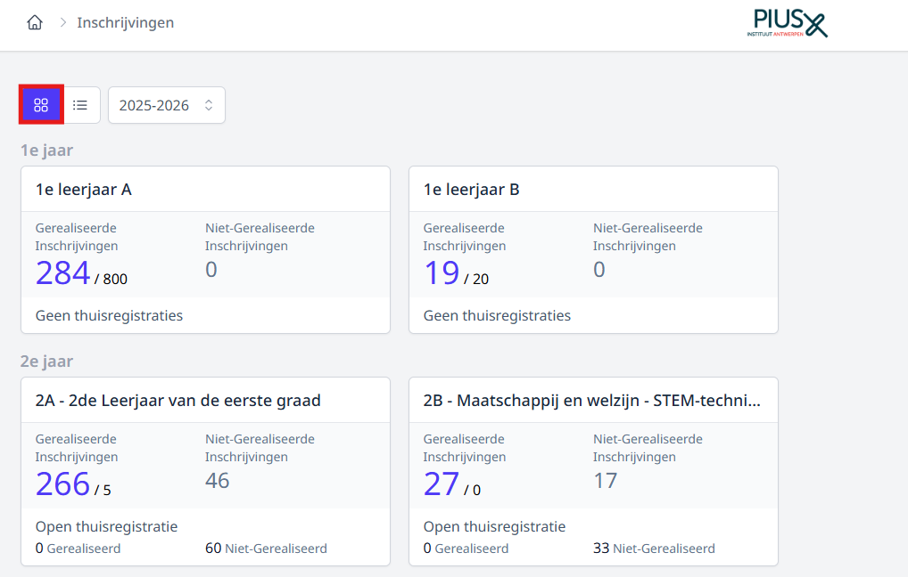

Alle inschrijvingen worden gebundeld en kunnen opgevolgd worden per studierichting, per keuzevak of in één globaal overzicht. Via deze overzichten is het tevens mogelijk om bepaalde gegevens aan te vullen, te wijzigen, relaties toe te voegen, een thuisaanmelding verder te finaliseren of te realiseren of een leerling uit te schrijven. 

## Opvolging per studierichting

Per studiejaar kan je de inschrijvingen voor elke studierichting raadplegen. In het overzicht zie je meteen het aantal afgewerkte inschrijvingen en het aantal thuisregistraties. Indien je quota hebt ingevuld, worden ook die getoond. Klik op een studierichting om de afzonderlijke inschrijvingen te bekijken.  

- Via de filters (linksboven) kan je instellen welke inschrijvingen je wil tonen. 

- Aan de hand van het selectiemenu bij <LegacyAction img="kolom.PNG"/> kan je aanvinken welke kolommen er getoond moeten worden. Je kan de resultaten in alle kolommen sorteren door bovenaan op de titel van de kolom te klikken. Dit is handig wanneer je bv. wil sorteren op datum en tijdstip van inschrijven of plaats in de wachtrij. 

- Met behulp van de knop <LegacyAction img="download.JPG"/> kan je de inschrijvingen exporteren naar Excel.

- De bovenste lijst bevat de volledig afgewerkte inschrijvingen. In het overzicht daaronder staan de thuisinschrijvingen die van hieruit verder gefinaliseerd kunnen worden. Indien je gebruik hebt gemaakt van de module Inschrijvingen voor de herinschrijving van eigen leerlingen, zal er nog een derde overzicht verschijnen met alle gegevens over de herinschrijving. 

- Via deze knop <LegacyAction img="oog.PNG"/> kan je de details van de inschrijving bekijken en eventueel (persoonlijke gegevens) aanpassen.  Alle velden uit de volledige inschrijfprocedure kunnen via deze weg nog aangepast worden, nl. persoonsgegevens van de leerling, van de relaties, gegevens ingevuld op de pagina's. Ook gekoppelde documenten kan je via deze weg opnieuw opvragen en afdrukken. 

- Met de actieknop <LegacyAction img="configure.JPG"/> helemaal achteraan kan je volgende acties uitvoeren:   
  
    Bij een inschrijving:
    - **Dupliceren**: Een leerling op een snelle manier inschrijven voor een bijkomende studierichting door te dupliceren. De eerste inschrijving blijft behouden. Alle gegevens m.b.t. de leerling, relaties en pagina's worden mee overgenomen naar de tweede inschrijving (op voorwaarde dat de pagina's dezelfde zijn voor de nieuwe studierichting).
    - **Studierichting wijzigen**: Enkel de studierichting van de inschrijving wordt gewijzigd. Alle andere gegevens m.b.t. de leerling, relaties en pagina's blijven behouden (op voorwaarde dat de pagina's dezelfde zijn voor de nieuwe studierichting). **OPMERKING!** Indien een leerling van studierichting wijzigt, krijgt die een plaatsje achteraan in de rij voor deze nieuwe studierichting. Wanneer voor die studierichting het quota reeds is bereikt, krijg je hier een melding van en kan je alsnog kiezen om de leerling niet van studierichting te wijzigen. Een betere optie is dan de originele inschrijving te dupliceren. Op die manier is de leerling zeker van een plaats in studierichting A, maar krijgt die ook een plaats op de wachtlijst voor studierichting B. Van zodra de leerling effectief kan ingeschreven worden in studierichting B, kan die alsnog uitgeschreven worden voor studierichting A.    
    - **Realiseren**: Wanneer het quota op een studierichting is bereikt, komen alle volgende inschrijvingen op een wachtlijst te staan. Wanneer er leerlingen uitschrijven of het quota wordt verhoogd, kan het voorkomen dat leerlingen op de wachtlijst alsnog een plaats kunnen bemachtigen. In dat geval worden de inschrijvingen op de wachtlijst niet automatisch gerealiseerd. Dit moet handmatig gebeuren via de knop 'Realiseer'. Pas wanneer alle inschrijvingen op de wachtlijst zijn gerealiseerd, zullen nieuwe inschrijvingen opnieuw automatisch gerealiseerd worden (zolang het quota niet is bereikt). Indien de inschrijvingen op de wachtlijst niet manueel worden gerealiseerd, zullen alle nieuwe inschrijvingen achteraan op de wachtlijst worden toegevoegd. Dit om de volgorde van inschrijven te respecteren. 
    - **Uitschrijven**: Een leerling uitschrijven voor een studierichting. De gegevens van een uitgeschreven leerling kan je achteraf nog steeds raadplegen.  

    Bij een thuisaanmelding:
    - **Finaliseren**: Een thuisinschrijving verder afwerken. M.a.w. de gegevens van de leerling verder aanvullen, relaties toevoegen en de pagina's verder aanvullen. Finaliseren kan zowel voor gerealiseerde thuisaanmeldingen (= aanmeldingen waarvoor er nog plaats was in de studierichting) als voor thuisaanmeldingen op de wachtlijst. 
        - **Situatie 1: Bij thuisaanmelding is er nog plaats in de gekozen studierichting.**  
        Wanneer er bij aanmelding plaats is in de gekozen studierichting, wordt de thuisaanmelding automatisch gerealiseerd. Bij het finaliseren is er aan einde van het proces de mogelijkheid om de gekoppelde documenten af te drukken of te mailen naar de opgegeven e-mailadresssen van de relaties. Na het finaliseren verwijnt de aanmelding uit de lijst met thuisaanmeldingen onderaan en wordt die naar de lijst erboven met de inschrijvingen verplaatst. 
        - **Situatie 2: Bij thuisaanmelding is er géén plaats meer in de gekozen studierichting.**  
        Wanneer men bij een thuisaanmelding een plaats heeft gekregen op de wachtlijst, kan die aanmelding ook al verder gefinaliseerd worden. Alle gegevens kunnen verder worden aangevuld zonder de aanmelding effectief te realiseren. De plaats op de wachtlijst blijft dus ongewijzigd. Na afloop worden niet de gekoppelde documenten getoond, maar wel het weigeringsattest.   
        **OPMERKING!** Is er toch een plaatsje vrijgekomen en wil je na afloop graag de gekoppelde documenten afdrukken of mailen, realiseer dan eerst de aanmelding alvorens ze te finaliseren. 
    - **Realiseren**: Wanneer het quota op een studierichting is bereikt, komen alle volgende aanmeldingen op een wachtlijst te staan. Wanneer er leerlingen uitschrijven of het quota wordt verhoogd, kan het voorkomen dat leerlingen op de wachtlijst alsnog een plaats kunnen bemachtigen. In dat geval worden de thuisaanmeldingen op de wachtlijst niet automatisch gerealiseerd. Dit moet handmatig gebeuren via de knop 'Realiseer'. Wil je na het aanvullen van alle gegevens en het doorlopen van de pagina's (=finaliseren) graag de gekoppelde documenten afdrukken of mailen, realiseer dan eerst de inschrijving alvorens ze te finaliseren (= verder af te werken). Indien je eerst finaliseert alvorens te realiseren, zal je aan het einde van proces nog steeds het weigeringsdocument te zien krijgen en niet de gekoppelde documenten van de studierichting, aangezien deze thuisaanmelding op dat moment nog steeds op de wachtlijst staat. 
    - **Uitschrijven**: Een leerling uitschrijven voor een studierichting. De gegevens van een uitgeschreven leerling kan je achteraf nog steeds raadplegen.

## Opvolging per keuzevak

Klik op het keuzevak om de inschrijvingen voor dat vak te raadplegen. 

## Globaal overzicht

In dit overzicht vind je alle inschrijvingen terug, behalve de herinschrijving van de eigen leerlingen. Die zijn enkel te raadplegen in het overzicht per studierichting. In het globaal overzicht wordt er gewerkt met 2 aparte lijsten: één voor de gefinaliseerde (lees: volledig afgewerkte) inschrijvingen en één voor de thuisinschrijvingen. Je kan eenvoudig wisselen tussen de 2 lijsten door te klikken op <LegacyAction img="inschrijvingen.PNG"/>.

Ook in dit overzicht kan je kiezen welke kolommen je wil tonen en kan je elke kolom steeds sorteren door bovenaan op de naam van de kolom te klikken. Op deze manier kan je de lijst bv. sorteren op studierichting.

Ook hier kan je met behulp van de knop <LegacyAction img="download.JPG"/> de inschrijvingen exporteren naar Excel.

Je vindt dezelfde icoontjes terug als bij de opvolging per studierichting. De functie van de icoontjes kan je hierboven lezen bij 'Opvolging per studierichting'.

De opmerkingen die worden ingegeven in het opmerkingenveld zijn voor alle gebruikers van de module Inschrijvingen zichtbaar. 

