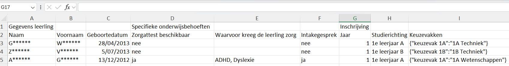
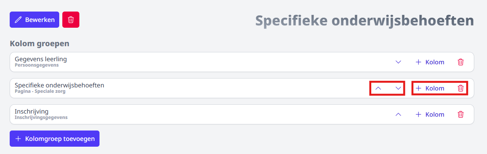
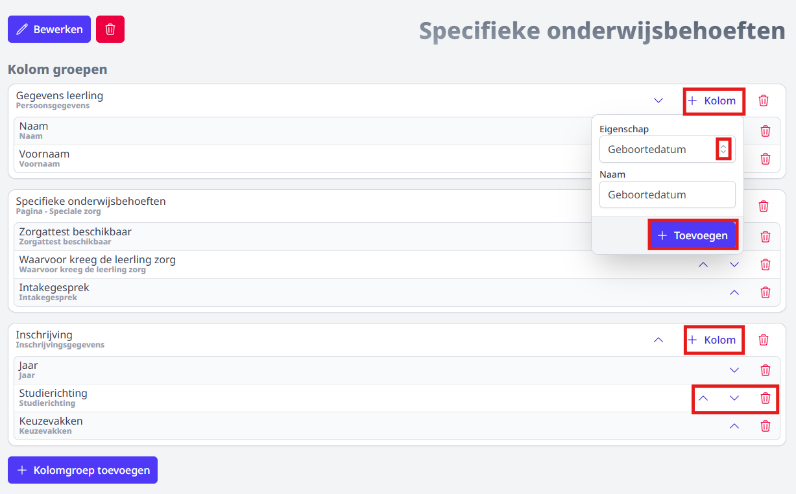
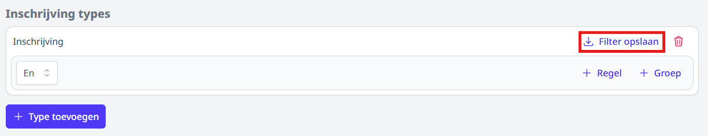
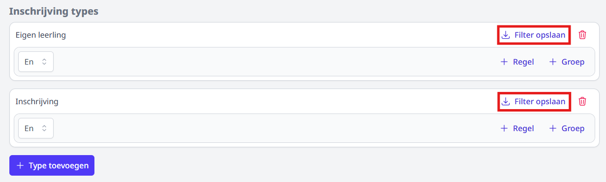
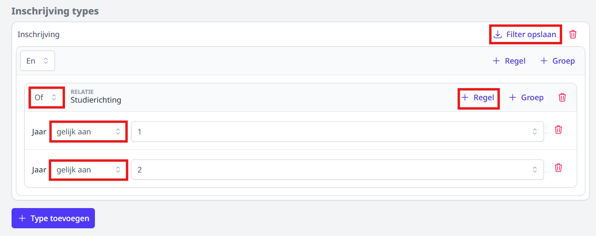
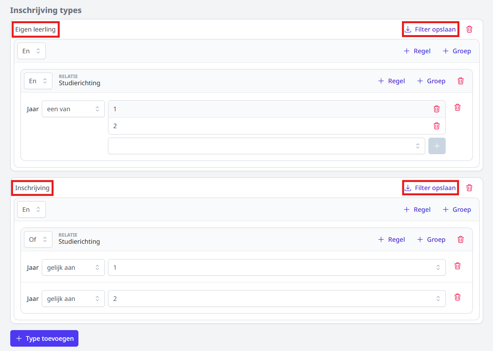

Alle inschrijvingen worden gebundeld en kunnen opgevolgd worden per studierichting, per keuzevak of in één globaal overzicht. Via deze overzichten is het tevens mogelijk om bepaalde gegevens aan te vullen, te wijzigen, relaties toe te voegen, een thuisaanmelding verder te finaliseren of te realiseren of een leerling uit te schrijven. Via de laatste optie 'Export' kan men eigen export-bestanden samenstellen waarin de gewenste gegevens worden weergegeven. 

## Opvolging per studierichting

Per studiejaar kan je de inschrijvingen voor elke studierichting raadplegen. In het overzicht zie je meteen het aantal afgewerkte inschrijvingen en het aantal thuisregistraties. Indien je quota hebt ingevuld, worden ook die getoond. Links bovenaan kan je kiezen hoe de resultaten weergegeven worden, in blokjes of in een lijst. Klik op een studierichting om de afzonderlijke inschrijvingen te bekijken. 

- Resultaten in blokweergave: 

    

- Resultaten in lijstweergave: 

    
    *Klik op de afbeelding om te vergroten.*

- Klik op een studierichting om de inschrijvingen te raadplegen. 
    
    *Klik op de afbeelding om te vergroten.*

- Via de filters (linksboven) kan je instellen welke inschrijvingen je wil tonen. 

- Aan de hand van het selectiemenu bij <LegacyAction img="kolom.PNG"/> kan je aanvinken welke kolommen er getoond moeten worden. Je kan de resultaten in alle kolommen sorteren door bovenaan op de titel van de kolom te klikken. Dit is handig wanneer je bv. wil sorteren op datum en tijdstip van inschrijven of plaats in de wachtrij. 

- Met behulp van de knop <LegacyAction img="download.JPG"/> kan je de inschrijvingen exporteren naar Excel.

- De bovenste lijst bevat de volledig afgewerkte inschrijvingen. In het overzicht daaronder staan de thuisinschrijvingen die van hieruit verder gefinaliseerd kunnen worden. Indien je gebruik hebt gemaakt van de module Inschrijvingen voor de herinschrijving van eigen leerlingen, zal er nog een derde overzicht verschijnen met alle gegevens over de herinschrijving. 

- Via deze knop <LegacyAction img="oog.PNG"/> kan je de details van de inschrijving bekijken en eventueel (persoonlijke gegevens) aanpassen.  Alle velden uit de volledige inschrijfprocedure kunnen via deze weg nog aangepast worden, nl. persoonsgegevens van de leerling, van de relaties, gegevens ingevuld op de pagina's. Ook gekoppelde documenten kan je via deze weg opnieuw opvragen en afdrukken of mailen. Je kan de samenvatting van de inschrijving ook afdrukken met de toetsencombinatie CTRL+P (voor Windows), CMD+P (voor Mac) of door middel van een rechtermuisklik en de optie Afdrukken.

- Met de actieknop <LegacyAction img="configure.JPG"/> helemaal achteraan kan je volgende acties uitvoeren:   
  
    Bij een inschrijving:
    - **Dupliceren**: Een leerling op een snelle manier inschrijven voor een bijkomende studierichting door te dupliceren. De eerste inschrijving blijft behouden. Alle gegevens m.b.t. de leerling, relaties en pagina's worden mee overgenomen naar de tweede inschrijving (op voorwaarde dat de pagina's dezelfde zijn voor de nieuwe studierichting).
    - **Studierichting wijzigen**: Enkel de studierichting van de inschrijving wordt gewijzigd. Alle andere gegevens m.b.t. de leerling, relaties en pagina's blijven behouden (op voorwaarde dat de pagina's dezelfde zijn voor de nieuwe studierichting). **OPMERKING!** Indien een leerling van studierichting wijzigt, krijgt die een plaatsje achteraan in de rij voor deze nieuwe studierichting. Wanneer voor die studierichting het quota reeds is bereikt, krijg je hier een melding van en kan je alsnog kiezen om de leerling niet van studierichting te wijzigen. Een betere optie is dan de originele inschrijving te dupliceren. Op die manier is de leerling zeker van een plaats in studierichting A, maar krijgt die ook een plaats op de wachtlijst voor studierichting B. Van zodra de leerling effectief kan ingeschreven worden in studierichting B, kan die alsnog uitgeschreven worden voor studierichting A.    
    - **Realiseren**: Wanneer het quota op een studierichting is bereikt, komen alle volgende inschrijvingen op een wachtlijst te staan. Wanneer er leerlingen uitschrijven of het quota wordt verhoogd, kan het voorkomen dat leerlingen op de wachtlijst alsnog een plaats kunnen bemachtigen. In dat geval worden de inschrijvingen op de wachtlijst niet automatisch gerealiseerd. Dit moet handmatig gebeuren via de knop 'Realiseer'. Pas wanneer alle inschrijvingen op de wachtlijst zijn gerealiseerd, zullen nieuwe inschrijvingen opnieuw automatisch gerealiseerd worden (zolang het quota niet is bereikt). Indien de inschrijvingen op de wachtlijst niet manueel worden gerealiseerd, zullen alle nieuwe inschrijvingen achteraan op de wachtlijst worden toegevoegd. Dit om de volgorde van inschrijven te respecteren. 
    - **Uitschrijven**: Een leerling uitschrijven voor een studierichting. De gegevens van een uitgeschreven leerling kan je achteraf nog steeds raadplegen.  

    Bij een thuisaanmelding:
    - **Finaliseren**: Een thuisinschrijving verder afwerken. M.a.w. de gegevens van de leerling verder aanvullen, relaties toevoegen en de pagina's verder aanvullen. Finaliseren kan zowel voor gerealiseerde thuisaanmeldingen (= aanmeldingen waarvoor er nog plaats was in de studierichting) als voor thuisaanmeldingen op de wachtlijst. 
        - **Situatie 1: Bij thuisaanmelding is er nog plaats in de gekozen studierichting.**  
        Wanneer er bij aanmelding plaats is in de gekozen studierichting, wordt de thuisaanmelding automatisch gerealiseerd. Bij het finaliseren is er aan einde van het proces de mogelijkheid om de gekoppelde documenten af te drukken of te mailen naar de opgegeven e-mailadresssen van de relaties. Na het finaliseren verwijnt de aanmelding uit de lijst met thuisaanmeldingen onderaan en wordt die naar de lijst erboven met de inschrijvingen verplaatst. 
        - **Situatie 2: Bij thuisaanmelding is er géén plaats meer in de gekozen studierichting.**  
        Wanneer men bij een thuisaanmelding een plaats heeft gekregen op de wachtlijst, kan die aanmelding ook al verder gefinaliseerd worden. Alle gegevens kunnen verder worden aangevuld zonder de aanmelding effectief te realiseren. De plaats op de wachtlijst blijft dus ongewijzigd. Na afloop worden niet de gekoppelde documenten getoond, maar wel het weigeringsattest.   
        **OPMERKING!** Is er toch een plaatsje vrijgekomen en wil je na afloop graag de gekoppelde documenten afdrukken of mailen, realiseer dan eerst de aanmelding alvorens ze te finaliseren. 
    - **Realiseren**: Wanneer het quota op een studierichting is bereikt, komen alle volgende aanmeldingen op een wachtlijst te staan. Wanneer er leerlingen uitschrijven of het quota wordt verhoogd, kan het voorkomen dat leerlingen op de wachtlijst alsnog een plaats kunnen bemachtigen. In dat geval worden de thuisaanmeldingen op de wachtlijst niet automatisch gerealiseerd. Dit moet handmatig gebeuren via de knop 'Realiseer'. Wil je na het aanvullen van alle gegevens en het doorlopen van de pagina's (=finaliseren) graag de gekoppelde documenten afdrukken of mailen, realiseer dan eerst de inschrijving alvorens ze te finaliseren (= verder af te werken). Indien je eerst finaliseert alvorens te realiseren, zal je aan het einde van proces nog steeds het weigeringsdocument te zien krijgen en niet de gekoppelde documenten van de studierichting, aangezien deze thuisaanmelding op dat moment nog steeds op de wachtlijst staat. 
    - **Uitschrijven**: Een leerling uitschrijven voor een studierichting. De gegevens van een uitgeschreven leerling kan je achteraf nog steeds raadplegen.

## Opvolging per keuzevak

Klik op het keuzevak om de inschrijvingen voor dat vak te raadplegen. 

## Globaal overzicht

In dit overzicht vind je alle inschrijvingen terug, behalve de herinschrijving van de eigen leerlingen. Die zijn enkel te raadplegen in het overzicht per studierichting. In het globaal overzicht wordt er gewerkt met 2 aparte lijsten: één voor de gefinaliseerde (lees: volledig afgewerkte) inschrijvingen en één voor de thuisinschrijvingen. Je kan eenvoudig wisselen tussen de 2 lijsten door te klikken op <LegacyAction img="inschrijvingen.PNG"/>.

Ook in dit overzicht kan je kiezen welke kolommen je wil tonen en kan je elke kolom steeds sorteren door bovenaan op de naam van de kolom te klikken. Op deze manier kan je de lijst bv. sorteren op studierichting.

Ook hier kan je met behulp van de knop <LegacyAction img="download.JPG"/> de inschrijvingen exporteren naar Excel.

Je vindt dezelfde icoontjes terug als bij de opvolging per studierichting. De functie van de icoontjes kan je hierboven lezen bij 'Opvolging per studierichting'.

De opmerkingen die worden ingegeven in het opmerkingenveld zijn voor alle gebruikers van de module Inschrijvingen zichtbaar. 

## Export

Indien de hogervermelde exportmogelijkheden niet volstaan, kan je via het menu **Exports** eigen lijsten samenstellen met de gewenste gegevens.
Dat kan gaan van persoonsgegevens van de leerling of een relatie tot antwoorden op een bepaalde vraag op een pagina. Dit maakt maatwerk voor de scholen mogelijk. 

In onderstaand voorbeeld willen we een overzicht bekomen met specifieke antwoorden op vragen uit de pagina’s m.b.t. leerstoornissen en specifieke onderwijsbehoeften om op basis van die antwoorden afspraken vast te leggen met de zorgcoördinator en vervolgens de klassamenstellingen te kunnen maken. De instellingen uit het voorbeeld dat verderop volgt, zullen dit resultaat geven: 
 
    
    *Klik op de afbeelding om te vergroten.*

VOORBEELD:

- Maak een nieuw exportbestand aan. Ga hiervoor naar het menu **Exports** en klik op 'Toevoegen'. Een bestaand exportbestand kan gedownload worden door achteraan op het downloadicoontje te klikken. De bestanden zijn steeds in XLSX-formaat. 
- Geef het bestand een naam en klik op 'Toevoegen'.

    
    *Klik op de afbeelding om te vergroten.*

- Per exportbestand kan je meerdere tabbladen toevoegen. Maak voor elk gewenst tabblad een aparte 'Sheet' aan door te klikken op 'Sheet toevoegen'. Heb je meerdere sheets toegevoegd, dan kan je de plaats van elk tabblad bepalen met behulp van de pijltjes achteraan. 

    

- Geef het nieuwe tabblad (sheet) een naam en klik op 'Toevoegen'. 

    

- Na het toevoegen van de sheet wordt die automatisch geopend en kan je de sheet meteen verder instellen. Dat kan ook nog op een later moment.

    

### Kolom groepen

- Bepaal eerst welke kolommen je wil tonen in je tabblad. Hiervoor moet je eerst en vooral de betreffende kolomgroep(en) toevoegen. Selecteer het 'Type kolomgroep' en geef die een zelfgekozen naam. Welke gegevens uit welke kolomgroep je precies wil tonen, kan je in een volgende stap bepalen. Indien je gegevens uit meerdere kolomgroepen wil tonen, kan je meerdere kolomgroepen toevoegen. Ook op een later moment kan je nog kolomgroepen toevoegen of verwijderen. Er zijn 6 types van kolomgroepen:
    - Persoonsgegevens (van de leerling): naam, voornaam, adres, rijksregisternummer, ...
    - Leerplichtverantwoordelijke 1: gegevens van LPV1
    - Leerplichtverantwoordelijke 2: gegevens van LPV2
    - Andere relaties: gegevens van bijkomende relaties die geen LPV zijn.
    - Pagina: Anwoorden op vragen uit eigen pagina's. 
    - Inschrijving: alle gegevens m.b.t. de inschrijving, nl. studiejaar, studierichting, keuzevakken, opmerkingen, ...

    

    - Bij het kolomtype 'Pagina' zal je ook de concrete pagina al moeten selecteren. Je kan meerdere pagina's toevoegen. 

    

- In onderstaand voorbeeld zijn volgende kolomgroepen toegevoegd:
    - kolomgroep 'Persoonsgegevens' met als naam 'Gegevens leerling'
    - kolomgroep 'Pagina' en meer specifiek de pagina 'Speciale zorg' met als naam 'Specifieke onderwijsbehoeften'
    - kolomgroep 'Inschrijvingsgegevens' met als naam 'Inschrijving'

     Je kan de kolomgroepen van plaats wisselen met behulp van de pijltjes of verwijderen met het vuilnisbakje. In de volgende stap bepaal je welke persoonsgegevens van de leerling, welke vragen/antwoorden uit de pagina en welke inschrijvingsgegevens je precies wil opnemen in het exportbestand. Hiervoor klik je op '+ Kolom'. 

    

- Selecteer de gewenste kolommen uit de kolomgroep en voeg ze één voor één toe. Er wordt automatisch een naam toegekend aan de kolom. Deze naam zal gebruikt worden als kolomkop in het Excel-bestand. Indien gewenst kan je die naam wijzigen bij het toevoegen. Dat kan ook achteraf nog door in het overzicht op de naam te klikken. Met behulp van de pijltjes achteraan kan je de kolommen van plaats wisselen. Je kan ook kolommen verwijderen door gebruik te maken van het vuilnisbakje. De kolom verdwijnt dan enkel uit dit tabblad en kan eenvoudig op de voormelde manier terug toegevoegd worden. 

    

RESULTAAT: 

    
    *Klik op de afbeelding om te vergroten.*

Wil je de naam van de kolomgroepen niet tonen in het exportbestand, klik dan op 'Bewerken' en schakel de optie 'Toon groep headers' uit. 

Bovenstaande wijziging geeft volgend resultaat: 

*Klik op de afbeelding om te vergroten.*

### Inschrijving types

'Inschrijving types' werkt als een filter waarmee je de resultatenlijst al meteen kan beperken tot een welbepaald resultaat. 
Wil je alle antwoorden, voor alle leerlingen, van alle types van inschrijvingen (eigen leerlingen, thuisaanmeldingen en nieuwe inschrijvingen) dan hoef je geen types in te stellen. In het Excel-/exportbestand kan je ook nog steeds zoeken en filteren. 

Wil je wel al graag vooraf een selectie maken? We leggen de mogelijkheden uit aan de hand van enkele concrete voorbeelden. 

:::caution principes van het filteren
- **EN** : Enkel de resultaten die aan **alle opgegeven criteria** binnen de groep voldoen worden getoond. 
- **OF** : Alle resultaten die aan **één van de opgegeven criteria** binnen de groep voldoen worden getoond.
- Filteren op antwoorden op een vraag van een pagina: gebruik in de filter **exact dezelfde schrijfwijze** als van het antwoord. 
- Maak je op een pagina gebruik van een **schuifbalk** voor een **ja-nee-vraag**? Typ dan 'True' om te filteren op het antwoord 'Ja' en 'False' om te filteren op 'Nee'. 
- Wanneer je op een pagina bij een bepaalde vraag **checkboxes (=multi select)** gebruikt, kan je niet filteren op het antwoord op deze vraag.  
:::

#### Voorbeeld 1
Je wil enkel de resultaten zien voor de nieuw ingeschreven leerlingen, maar niet voor de heringeschreven eigen leerlingen of voor de thuisaanmeldingen (die nog niet effectief ingeschreven zijn). 

- Klik op 'Type toevoegen' en selecteer 'Inschrijving' uit de lijst met types. 

    

- Klik op 'Filter opslaan'. 

    

#### Voorbeeld 2

Je wil graag de gegevens zien voor de nieuw ingeschreven leerlingen én voor de heringeschreven eigen leerlingen, maar niet voor de thuisaanmeldingen. 

- Klik op 'Type toevoegen' en selecteer 'Inschrijving' uit de lijst met types. 
- Klik op 'Type toevoegen' en selecteer 'Eigen leerling' uit de lijst met types. 
     

- Klik op 'Filter opslaan'. 

    

#### Voorbeeld 3

Je wil een lijst van alle nieuw ingeschreven leerlingen uit de eerste graad.

- Klik op 'Type toevoegen' en selecteer 'Inschrijving' uit de lijst met types. Je wil namelijk enkel de nieuw ingeschreven leerlingen in de resultatenlijst zien. 
- Klik op '+ Regel' en selecteer de optie 'Studierichting'.

- Voeg op de studierichting een regel toe en kies voor de optie 'Jaar'. 

    - Mogelijkheid 1: 
    
        - Selecteer vooraan 'Jaar = Een van' en voeg vervolgens met behulp van de dropdownlijst en de blauwe plus één voor één de jaren toe die je in de resultatenlijst wil tonen. In de resultatenlijst worden beide jaren getoond. 
        - Klik op 'Filter opslaan'. 

        

    - Mogelijkheid 2: 

        - Selecteer vooraan 'Jaar = Gelijk aan' en selecteer uit de dropdownlijst het eerste jaar. 
        - Voeg vervolgens een regel toe op de studierichting en herhaal de vorige stap om het tweede jaar toe te voegen. 
        - OPGELET! Gebruik in dit geval de setting **OF** voor **Studierichting**. Het bestand bevat dan alle leerlingen die in het eerste **OF** in het tweede jaar zijn ingeschreven. 
        
            *Gebruik je in dit geval de optie **EN** dan zal de lijst alle leerlingen bevatten die zowel in het eerste als in het tweede jaar zijn ingeschreven. Dat zal vermoedelijk geen resultaten opleveren.*  
        - Klik op 'Filter opslaan'. 

        

#### Voorbeeld 4

Je wil een lijst van alle ingeschreven leerlingen uit de eerste graad, zowel de nieuwe leerlingen als de heringeschreven eigen leerlingen. 

- Volg alle stappen uit voorbeeld 3. Je kan vrij kiezen uit mogelijkheid 1 of 2. Alle nieuw ingeschreven leerlingen uit de eerste graad zijn nu toegevoegd.
- Klik op 'Filter opslaan' bij het type 'Inschrijving'. 
- Klik onderaan op 'Type toevoegen' en selecteer 'Eigen leerling' uit de lijst met types. Je wil namelijk ook de heringeschreven eigen leerlingen in de resultatenlijst zien. 
- Volg de verdere stappen zoals omschreven in voorbeeld 3 en klik op 'Filter opslaan' bij 'Eigen leerling'. 
- In het voorbeeld hieronder zijn de twee verschillende mogelijkheden toegepast. Beide zijn correct. 

        

#### Voorbeeld 5 

Je wil een lijst van alle nieuw ingeschreven leerlingen uit de eerste graad die een afspraak wensen met de zorgcoördinator. 

- Volg alle stappen uit voorbeeld 3 en ga dan verder met onderstaande stappen. Je kan in voorbeeld 3 vrij kiezen uit mogelijkheid 1 of 2.

- Voeg bovenaan (bij Inschrijving) een nieuwe regel toe en kies voor 'Pagina'. 

    

- Voeg op de relatie 'Pagina antwoord' een regel 'Veld' en een regel 'Antwoord' toe. 

    

- Selecteer bij 'Veld' een vraag uit de bestaande pagina's.

- Bij 'Antwoord' vul je zelf het gewenste antwoord in waarop je wil filteren. De tekst moet exact overeen komen met het antwoord uit de pagina. Gebruikte je op je pagina de schuifbalk <LegacyAction img="buttonBlue.PNG"/> voor een ja-nee-vraag, vul dan de tekst **'True'** in als je alle leerlingen wil tonen waarvoor het antwoord 'Ja' was en **'False'** als je alle leerlingen wil weergeven waarvoor het antwoord op de betreffende vraag 'Nee' was. Je gebruikt hier de optie **EN**, omdat aan beide voorwaarden voldaan moet zijn. De vraag moet ingevuld zijn én het antwoord moet in dit geval 'True' (Ja) zijn. Je wil namelijk alle leerlingen te zien krijgen waarvoor een gesprek met de zorgcoördinator wenselijk is. 
    
    *Gebruik je in dit geval **OF**, dan zal je alle leerlingen te zien krijgen waarvoor er een vraag (eender welke vraag) met 'Ja' werd beantwoord en dat is niet de bedoeling.*
- Klik op 'Filter opslaan'. 

- Het eindresultaat volgens mogelijkheid 1: 

    

- Het eindresultaat volgens mogelijkheid 2:

    

#### Voorbeeld 6

De zorgcoördinator vraagt een lijst van alle nieuw ingeschreven leerlingen in het eerste jaar die:
- ofwel in het verleden ooit speciale zorg hebben gekregen;
- ofwel beschikken over een attest voor speciale zorg;
- ofwel waarvoor een afspraak met de zorgcoördinator wenselijk is.  

1. Als 'type' kies je voor 'Inschrijving' aangezien je enkel de nieuw ingeschreven leerlingen wil tonen.
2. Voeg een **regel** toe voor de studierichting en voeg op de studierichting een regel toe voor het eerste jaar.
3. Voeg bovenaan (op het hoogste niveau) een **groep** toe. Die groep staat bijgevolg op hetzelfde niveau als de studierichting. 
4. Voeg aan de groep een regel toe voor een 'Pagina antwoord'. 
5. Voeg aan het 'Pagina antwoord' een regel toe voor 'Veld' en een regel voor 'Antwoord'.
6. Selecteer bij 'Veld' de gewenste vraag uit de pagina.
7. Typ bij 'Antwoord' het antwoord op de vraag waarop je wil filteren. OPGELET: Gebruikte je op je pagina de schuifbalk <LegacyAction img="buttonBlue.PNG"/> voor een ja-nee-vraag, vul dan de tekst **'True'** in als je alle leerlingen wil tonen waarvoor het antwoord 'Ja' was en **'False'** als je alle leerlingen wil weergeven waarvoor het antwoord op de betreffende vraag 'Nee' was. Je gebruikt hier de optie **EN**, omdat aan beide voorwaarden voldaan moet zijn. De vraag moet ingevuld zijn én het antwoord moet in dit geval 'True' (Ja) zijn.
8. Herhaal dit voor de andere vragen waarbij je op een bepaald antwoord wil filteren. 

:::caution opmerkingen
Merk op dat op de groep de optie **OF** wordt gebruikt. De resultatenlijst bestaat dus uit leerlingen die bij inschrijving op minimaal één van de drie vragen 'ja' heeft geantwoord. Gebruik je voor de groep de optie **EN** dan krijg je enkel de leerlingen te zien waarvoor op alle drie de vragen het ingetypte antwoord werd gegeven. Deze lijst zal over het algemeen een stuk korter zijn. 
:::

    