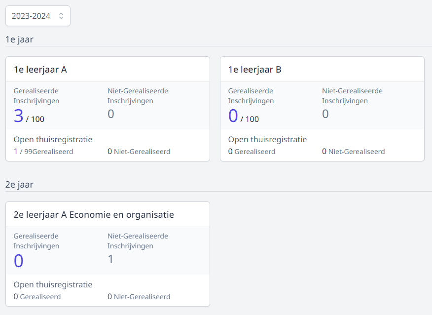
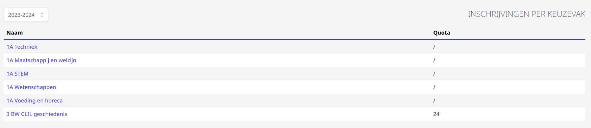

Alle inschrijvingen worden gebundeld en kunnen opgevolgd worden per studierichting, per keuzevak of in één globaal overzicht. Via deze overzichten is het eveneens mogelijk om een thuisaanmelding te finaliseren, gegevens te wijzigen of een inschrijving volledig te verwijderen. 

## Opvolging per studierichting

Per studiejaar kan je de inschrijvingen voor elke studierichting raadplegen. In het overzicht zie je meteen het aantal afgewerkte inschrijvingen en het aantal thuisregistraties. Indien je quota hebt ingevuld, worden ook die getoond. Klik op een studierichting om de afzonderlijke inschrijvingen te bekijken.  

Via de filters (links) kan je instellen welke inschrijvingen je wil tonen. 
Aan de hand van het selectiemenu bij <LegacyAction img="kolom.PNG"/> kan je aanvinken welke kolommen er getoond moeten worden. Je kan alle kolommen sorteren door bovenaan op de titel van de kolom te klikken. Dit is handig wanneer je bv. wil sorteren op datum en tijdstip van inschrijven.  

Bovenaan in de lijst zie je de afgewerkte inschrijvingen. Daaronder staan de thuisinschrijvingen. 

Volgende acties zijn mogelijk:

<LegacyAction img="oog.PNG"/> Een inschrijving bekijken en eventueel (persoonlijke gegevens) aanpassen. 

 Gekoppelde documenten kan je via deze weg ook opnieuw opvragen en afdrukken. Het wijzigen van studierichting kan **niet** op deze manier. Daarvoor moet je de leerling uitschrijven uit deze studierichting en inschrijven in de andere studierichting. Kijk dus eerst na of er in de andere studierichting nog plaats is. Na uitschrijven is de leerling zijn plaats kwijt. 

<LegacyAction img="remove2.PNG"/> Een leerling uitschrijven. 

 De gegevens van een uitgeschreven leerling kan je achteraf nog steeds raadplegen. 

<LegacyAction img="finaliseren.PNG"/> Een thuisinschrijving finaliseren. 

 Eens een thuisinschrijving is gefinaliseerd, verdwijnt die uit de onderste lijst en komt die in de lijst met afgewerkte inschrijvingen te staan. 

## Opvolging per keuzevak

Klik op het keuzevak om de inschrijvingen voor dat vak te raadplegen. 

## Globaal overzicht

In dit overzicht vind je alle inschrijvingen terug. Er zijn 2 aparte lijsten: één voor de gefinaliseerde inschrijvingen en één voor de thuisinschrijvingen. Je kan eenvoudig wisselen tussen de 2 lijsten door te klikken op <LegacyAction img="inschrijvingen.PNG"/>.

Ook in dit overzicht kan je kiezen welke kolommen je wil tonen en kan je elke kolom steeds sorteren door bovenaan op de naam van de kolom te klikken. Op deze manier kan je de lijst bv. sorteren op studierichting.

Je vindt dezelfde icoontjes terug als bij de opvolging per studierichting. De functie van de icoontjes kan je hierboven lezen bij 'Opvolging per studierichting'.

De opmerkingen die worden ingegeven in het opmerkingenveld zijn voor alle gebruikers van de module Inschrijvingen zichtbaar. 

