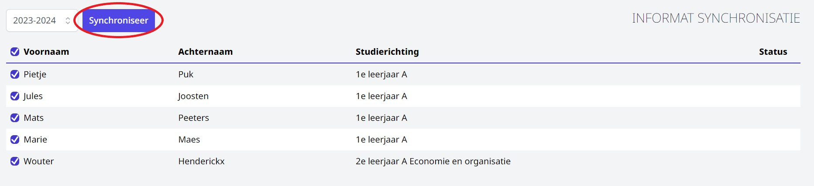

## Informat

De inschrijvingen kunnen via een druk op de knop geïmporteerd worden in Informat. Vink de inschrijvingen die je wil overzetten aan en klik op de knop <LegacyAction text="Synchroniseer"/>. Vervolgens komen deze inschrijvingen in het acceptatiescherm in Informat terecht.

Voor het administratief pakket Wisa wordt er een exportfunctie naar Excel voorzien. 

## Wisa/Excel

Bij de overzichten per studierichting alsook bij de globale overzichten vind je de knop <LegacyAction img="download.JPG"/> terug. Aan de hand van deze knop kan je de inschrijvingen exporteren naar Excel. Met behulp van dit document kan je de inschrijvingen inlezen in Wisa. 