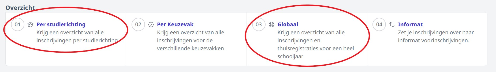

## Informat

:::danger belangrijke info voor internaten
Internaten kunnen hun inschrijvingen NIET importeren in Informat. Zijn zullen alle inschrijvingen nog manueel moeten ingeven in het administratief pakket. 
:::

De inschrijvingen kunnen via een druk op de knop geïmporteerd worden in Informat. Vink de inschrijvingen die je wil overzetten aan en klik op de knop <LegacyAction text="Synchroniseer"/>. Vervolgens komen deze inschrijvingen in het acceptatiescherm in Informat terecht.

Volgende informatie wordt doorgestuurd naar Informat:

**Leerling**
- naam
- bijkomende voorna(a)m(en)
- voornaam
- geboortedatum
- geboorteland
- nationaliteit
- geslacht
- geboorteplaats
- rijksregisternummer
- eID nummer
- foto (eID)
- gsm-nummer
- e-mailadres
- religie

**Relaties**

Enkel de gegevens van de leerplichtverantwoordelijken worden doorgestuurd naar Informat. Dit zijn er maximaal 2. De relaties 'broer' en 'zus' kunnen niet doorgestuurd worden naar Informat. Deze twee relatietypes kunnen dan in Toolbox ook niet aangeduid worden als leerplichtverantwoordlijke. 
- type relatie (vader, moeder, ...)
- naam
- voornaam
- adres
- telefoonnummer
- gsm nummer
- e-mailadres
- rijksregisternummer
- ‘er mag post verstuurd worden’: ja of nee

**Adressen: van leerling en van maximaal 2 relaties (nl. enkel de leerplichtverantwoordelijken)**
- straat
- nummer
- bus
- postcode
- gemeente
- land
- is domicilie / is aanschrijfadres / is verblijfplaats

**Inschrijving**
- schooljaar
- instellingsnummer
- structuur
- locatieID 
- administratieve groep
- registratiedatum
- startdatum
- status (gerealiseerd)

## Foutmelding bij importeren (Informat)

Het kan gebeuren dat je een foutmelding krijgt op een bepaalde inschrijving wanneer je de leerlingen wil importeren in Informat, waardoor er één of meerdere leerlingen niet overgezet kunnen worden. Dit komt voor als er bepaalde gegevens in de inschrijving niet correct zijn. In de module Inschrijvingen bij het menu 'Informat' kan je nagaan wat de foutmelding precies is en het nodige doen om de inschrijving te corrigeren. 

- Stel eerst de filter voor de status in op 'Fout'. Nu krijg je een overzicht te zien van alle inschrijvingen die een fout hebben gegeven bij het overzetten naar Informat.
- Klik op het rode kruisje achteraan om de foutmelding weer te geven.

    

- Aan de hand van de foutmelding kan je achterhalen wat er precies is misgelopen. In het onderstaande voorbeeld lag de startdatum van de inschrijving buiten het betreffende schooljaar. 

    

- Doe de nodige aanpassingen aan de inschrijving zelf of aan de studierichting (afhankelijk van de foutmelding). 
- Om een aanpassing te doen aan de inschrijving, sluit je de foutmelding en klik je achteraan op het blauwe oogje. Hiermee open je de inschrijving en kan je die op verschillende plekken bewerken. 

    

    

- Probeer opnieuw te synchroniseren nadat je de aanpassingen hebt bewaard. 

## Wisa/Excel

Voor het administratief pakket Wisa is er een exportfunctie naar Excel voorzien. 

Bij de overzichten per studierichting alsook bij de globale overzichten vind je de knop <LegacyAction img="download.JPG"/> terug. Aan de hand van deze knop kan je de inschrijvingen exporteren naar Excel. Met behulp van dit document kan je de inschrijvingen inlezen in Wisa. 

