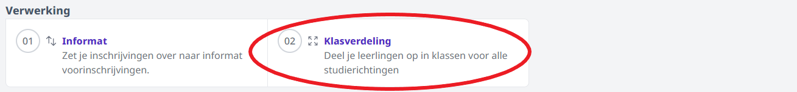
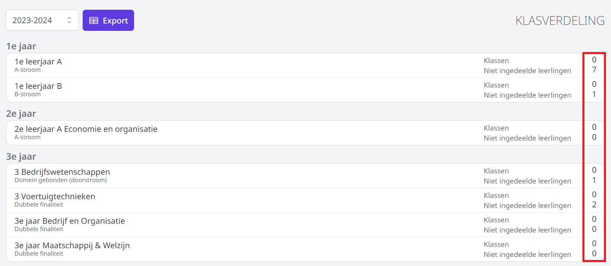
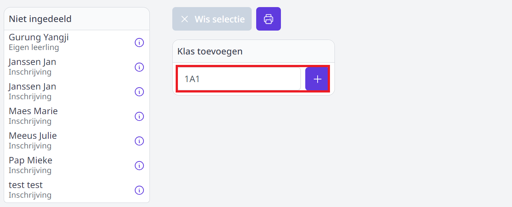
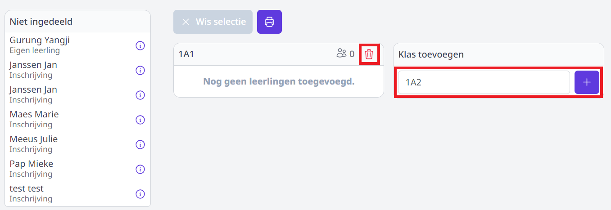
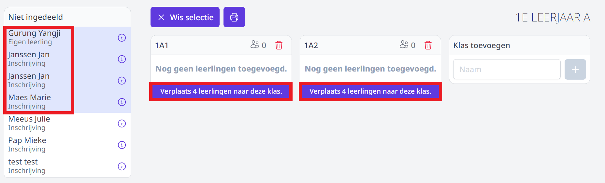
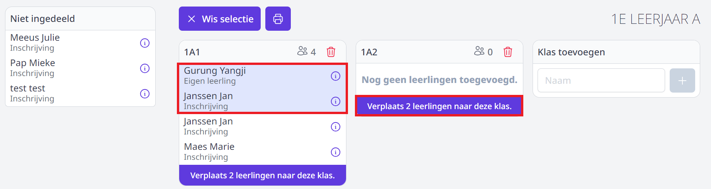
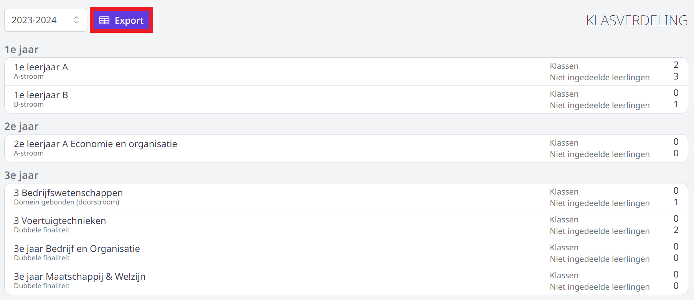
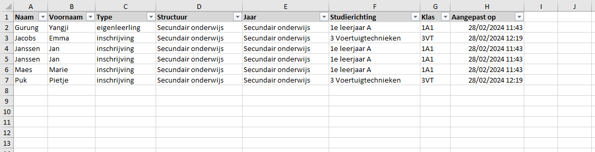
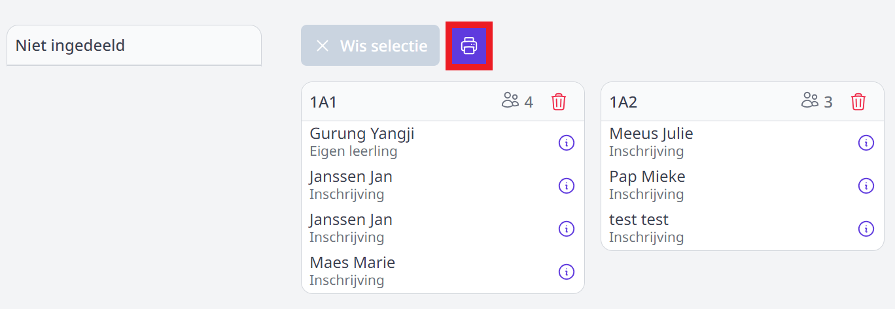
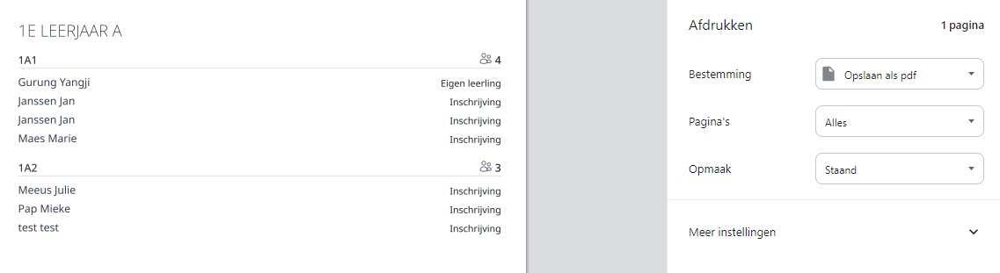

Aan de hand van de inschrijvingen per studierichting is het mogelijk om de leerlingen op een eenvoudige manier in te delen in klassen. Deze tool is ontwikkeld om de klasverdeling te laten maken door collega's die geen toegang hebben tot het administratief pakket (Infomat/Wisa). Het is echter **niet** mogelijk om de leerlingen via een synchronisatie met Informat meteen te koppelen aan de overeenkomstige klas in het administratief pakket. Het is meer bedoeld als werkinstrument voor bv. graad- of jaarcoördinatoren die verantwoordelijk zijn voor het opmaken van de klasverdeling. 

Enkele voordelen op een rijtje:
- Gedaan met lijstjes op papier of in Excel. 
- Iedereen (met toegang) kan steeds de stand van zaken van de klasindelingen raadplegen. 
- Wordt er op een later moment nog een leerling ingeschreven, dan staat die meteen in het overzicht van de niet-ingedeelde leerlingen. 
- Alle geregistreerde info m.b.t. de studierichting én de antwoorden uit de eigen pagina's zijn beschikbaar voor de klasverdeling. 

## Gebruikersrechten

Om enkel de klasverdeling te kunnen opmaken, is het gebruikersrecht **Inschrijvingen_klasverdeling** noodzakelijk. Iemand met het gebruikersrecht Inschrijvingen_beheer heeft sowieso toegang tot de volledige module, dus ook tot het onderdeel voor de klasverdelingen.

## Klassen toevoegen aan studierichting

In het overzicht zie je helemaal achteraan in één oogopslag hoeveel klassen er per studierichting beschikbaar zijn en hoeveel leerlingen er nog niet zijn ingedeeld in een klas. 

- Klik in het overzicht op een studierichting om één of meerdere klassen aan te maken binnen die studierichting. 
- Geef de klas een naam en klik op het plusteken om ze toe te voegen.

- Voeg eventueel op dezelfde manier nog bijkomende klassen toe.
- Gebruik het rode vuilnisbakje om een klas terug te verwijderen. Leerlingen die reeds gekoppeld waren aan die klas zullen opnieuw bij de niet-ingedeelde leerlingen komen te staan. 

## Leerlingen toevoegen aan klas 

- Klik in het overzicht op de studierichting waarvoor je de klasverdeling wil opmaken. 
- In de linkerkolom worden alle leerlingen weergegeven die ingeschreven zijn voor deze studierichting en die nog **niet** in een klas zijn ingedeeld. Selecteer één of meerdere leerlingen uit de linkerkolom om ze in te delen in een klas. 
- Van zodra er leerlingen zijn geselecteerd, verschijnt er onderaan elke beschikbare klas de mogelijkheid om de leerlingen naar die klas te verplaatsen. Klik bij de gewenste klas onderaan op de knop 'Verplaats X leerlingen naar deze klas.'

- Heb je een leerling verkeerd ingedeeld, dan kan je die opnieuw selecteren en op de hogervermelde manier verplaatsen naar een andere klas. 

- Via de infobol achter elke leerling worden de keuzevakken (indien van toepassing) en alle antwoorden uit de eigen pagina's weergegeven. Op die manier kan je b.v. makkelijk alle leerlingen met hetzelfde keuzevak samenzetten in één klas. De leerlingenselectie blijft behouden wanneer je op de infobol klikt. Bij de eigen leerlingen worden hier ook de eventuele opmerkingen getoond. Ze kan je bij de herinschrijving reeds belangrijke info m.b.t. de klasverdeling noteren. 

<Thumbnails img={[
    require('./klasverdeling7.png').default, 
]} />

## Klasverdeling exporteren naar Excel

Via de overzichtspagina van het onderdeel 'Klasverdeling' is het mogelijk om een export te maken naar Excel. Opgelet! Dit is enkel een export van de leerlingen die reeds zijn ingedeeld in een klas. 

## Klaslijsten printen (naar pdf)

Per studierichting is het ook mogelijk om klaslijsten af te drukken. 
- Klik in het overzicht op de gewenste studierichting waarvoor je de klaslijsten wil afdrukken.
- Klik op het printicoontje en volg de instructies op het scherm.  

