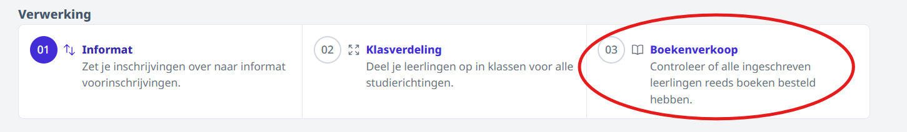
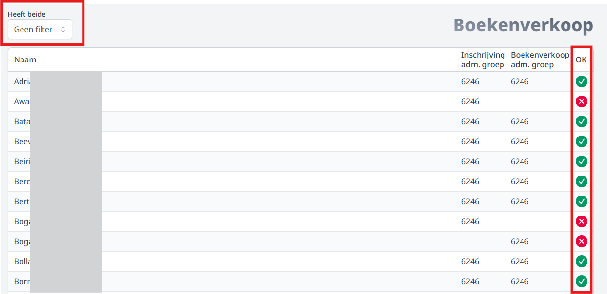
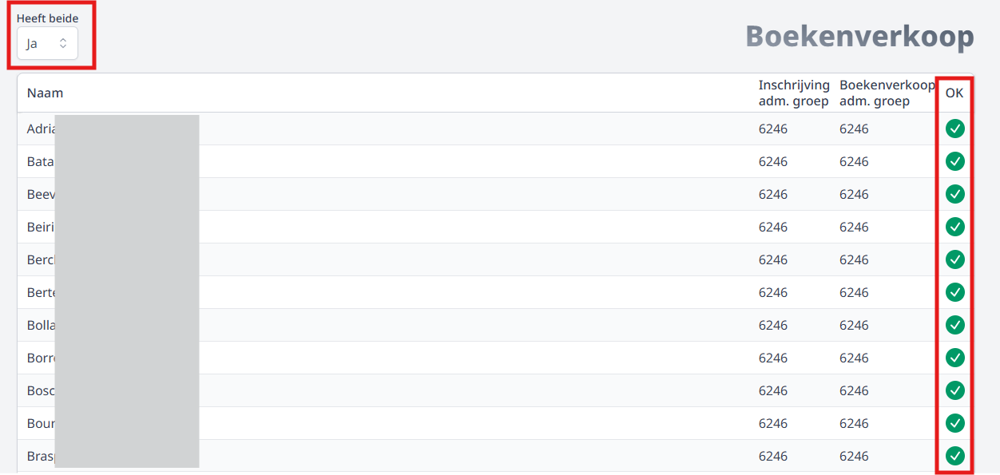
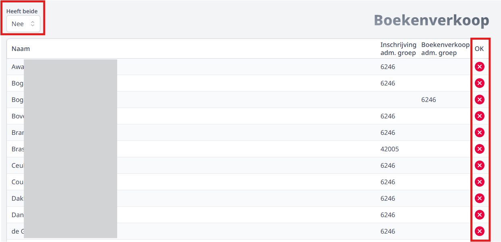

In het menu **Boekenverkoop** is het mogelijk om een vergelijking te maken tussen de geplaatste bestellingen in de module Boekenverkoop en de (her)inschrijvingen van leerlingen. Die vergelijking vind je terug bij het onderdeel Verwerking helemaal onderaan. Deze functionaliteit maakt het mogelijk om heel snel op te sporen welke leerlingen al wel hebben (her)ingeschreven, maar nog geen boekenpakket hebben besteld of andersom. Je kan er ook nagaan of leerlingen voor de juiste studierichting een boekenpakket hebben besteld.

De voorwaarden om gebruik te kunnen maken van deze functionaliteit:

- Beschikken over het gebruikersrecht **'inschrijvingen_gebruik'**. Dan kan men toekennen via de module [Gebruikersbeheer](/gebruikersbeheer).
- De leerlingen moeten reeds **ingeschreven zijn in Informat** in de juiste studierichting. Indien de inschrijvingen zijn verlopen via Toolbox of iVoorinschrijvingen, dan moeten ze geaccepteerd zijn in Informat.
- In de module Boekenverkoop moet het **nummer van de administratieve groep** zijn ingevuld bij de studierichting. Dit is nodig om de match met de inschrijving uit Informat te kunnen maken.

Standaard staat de filter rechtsboven uit. In dat geval worden alle leerlingen getoond. Dat zijn de leerlingen die ofwel ingeschreven zijn in Informat, ofwel een boekenpakket hebben besteld via de module Boekenverkoop of beide. 

De leerlingen met een **groen vinkje achteraan** hebben beide. Ze zijn ingeschreven in Informat én hebben een boekenpakket besteld. Aan de hand van het nummer van de administratieve groep kan je nog nagaan of de leerlingen wel degelijk voor de juiste studierichting een boekenpakket hebben besteld. Wanneer er verschillende administratieve groepen worden getoond bij eenzelfde leerling, kan je die leerling best contacteren. Er is vermoedelijk een fout gebeurd bij het inschrijven of bij het bestellen van de boeken. Eén van de twee is de foutieve studierichting. 

Leerlingen met een **rood kruisje achteraan** hebben slechts één van beide. Ze zijn ofwel ingeschreven in Informat, maar hebben nog geen boekenpakket besteld. Ofwel hebben ze wel een boekenpakket besteld, maar zijn ze nog niet ingeschreven in Informat. Voor deze leerlingen moet dus ook nog actie ondernomen worden. 

