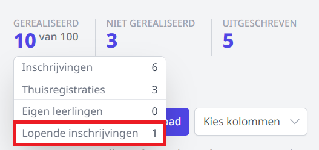

## 1. Welke quota kan je instellen op een studierichting?

Er zijn twee afzonderlijke quota die je kan instellen op een studierichting: “Quota” en “Quota thuisaanmedlingen”. Wanneer je deze velden leeg laat, stel je geen quota in. Opgelet! 0 is niet gelijk aan leeg.

## 2. Hoe beïnvloeden de quota nieuwe inschrijvingen?
### 2.1 Quota
    Om te begrijpen hoe de quota werken, is het belangrijk om te begrijpen hoe we het aantal leerlingen voor een studierichting bepalen. Deze worden samengesteld door volgende aantallen op te tellen:
        - Alle gerealiseerde, niet-uitgeschreven **inschrijvingen**
        - Alle gerealiseerde, niet-uitgeschreven **thuisaanmeldingen**
        - Alle heringeschreven **eigen leerlingen**
        - Alle **lopende** inschrijvingen of thuisaanmeldingen
        Net nadat je tijdens een inschrijving of thuisaanmelding een studierichting gekozen hebt, wordt er een plaatsje gereserveerd. Dit plaatsje blijft 2 uur geldig. Zolang de inschrijving of thuisaanmelding niet afgerond is, telt het gereserveerde plaatsje ook mee voor de quota.
        
        Wanneer de quota niet overschreden zijn, zijn nieuwe inschrijvingen en thuisaanmeldingen (tenzij het “Quota thuisaanmeldingen” overschreden is) mogelijk en krijgen deze automatisch de status “gerealiseerd”. Wanneer de quota wel overschreden zijn:
        
        - Voor nieuwe inschrijvingen en thuisaanmeldingen: deze krijgen de status ‘niet gerealiseerd’.
        - Voor eigen leerlingen: deze kunnen altijd ingeschreven worden. De quota hebben geen invloed op eigen leerlingen. Je kan dus over de quota gaan door eigen leerlingen in te schrijven.

### 2.2 Quota thuisinschrijvingen
Dit type quota is uiteraard enkel van toepassing op thuisaanmeldingen. Het werkt ook anders dan bij de normale quota. Het aantal wordt hier bepaald door het aantal lopende thuisaanmeldingen + het aantal thuisaanmeldingen (onafhankelijk van de status). Wanneer dit aantal overschreden is, wordt de studierichting **onzichtbaar** bij het thuisaanmelden. 

:::caution NOOT
Als je wil dat leerlingen thuis kunnen aanmelden voor de wachtlijst indien het quota op de studierichting is bereikt, vul je enkel het quota op de studierichting in en laat je dat van de thuisaanmelding leeg. Opgelet! 0 is niet gelijk aan leeg.
:::

## 3. Hoe worden de volgordes bepaald?
Nadat je een studierichting selecteert bij een thuisaanmelding of inschrijving, wordt er een plaatsje gereserveerd. Als de quota nog niet overschreden zijn, wordt de inschrijving/thuisaanmelding gerealiseerd en wordt er geen volgnummer toegekend. Indien er geen plaats meer is, worden er per studierichting oplopende volgnummers toegekend (1,2,3,…)

Aangezien sommige inschrijvingen/thuisaanmeldingen niet afgerond worden, kan het zijn dat er gaten ontstaan in de nummering van de volgordes. Op zich is dit niet erg omdat oplopende nummers nog altijd de juiste volgorde aanduiden. Dit is ook het nummer dat vermeld wordt op de weigeringsattesten.

In de overzichten in toolbox is het veld ‘wachtrij positie’ beschikbaar. Dit geeft weer op de hoeveelste positie een leerling staat in de wachtrij. Deze kan dus verschillen van het nummer op het weigeringsattest. Een voorbeeld waarvoor de quota op 1 staan, chronologisch:
    - Leerling A schrijft zich in → inschrijving wordt gerealiseerd
    - Leerling B schrijft zich in → krijgt volgnummer 1
    - Leerling C start een inschrijving, maar rondt deze niet af → krijgt volgnummer 2
    - Leerling D start een inschrijving → krijgt volgnummer 3
    
    Merk op dat leerling D volgnummer 3 krijgt, ondanks dat hij op positie 2 in de wachtrij staat. Wanneer de inschrijving van leerling B later manueel gerealiseerd wordt, zal leerling D op wachtrij positie 1 staan.
    
## 4. Een nieuwe inschrijving of thuisaanmelding wordt niet gerealiseerd, terwijl de quota nog niet overschreden zijn.
Vanaf wanneer er voor een studierichting niet gerealiseerde thuisaanmeldingen of inschrijvingen zijn, krijgen alle volgende inschrijvingen of thuisaanmeldingen ook de status “niet gerealiseerd”. Als we dit **niet** zouden doen, zou volgend scenario mogelijk zijn:

De studierichting heeft quota = 2
    - Leerling A start een inschrijving om 13:00 → inschrijving wordt afgerond en gerealiseerd.
    - Leerling B start een inschrijving om 13:30 → inschrijving wordt niet afgerond, zijn plaats wordt echter wel 2 uur lang gereserveerd.
    - Leerling C start een inschrijving om 14:00 → inschrijving wordt afgerond, maar niet gerealiseerd omdat de gerealiseerde plaatsen reeds ingenomen worden door leerling A en B.
    - Leerling D start een inschrijving om 17:00 → inschrijving wordt afgerond en gerealiseerd omdat enkel leerling A een gerealiseerde plaats heeft.
    
    Merk op dat leerling D gerealiseerd wordt en leerling C niet. Dit scenario borgt de volgordes niet en moeten we zien te vermijden. Daarom hanteren we hogeromschreven maatregel.

## 5. De nummers op de weigeringsattesten komen niet overeen met de volgorde van de wachtrij.

Toolbox bepaalt de volgorde van het weigeringsattest bij de start van de inschrijving, meer bepaald bij de selectie van de studierichting. Op dat moment wordt er een plaatsje gereserveerd dat 2 uur geldig blijft en wordt er ook reeds een nummer voor het weigeringsattest gegenereerd. Als er een inschrijving vervolgens niet wordt afgerond, dan ontstaat er een "gat" in de nummering op de weigeringsattesten.

De "wachtrij positie" kolom in Toolbox duidt de effectieve positie aan van de leerling op de wachtlijst van de studieriching die ook rekening houdt met verschuivingen door gerealiseerde of uitgeschreven inschrijvingen. Zo kan je, bijvoorbeeld wanneer een ouder belt, steeds de actuele positie op de wachtlijst geven. 

## 6. De quota zijn nog niet bereikt, maar wanneer ik mijn niet gerealiseerde thuisaanmelding finaliseer, blijft deze “niet gerealiseerd”.
Dat klopt, wanneer een thuisaanmelding gefinaliseerd wordt, behoudt de uiteindelijke inschrijving de originele status (gerealiseerd of niet gerealiseerd) en volgnummer (indien niet gerealiseerd). Aangezien thuisaanmeldingen op volgorde gefinaliseerd moeten kunnen worden, is dit nodig om de volgorde te behouden. Je kan de inschrijving uiteraard achteraf altijd realiseren.

## 7. Als ik het overzicht van een studierichting raapleeg, is het aantal geraliseerde inschrijvingen hoger dan het effectief aantal gerealiseerde inschrijvingen.
    
    Dat is inderdaad mogelijk. Het aantal lopende inschrijvingen (inschrijvingen of thuisaanmeldingen die minder dan 2 uur geleden begonnen zijn) worden hier bij opgeteld, omdat deze potentieel ook gerealiseerd kunnen worden. Dit geeft het interne aantal aan dat ook gebruikt wordt om de quota te berekenen zodat je kan inschatten of nieuwe inschrijvingen gerealiseerd kunnen worden. Als je hovert over het aantal, kan je een opdeling zien tussen de verschillende onderdelen.

    Wanneer een nieuwe inschrijving of thuisaanmelding na 2 uur **niet** is afgerond, wordt die niet meer meegeteld.

## 8. Zij-instromers moeten al kunnen aanmelden/inschrijven voor volgend schooljaar, maar ik wil voldoende plaatsen reserveren voor eigen leerlingen. 

Enkele voorbeelden:
- In studierichting X zijn voor volgend schooljaar 24 plaatsen voorzien. Er wordt verwacht dat 22 van de 24 plaatsen ingenomen zullen worden door eigen leerlingen. Er zijn momenteel dus 2 plaatsen beschikbaar voor zij-instromers. 
    - Zet het quota op de studierichting op 2. Als leerlingen van thuis moeten kunnen aanmelden, vul je het quota van de thuisaanmelding niet in. Dit veld blijft leeg. 
    - Nu kan je zij-instromers inschrijven via een nieuwe inschrijving of via een thuisaanmelding. De eerste 2 aanmeldingen zullen gerealiseerd worden. Alle volgende aanmeldingen zullen op de wachtlijst terecht komen en krijgen een volgnummer toegekend zodat de correcte volgorde gewaarborgd kan worden. Het is mogelijk om meteen een weigeringsattest te genereren indien deze functionaliteit geactiveerd werd in het beheer. 
    - Vanaf 30/6 schrijf je de eigen leerlingen in. Die kan je altijd herinschrijven, ongeacht het ingevulde quota. Voor eigen leerlingen is er altijd plaats, zelfs als daarmee het quota wordt overschreden. 
    - Uiteindelijk schrijven slechts 20 eigen leerlingen in voor studierichting X. Er zijn dus 4 plaatsen vrij voor zij-instromers. Twee van die plaatsen werden eerder al ingenomen. Er zijn dus nog 2 beschikbare plaatsen. 
    - Pas het quota op de studierichting aan naar 24. Je kan nu de 2 eerste aanmeldingen op de wachtlijst realiseren en eventueel finaliseren. 

## 9. Bij het synchroniseren naar Informat zijn er foutmeldingen. Wat nu?

Lees [hier](/inschrijvingen/importeren_informat/#foutmelding-bij-importeren-informat) hoe je kan achterhalen wat er precies is foutgelopen en hoe je dat kan oplossen in de module Inschrijvingen. 

