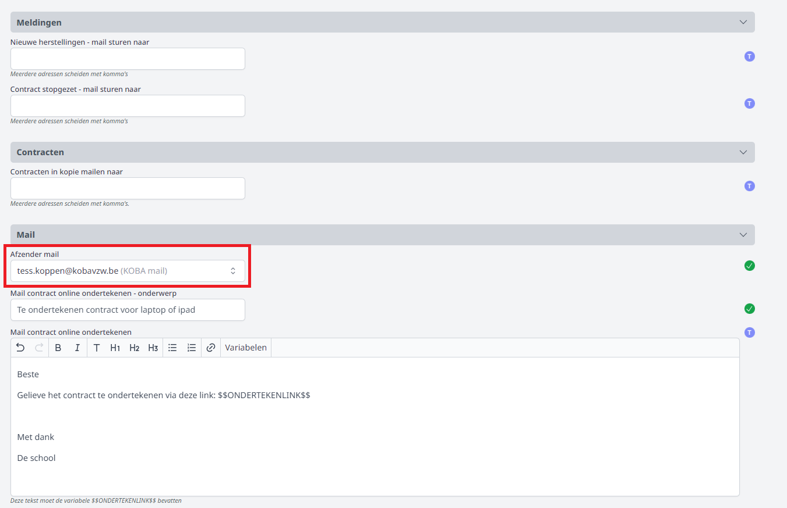

## Gebruikersrechten toekennen

Om de module Inventaris te kunnen gebruiken, moeten er rechten toegekend worden. Dat gebeurt door een beheerder via de module [Gebruikersbeheer](/gebruikersbeheer). Voor de module Inschrijvingen is dat het recht **Inschrijvingen beheer**. Indien men geen rechten heeft op de module, kan men de Inventarismodule wel openen, maar krijgt men enkel een scherm met een zoekveld te zien. Wanneer een toestel gevonden wordt, kan men in het zoekveld de inventarisnummer, serienummer of assettag invullen en krijgt men de inventarisgegevens over het toestel te zien evenals aan welke leerling of leerkracht het toestel is toegewezen.  

## Algemene instellingen

Vooraleer je aan de slag kan met de module Inventaris, moeten er nog een aantal zaken worden ingesteld in de module Instellingen van Toolbox. Die module is enkel toegankelijk voor een beheerder. 

Allereerst moeten een aantal boekhoudkundige parameters worden ingevuld voor het opmaken van de waarborg- en herstelfacturen. 

<Thumbnails img={[
    require('./instellingen1.PNG').default,  
]} />

Vervolgens kan je instellen welke gegevens er op de etiketten getoond moeten worden en wat de instellingen zijn van de etiketten zelf.   Deze gegevens zijn op voorhand ingesteld en werkbaar voor de meeste soorten etiketten. Indien nodig kunnen de instellingen hier nog aangepast worden. Op het etiket kan enkel de variabele $$ASSETTAG$$ gebruikt worden.

<Thumbnails img={[
    require('./instellingen2.PNG').default,  
]} />

Indien je contracten wil mailen of automatische mails wil versturen naar collega's bij een nieuw contract, herstelling of stopzetting van een contract, moeten de mailsettings en de e-mailadressen van de betreffende collega's worden ingevoerd. 

Onderaan kan ook het mailbericht voor het online ondertekenen van een nieuw contract worden ingesteld. 

## Voorbereiding in de module Inventaris

Naast de algemene instellingen moeten er in de module Inventaris zelf ook nog een aantal zaken worden ingesteld om de module vlot te kunnen gebruiken. Dat zijn de onderstaande onderdelen in het menu <LegacyAction img="menu.JPG"/>. 

Op alle plekken worden volgende actieknoppen gebruikt:

- Klik <LegacyAction img="pluscircle.png"/> om toe te voegen.

- Klik <LegacyAction img="edit.png"/> om te wijzigen.

- Klik <LegacyAction img="remove.png"/> om te verwijderen. 

### Labels
Elk item kan voorzien worden van één of meerdere labels. Door middel van labels kan je zelf bijkomende informatie toevoegen waarop je makkelijk items kan groeperen. Je kan zelf labels aanmaken via het menu Labels. Elk label bevat een tekst, een voorgrondkleur en een achtergrondkleur die je zelf kan instellen. Het gebruik van labels is optioneel. 

### Leveranciers
Elk item dat je toevoegt, kan je koppelen aan een leverancier. Alvorens items aan te maken, kan je best de nodige leveranciers aanmaken via het menu Leveranciers. Via het mannetje achteraan <LegacyAction img="person.png"/> kan je per leverancier de contactperso(o)n(en) raadplegen of toevoegen. 

### Statussen
Naast de items kan je ook zelf de statussen van de items aanmaken via het menu Statussen. Daar voeg je zelf de gewenste statussen toe. Enkele voorbeelden: Actief, Defect, Te koop, Verloren, Uitgeleend, Afgevoerd, In herstelling, In bestelling, Verkocht. Bij elke status kan je aangeven of het item met die status nog in de school is of uit de school.

### Herstelstatussen
Om de herstelstatussen te definiëren ga je opdezelfde manier te werk als bij de gewone statussen. Hier gaat het echter over statussen die specifiek gekoppeld kunnen worden aan een defect toestel dat in herstelling gaat. Bij elke status kan je aangeven of de herstelling op dat moment nog open staat of al afgesloten is. Dit maakt de opvolging van makkelijker. Meer hierover vind je bij het onderdeel [Herstellingen](/inventaris/herstelling/).

### Types
Dit zijn de verschillende types van items die je wenst te registreren. In de module Inventaris ga je naar het menu Types. Daar kan je een type toevoegen. Denk bijvoorbeeld aan Beamer, Computer, Meubilair, Netwerk, Printer, Randapparatuur, Virtuele machines, Tablets, Brandblussers,...

Per type item kan je via de <LegacyAction img="pluscircle.png"/> in de kolom Subtypes nog bijkomende **subtypes** aanmaken. In het voorbeeld van het type 'Computer' kan je bijvoorbeeld de subtypes Desktop en Laptop aanmaken. In het voorbeeld van het type Netwerk kan je de subtypes Firewall, Switch, Wireless access point,... voorzien. 

### Modaliteiten

Wanneer je toestellen (items) wil koppelen aan gebruikers zal je eerst één of meerdere modaliteiten (modelcontracten) moeten aanmaken. In elke modaliteit kan je de contractvoorwaarden instellen. Zo kan je bv. een modaliteit maken voor 'laptops leraren' maar ook één voor 'tablet leerlingen', omdat de uitleenvoorwaarden voor de leraren anders zijn dan voor de leerlingen. 

Een modaliteit maak je aan via het menu Modaliteiten. Voeg een nieuwe modaliteit toe en vul vervolgens de velden in. 

- **Status toestel**: selecteer hier de nieuwe status die een toestel moet krijgen wanneer het gekoppeld wordt aan een bepaalde modaliteit. 
- **Benaming item**: hier kan je opgeven over welk soort item het gaat. Deze naam wordt mee overgenomen op de facturen. Bv. bij de benaming 'laptop' wordt dat: waarborg laptop, herstelling laptop, terugbetaling waarborg laptop. 

Moet een leerling een waarborg betalen voor het toestel? Dan kan je dat hier opgeven. Toolbox zal bij het toekennen van een toestel dan automatisch een factuur opmaken voor die waarborg. De boekhoudkundige parameters worden automatisch overgenomen uit de algemene instellingen. Indien voor dit contract andere parameters gelden, kunnen die hier (enkel voor deze modaliteit) worden aangepast. De parameters van de modaliteit overrulen die uit de module Instellingen. 

Als je je gebruikers een gepersonaliseerd document wil bezorgen, dan kan je dat in de tekstvelden aanmaken. Je kan in die tekst gebruik maken van de variabelen die onder het tekstvak staan. Op die manier kan de leerling een PDF krijgen waarin staat welk type toestel hij/zij kreeg en welk serienummer dat toestel heeft.

Toelichting bij enkele variabelen:

- $$EERSTE_ITEM...$$ is steeds van toepassing voor nieuwe contracten en wordt gebruikt in de eerste tekst 'document ontvangst toestel'). 'Eerste' slaat hier op het allereerste toestel dat aan een leerling/personeelslid werd toegekend. 
- $$HUIDIGE_ITEMS$$: deze variabele kan gebruikt worden in de derde tekst 'wijziging contract'. Wanneer er een defect toestel in herstelling gaat en een leerling/personeelslid ontvangt (tijdelijk) een ander toetsel, kan er een document afgedrukt worden waarin er overzicht getoond wordt van de items die zich momenteel in het contract bevinden. 
- $$HANDTEKENING_SCHOOL$$: om deze variabele te kunnen gebruiken, moet bovenaan in de modaliteit een handtekening geselecteerd zijn. Indien er geen handetekening beschikbaar is, mag die ingescand bezorgd worden aan het Toolbox-team. 
- $$DIGITALE_HANDTEKENING_OUDERS$$: deze variabele is nodig om het contract (of de stopzetting ervan) digitaal te kunnen laten handtekenen, **zowel door de ouders als door personeelsleden**.

In de tabel (overzicht) van de modaliteiten kan je via <LegacyAction img="list.png"/> ook nog opgeven welke **bijkomende accessoires** een gebruiker ontving. Denk bijvoorbeeld aan een adapter (lader) en een beschermhoes. Je kan daarbij optioneel ook de prijs, het merk en het model van de accessoire opgeven. De prijzen die hier worden ingegeven, worden niet doorgerekend via het contract. Ze zijn louter ter info. 

De bijkomende accessoires in een modaliteit worden automatisch mee opgenomen in de contracten waarvoor de betreffende modaliteit werd gekozen. Het is op het moment van toewijzen nog steeds mogelijk om op individueel niveau deze accessoires uit het contract te halen. 

Een modaliteit kan enkel verwijderd worden wanneer ze nog niet in gebruik is. Van zodra er één toestel aan een bepaalde modaliteit is gekoppeld, kan die niet meer verwijderd worden. Achteraan in het overzicht wordt dan dit teken <LegacyAction img="noAccess.png"/> getoond. Wijzigen aanbrengen kan altijd nog. Indien je een bepaalde gebruikte modaliteit op non-actief wil zetten, volstaat het om het vinkje <LegacyAction img="vinkjeGroenRond.png"/> uit te zetten. Het zal dan niet meer mogelijk zijn om deze modaliteit te gebruiken voor nieuwe toewijzingen. 

