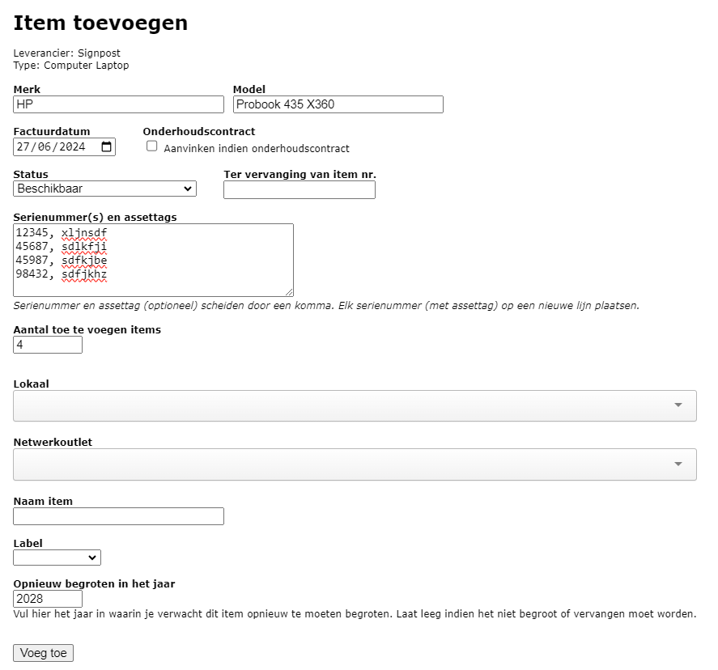
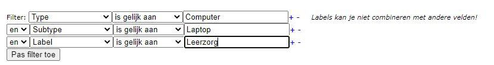

## 1. Items aanmaken

### Manueel toevoegen

Nieuwe items voeg je toe via het menu **Items school** door op <LegacyAction img="pluscircle.png" text="Item toevoegen"/> te klikken. Je krijgt nu een scherm waarin je de leverancier en het type item kan selecteren. Als dat type nog subtypes heeft, krijg je een extra lijst te zien. Indien de leverancier nog niet is aangemaakt, word je via de blauwe link <Text color="blue">'leverancierspagina'</Text> meteen doorverwezen naar het menu Leveranciers waar je de ontbrekende leverancier kan aanmaken. 

In het volgende scherm kan je bijkomende informatie over het item opgeven. In de velden **Merk** en **Model** kan je typen of je kan reeds eerder ingevulde merken of modellen uit de lijst selecteren.

De **factuurdatum** is optioneel en is die van de aankoopfactuur van het/de toetstel(len).

Als het item wordt toegevoegd ter vervanging van een bestaand item (bv. defecte tablet), dan kan je in het veld **Ter vervanging van item nr.** het itemnummer van het originele item invullen.

Het veld **serienummers** is groot en kan meerdere serienummers bevatten; telkens één serienummer per lijn. **Hierdoor kan je in één beweging meerdere items van dezelfde soort, leverancier en facturatiedatum aanmaken.** Denk maar aan een bestelling van 30 laptops van hetzelfde type. Het aantal items wordt automatisch door Toolbox geteld en ingevuld. Aan de hand daarvan kan je nagaan of het aantal ingegeven serienummers overeenkomt met het aantal toestellen dat je wil toevoegen. Je kan voor elk item naast een serienummer ook meteen een **externe assettag** meegeven. Die geef je in naast het bijhorende serienummer, gescheiden door een komma. 

Als je reeds **lokalen** hebt aangemaakt via de module [Gebouwen en lokalen](/gebouwen_lokalen) dan kan je hier alvast opgeven in welk lokaal het item komt te staan. Als je **netwerkoutlets** hebt aangemaakt in de module [Netwerken](/netwerken) dan kan je hier ook selecteren via welke outlet het items met je netwerk is verbonden. Dit zijn optionele velden.

Ook optioneel is de **naam** die je aan een item geeft. Een naam kan je gebruiken om een toestel snel te identificeren. Bijvoorbeeld 'Printer in het open leercentrum'. Verder in de handleiding zal je zien dat door het invullen van een lokaal of een naam er meteen ook een historieklijn wordt aangemaakt voor dit item. Wanneer je de toestellen aan personen wil gaan toewijzen via de modaliteiten, laat je dit veld best leeg. De naam zal automatisch gewijzigd worden naar 'Toestel toegewezen aan (*naam gebruiker*)' wanneer het toestel gekoppeld wordt aan een gebruiker.

Je kan een nieuw item alvast een **label** meegeven alsook het jaar waarin je dat item mogelijk wil gaan vervangen. Als je schat dat een computer die je in 2023 toevoegt 5 jaar mee zal gaan, dan kan je hier alvast 2028 invullen zodat je hiermee rekening kan houden in je **begroting** van dat jaar.

### Importeren

Toestellen die beheerd worden in Jamf School of Microsoft inTune kunnen geïmporteerd worden via deze icoontjes: 

Microsoft inTune geeft bij de import echter niet alle velden mee, waardoor het interessanter is om van deze toestellen een Excel-overzicht aan het Toolbox-team te bezorgen. Ook wanneer je niet met inTune werkt, kan je een overzicht bezorgen van toestellen die geïmporteerd moeten worden in de module Inventaris. 

## 2. Items zoeken en sorteren

In de tabel kan je items opzoeken door middel van de snelfilter. Je kan hier op serienummer, naam, merk,... opzoeken. 

Wil je geavanceerder zoeken, dan kan je de filter helemaal bovenaan gebruiken. In die filter kan je zelf criteria toevoegen door middel van de blauwe plus achter het veld. Zo kan je meerdere filters combineren. Er wordt pas effectief gefilderd door te klikken op 'Pas filter toe'.  Wil je een filter terug verwijderen, klik op de blauwe min. 

Je kan de gegevens in het overzicht ook sorteren. Dat kan toegepast worden in combinatie met de filters. Tot slot kan je ook nog opgeven hoeveel items je op één pagina wil tonen.

Indien er items zijn toegewezen aan gebruikers, kan je in de kolom 'Naam toestel' zien wie de begunstigde is. Door in de kolom 'Contract' te klikken op het contractnummer, open je het bijhorende contract van dit item. 

## 3. Items wijzigen

Zodra een item is aangemaakt kan je via het overzicht (menu Items school) de nodige wijzigingen aanbrengen. Dat kan per item door in de tabel op het te wijzigen gegeven te klikken. Je kan ook één of meerdere items aanvinken en vervolgens een keuze maken uit de verschillende opties bovenaan de tabel. Indien je meerdere items aanvinkt, worden de wijziging in bulk doorgevoerd. 

Via dit icoon <LegacyAction img="edit.png"/> vóór elk item kan je de details van dat item opvragen, nl. algemene gegevens, historieken van locaties, statussen, herstellingen en netwerken. 

## 4. QR codes afdrukken

Elk toestel kan voorzien worden van een QR code die gescand kan worden wanneer een toestel wordt uitgeleverd. Selecteer de toestellen waarvoor je een QR code wil genereren en klik op <LegacyAction img="qr.png" text="QR codes"/>. De labels bevatten bijkomende info over het toestel. Indien er in de module Inventaris een document van het type 'handleiding' of 'veiligheidsinstructiekaart' werd gekoppeld aan het toestel, worden deze documenten eveneens getoond bij het scannen van de QR code.

Welke info vermeld moet worden op de etiketten, kan je instellen in de module [Instellingen => Inventaris](/inventaris/voorbereiding/#algemene-instellingen) in Toolbox. 

Wil je zelf labels maken via bv. labelsoftware, gebruik dan de export naar Excel. Achteraan is er voor elk toestel een link terug te vinden die je (in de labelsoftware) kan omzetten naar een QR code.

## 5. IP-adressen koppelen 

Als toestellen in je netwerk een (vast) ip-adres krijgen, kan je dat hier ook registreren. Klik op het wijzig icoontje <LegacyAction img="edit.png"/> van een item en ga naar het tabblad netwerk. Daar kan je één of meerdere ip-adressen toevoegen. Je kan ook het type van netwerkadapter opgeven (vast, draadloos, virtueel,...). Een overzicht van alle gebruikte IP-adressen kan je opvragen via de module [Netwerken](/netwerken).

