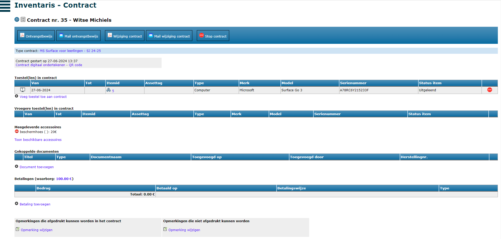
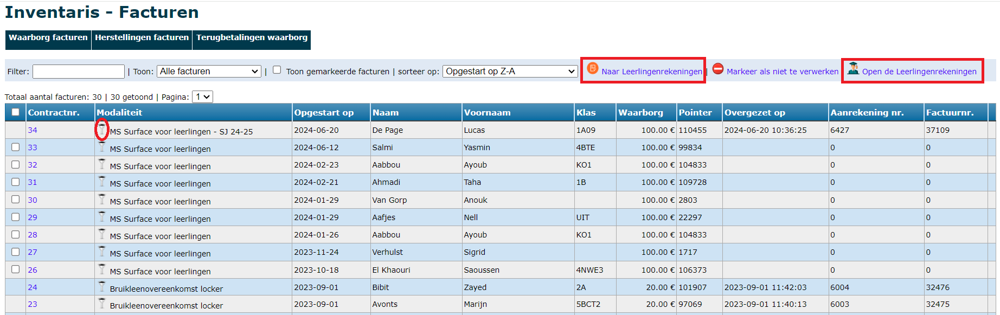

Alvorens je toestellen kan toewijzen aan gebruikers, moet er minimaal 1 modaliteit zijn aangemaakt. Lees [hier](/inventaris/voorbereiding/#modaliteiten) alles over het aanmaken van modaliteiten.

## Toestel toewijzen
Via het menu Toewijzen kan je een item koppelen aan een gebruiker. Zoek eerst naar de leerling of leraar. Heeft die gebruiker reeds een toestel toegewezen gekregen, dan zal het systeem dat laten zien. Je kan echter altijd bijkomende toestellen toewijzen, al raden we aan om toestellen steeds binnen hetzelfde contract toe te wijzen. Dat doe je via deze weg door op het nummer (blauwe link) van het contract te klikken. 

Als je de juiste persoon hebt gevonden, vul je het inventarisnummer, serienummer of externe assettag in het tekstvak in. Je kan hiervoor ook een barcodescanner gebruiken als je veel toestellen moet uitleveren.

Geeft de nieuwe status van het toestel in, bv. uitgeleend en selecteer de modaliteit waaraan je het toestel wil koppelen. Klik vervolgens op 'Wijs toestel toe'.

Er wordt nu een nieuw contract opgemaakt. Binnen dat contract wordt het toestel aan de gebruiker gekoppeld. 

## Contract

Na het toewijzen, kom je rechtstreeks in het scherm van het contract terecht. Hier kan je de overeenkomst verder finaliseren. Je kan ook steeds de contracten raadplegen via het menu > Contracten. Daar krijg je automatisch een overzicht van de **lopende contracten**, maar je kan ook alle afgelopen contracten nog raadplegen. Volgende overzichten zijn mogelijk:
- Alle contracten
- Lopende contracten
- Afgesloten contracten
- Alle ingeschreven leerlingen (met de vermelding wie een contract heeft en wie niet)
- Leerlingen zonder contract
- Uitgeschreven leerlingen met contract

Je kan in de overzichten zoeken op naam en/of klas en je kan de resultaten op verschillende manieren sorteren. Klik op <LegacyAction img="detail.png"/> om het contract te openen. 

In het scherm van het contract heb je een overzicht van het toegewezen toestel, de meegeleverderde accessoires, te betalen waarborg, ...
Je kan enkel **accessoires** toevoegen die gekoppeld zijn aan de gekozen modaliteit. Indien je bijkomende accessoires wil opnemen in het contract, voeg je die toe op niveau van de modaliteit (via menu > [Modaliteiten](/inventaris/voorbereiding/#modaliteiten)). Indien je aan het contract een **document** toevoegt, is dat gekoppeld aan het contract van deze leerling/leraar en niet aan het item. Dit kan bv. een volmachtdocument zijn van de ouders. Alle toegevoegde documenten zijn te raadplegen via het menu > [Documenten](/inventaris/documenten/). 

Een **betaalde waarborg** of ontvangen voorschot kan je registreren bij <LegacyAction img="pluscircle.png" text="Betaling toevoegen"/>. Dat kan voor een betaling met bancontact, POM (mits contract met deze betaalprovider) of cash. Betalingen kunnen opgevolgd worden via het menu > [Betalingen](/inventaris/toestel_toewijzen/#betalingen). Indien er aan de modaliteit een waarborg gekoppeld is, wordt er sowieso een factuur opgemaakt, ongeacht of er een betaling is geregistreerd. Deze facturen kunnen worden overgezet naar de leerlingenrekeningen om vervolgens in te lezen in Exact Online. Indien er **geen betaling** werd geregistreerd, is het mogelijk om de automatisch aangemaakte facturen via de leerlingenrekeningen verder te verwerken, bv. facturen afdrukken of digitaal bezorgen aan de ouders en opvolgen via de module Openstaande facturen. Lees hierover meer in het onderdeel [Facturen](/inventaris/toestel_toewijzen/#facturen).

Je kan eventueel ook **opmerkingen** toevoegen aan het contract. Je hebt opmerkingen die mee in het contract kunnen worden afgedrukt (mits de variabele $$OPMERKINGEN$$ in de tekst werd opgenomen), maar ook opmerkingen die niet afgedrukt worden en meer voor intern gebruik zijn bedoeld.

## Contract ondertekenen

Indien het contract volledig op punt staat, kan het ondertekend en/of afgedrukt worden. Het contract kan **digitaal ondertekend** worden indien de variabele $$DIGITALE_HANDTEKENING_OUDERS$$ gebruikt werd in de modaliteit. Dat kan door bovenaan te klikken op 'contract digitaal ondertekenen' of door met een mobiel toestel de QR code te scannen. Onderstaand scherm verschijnt waarin men kan handtekenen. Het contract kan voorafgaand aan het ondertekenen worden gedownload (niet ondertekende versie ter controle) of meteen na het ondertekenen (de ondertekende versie). 

<Thumbnails img={[
    require('./toewijzen4.PNG').default, 
    require('./toewijzen5.PNG').default, 
]} />

Wanneer het contract ondertekend is, wijzigt bovenaan in het scherm van het contract de status naar 'Contract is digitaal ondertekend'. Je kan eventueel de handtekening verwijderen en het ondertekenproces opnieuw starten. 

Helemaal onderaan in het contract kan je een ontvangstbewijs (al dan niet digitaal ondertekend) afdrukken of het ontvangstbewijs mailen naar een nog nader te bepalen ontvanger. 

<Thumbnails img={[
    require('./toewijzen6.PNG').default, 
    require('./toewijzen7.PNG').default, 
]} />

Contracten kunnen ook **in bulk gemaild** worden **ter ondertekening**. Dit kan handig zijn wanneer toestellen in de klassen worden uitgedeeld en de waarborgfacturen vooraf of achteraf aan de leerlingen worden bezorgd. De toestellen moeten reeds toegewezen zijn aan een leerling, waardoor er automatisch een contract werd opgemaakt. Ga vervolgens naar het menu > Contracten. Kies in de dropdownlijst de gewenste contracten en vink de te versturen contracten aan. Klik tot slot op <LegacyAction img="mail.png" text="Mail contracten ter ondertekening"/>.

## Contract wijzigen

Stel dat iemand een lopend contract heeft maar een ander toestel moet krijgen. Kan je ervoor voor kiezen om het bestaande contract te behouden en enkel het huidige toestel te stoppen. Dat doe je door achteraan in de tabel met toestellen op het Stop-icoon <LegacyAction img="stop.png"/> te klikken. Hierdoor geef je aan dat het contract nog wel loopt maar dat het toestel niet meer in bezit is van de gebruiker. Je kan nu eventueel een ander toestel toevoegen aan het lopende contract.

Als een toestel defect geraakt binnen een lopend contract, is het aanbevolen om ook dat via het contract te registreren. Vóór elk toestel staat er een icoontje <LegacyAction img="defect.png"/> waarmee je schade kan registreren, de status van het toestel kan aanpassen en eventueel de kostprijs voor de gebruiker kan vaststellen. Wanneer dit bedrag wordt ingevuld, zal Toolbox automatisch een herstelfactuur aanmaken dat via de leerlingenrekeningen verder verwerkt kan worden. 

De defecten/herstellingen worden binnen het contract onder het juiste toestel getoond. Zo kan je heel snel zien of een leerling een toestel al meermaals heeft beschadigd. Meer over het **registreren en opvolgen van herstellingen** kan je [hier](/inventaris/herstelling/) lezen.

Je kan eveneens een bevestiging van de wijziging van het contract afdrukken of via mail versturen. De teksten voor dit document moeten op voorhand worden ingesteld bij de modaliteiten (Tekst wijziging contract).  

## Contract stopzetten
Het stopzetten van een contract gebeurt helemaal onderaan in het contract via de knop <LegacyAction img="stop.png" text="Stop contract"/>. Als je een contract stopt, kan je bijkomende informatie over de staat van het toestel invullen. Je kan het toestel ook meteen een nieuwe status binnen de inventaris geven (bv. opnieuw beschikbaar of in herstelling). Vervolgens kan je het inleverbewijs afdrukken of per mail versturen. De teksten voor dit document moeten op voorhand worden ingesteld bij de modaliteiten (Tekst document inlevering toestel). 

Indien er een waarborg aan het contract was gekoppeld, wordt er bij het stopzetten automatisch een creditnota aangemaakt voor de terugbetaling ervan. Als er schade is vastgesteld én er wordt een kostprijs ingevuld, zal dat bedrag van de waarborg worden afgehouden.  De credinota's kunnen eenvoudig worden overgezet naar de leerlingenrekeningen om vervolgens in te lezen in Exact Online. Bij schade is het zinvol om ook een herstelling voor het item aan te maken. Daar kan een foto van de vastgestelde schade aan worden toegevoegd. Voor meer info over herstellingen klik [hier](/inventaris/herstelling/). 

## Toegewezen toestellen 
Via het menu **Toegewezen** kan je zien welke toestellen aan welke persoon zijn toegewezen. Daar vooraan op het contractnummer te klikken, open je het contract. Door op het item nr. te klikken, open je het item. In het menu **Items school** zie je in de kolom 'Naam toestel' ook steeds aan wie het toestel is toegewezen. 

## Betalingen

In het contract kan je een betaling (van bv. een waarborg) registreren. Die betaling moet vervolgens boekhoudkundig verwerkt worden en gekoppeld worden aan de overeenkomstige factuur. Een betaling registreren kan voor volgende betaalmodaliteiten:

- **Bancontact**: Hiervoor moet de school beschikken over een betaalterminal. Het is mogelijk om de terminal zo in te stellen dat elke transactie apart in Exact Online terecht komt. Alvorens de ouders kunnen betalen, moet er een referentie in het toestel worden ingevoerd. Dat is steeds het contractnummer. Door op deze manier te werken, worden de waarborgfacturen na het inlezen in Exact Online automatisch afgepunt.  
- **Cash**: Wanneer ouders cash betalen, kan de betaling worden overgezet naar de module [Kas](/kas) in Toolbox. Van daaruit kan de betaling (gekoppeld aan het contractnummer en de juiste leerlingenfiche) overgezet worden naar Exact Online. 
- **POM**: Om via deze weg betalingen te kunnen ontvangen, moet er een contract afgesloten zijn met de betaalprovider POM. Als deze betaalwijze werd gekozen, wordt er een QR code gegenereerd die kan gescand worden. Van zodra een ouder betaalt, wordt er vanuit de betaalprovider POM onmiddellijk een melding gegeven aan Toolbox dat die factuur betaald werd. Nadien komt dat geld op de rekening van de school en wordt de factuur automatisch afgepunt, omdat POM de juiste mededeling mee doorstuurt naar de boekhouding. Tarieven raadplegen en POM activeren kan via https://app.pom.be/nl/connect/koba-toolbox/tarieven. POM zal pas functioneel zijn als het contract is geactiveerd.
 
 

Van zodra er betalingen zijn geregistreerd, kunnen die opgevolgd worden via het menu **Betalingen**. Daar zie je standaard een overzicht van alle betalingen, maar je kan ook lijst opvragen van de betalingen per betaalmodaliteit (BC, cash of POM). Verder kan je de resultaten filteren op bedrag of sorteren volgens een aantal parameters. Standaard worden enkel de betalingen op de huidige datum getoond. Dat kan eenvoudig aangepast worden door bovenaan de begindatum te wijzigen naar een datum in het verleden.

Cashbetalingen kunnen via deze weg overgezet worden naar de Kas in Toolbox (op voorwaarde dat die module in gebruik is). Vink de te werken betalingen aan en klik op <LegacyAction img="geld.png" text="Zet over naar kas"/>. Selecteer de gewenste kas en grootboekrekening en zet over. Het inlezen van de verrichting naar Exact Online gebeurt rechtstreeks in de Kas-module.

## Facturen
In het menu **Facturen** kan je de door Toolbox aangemaakte facturen opvolgen. Dat kunnen waarborgfacturen zijn, maar ook herstelfacturen als gevolg van schade/herstellingen of creditnota's na het stopzetten van een contract. 

Via een dropdownlijst kan je per factuurtype kiezen of je alle facturen of enkel de verwerkte of nog te verwerken facturen wil zien. Facturen die nog niet zijn overgezet naar de module Leerlingenrekeningen (= te verwerken), hebben achteraan factuurnummer 0. Je kan ze aanvinken en vervolgens overzetten naar de module Leerlingenrekeningen via de knop <LegacyAction img="factuur.png"/>. De facturen worden daar aangemaakt in een aparte school 'Inventaris'. Die school wordt automatisch aangemaakt wanneer je de eerste keer facturen overzet vanuit de module Inventaris. 

De filter <LegacyAction img="filter.png"/> in de kolom Modaliteit maakt het mogelijk om de 'te verwerken facturen' te filteren op modaliteit en zo facturen met een verschillende modaliteit apart over te zetten naar de module Leerlingenrekeningen. Voor bepaalde modaliteiten moet er bv. onmiddellijk betaald worden, terwijl er voor andere een achterafbetaling via factuur moet plaatsvinden. Door modaliteiten apart over te zetten, komen de facturen ook in een aparte notagroep (in de module Leerlingenrekeningen) terecht. 

Aangezien **waarborgfacturen** op verschillende manieren betaald kunnen worden, moet je bij dit factuurtype nog wat extra info opgeven alvorens je kan overzetten naar de leerlingenrekeningen, nl. welke referentie er op de factuur moet komen.
- **Contractnummer als referentie**: Deze optie moet worden aangeduid bij waarborgen die reeds betaald zijn bij afhaling (cash, met BC of POM). Bij deze betalingen werd het contractnummer gebruikt als referentie. Dit nummer zal ook worden overgenomen in de module Leerlingenrekeningen en vervolgens in Exact Online. Op die manier kunnen de betaling en de factuur tegenover elkaar worden afgepunt. De verwerking in de module Leerlingenrekeningen is in dit geval puur administratief/boekhoudkundig. De facturen worden over het algemeen niet meer aan de ouders bezorgd. 
- **Gestructureerde mededeling als referentie**: Wanneer de waarborgfacturen niet meteen bij afhaling van het toestel betaald worden, kunnen ze overgezet worden naar de leerlingenrekeningen met een gestructureerde mededeling. Vanuit de module Leerlingenrekeningen kunnen de facturen vervolgens worden afgedrukt of digitaal verstuurd. De ouders kunnen dan gebruik maken van de gestructureerde mededeling (OGM-nummer) voor de betaling, waardoor de factuur ook weer automatisch kan worden afgepunt in Exact Online. 

Voor **herstelfacturen** moet deze keuze niet gemaakt worden, aangezien dergelijke facturen steeds voorzien worden van een gestructureerde mededeling om vervolgens te verwerken zoals een gewone factuur in de module Leerlingenrekeningen. 

Bij de **terug te betalen waarborgen** zal de creditnota rekening houden met eventuele schade aan het toestel bij stopzetting van het contract. De prijs van de schade wordt apart vermeld op de creditnota, waardoor het terug te storten bedrag lager zal zijn dan het oorspronkelijke waarborgbedrag. Wanneer het schadebedrag hoger is dan de waarborg, zal er voor het restbedrag een aanrekening gemaakt worden. 

Bij alle factuurtypes is het mogelijk om facturen aan te duiden als 'niet te verwerken'. Dit kan nodig zijn, omdat je bepaalde kosten bv. al manueel hebt toegevoegd aan de leerlingenrekeningen. In dat geval vink je de betreffende factu(u)r(en) aan en klik je op <LegacyAction img="noAccess.png" text="Markeer als niet te verwerken"/>. De geselecteerde facturen zullen in het rood getoond worden en kunnen niet meer aangevinkt worden, waardoor ze niet per ongeluk overgezet kunnen worden naar de leerlingenrekeningen. Je kan deze actie ongedaan maken door achteraan op <LegacyAction img="noAccess.png"/> te klikken.

