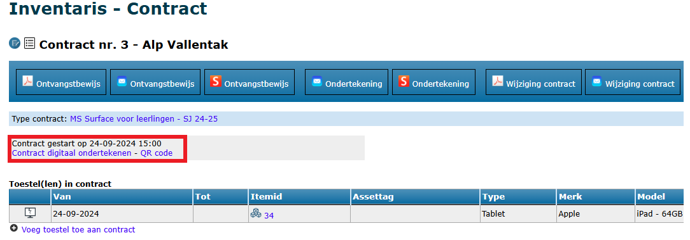
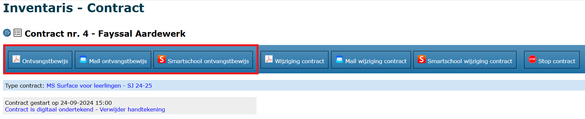
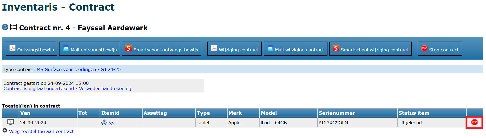

Alvorens je toestellen kan toewijzen aan gebruikers, moet er minimaal 1 modaliteit zijn aangemaakt. Lees [hier](/inventaris/voorbereiding/#modaliteiten) alles over het aanmaken van modaliteiten.

## Toestel toewijzen
Via het menu Toewijzen kan je een item koppelen aan een gebruiker. Zoek eerst naar de leerling of leraar. Heeft die gebruiker reeds een toestel toegewezen gekregen, dan zal het systeem dat laten zien. Je kan echter altijd bijkomende toestellen toewijzen, al raden we aan om toestellen steeds binnen hetzelfde contract toe te wijzen. Dat doe je via deze weg door op het nummer (blauwe link) van het contract te klikken. 

Leerlingen en personeelsleden worden via de synchronisatiemodules automatisch vanuit het administratief pakket (Informat of Wisa) geïmporteerd in Toolbox. Indien een toestel toegewezen moet worden aan een externe die niet ingegeven is in het administratief pakket, moet deze persoon eerst manueel aangemaakt worden via de module 'Synchronisatie Externen'. Vervolgens zal de persoon terug te vinden zijn in de inventarismodule. 

Als je de juiste persoon hebt gevonden, vul je het inventarisnummer, serienummer of externe assettag in het tekstvak in. Je kan hiervoor ook een barcodescanner gebruiken als je veel toestellen moet uitleveren.

Selecteer de modaliteit waaraan je het toestel wil koppelen en geef de nieuwe status van het toestel in (bv. uitgeleend). Indien in de modaliteit een 'status toestel bij toewijzing' werd ingegeven, wordt die status default ingevuld bij het selecteren van de modaliteit. Die status kan in dit scherm nog gewijzigd worden. Klik vervolgens op 'Wijs toestel toe'.

Er wordt nu een nieuw contract opgemaakt. Binnen dat contract wordt het toestel aan de gebruiker gekoppeld. 

## Contract

Na het toewijzen, kom je rechtstreeks in het scherm van het contract terecht. Hier kan je de overeenkomst verder finaliseren. Je kan ook steeds de contracten raadplegen via het menu Contracten. Daar krijg je automatisch een overzicht van de **lopende contracten**, maar je kan ook alle afgelopen contracten nog raadplegen. Volgende overzichten zijn mogelijk:
- Alle contracten
- Lopende contracten
- Afgesloten contracten
- Alle ingeschreven leerlingen (met de vermelding wie een contract heeft en wie niet)
- Leerlingen zonder contract
- Uitgeschreven leerlingen met contract
- Personeel uit dienst met contract 

Je kan in de overzichten zoeken op naam en/of klas en je kan de resultaten op verschillende manieren sorteren. Klik op <LegacyAction img="detail.png"/> om het contract te openen. 

In het scherm van het contract heb je een overzicht van het toegewezen toestel, de meegeleverderde accessoires, te betalen waarborg, ...
Je kan enkel **accessoires** toevoegen die gekoppeld zijn aan de gekozen modaliteit. Indien je bijkomende accessoires wil opnemen in het contract, voeg je die toe op niveau van de modaliteit (via menu [Modaliteiten](/inventaris/voorbereiding/#modaliteiten)). Indien je aan het contract een **document** toevoegt, is dat gekoppeld aan het contract van deze leerling/leraar en niet aan het item. Dit kan bv. een volmachtdocument zijn van de ouders. Alle toegevoegde documenten zijn te raadplegen via het menu [Documenten](/inventaris/documenten/). 

Een **betaalde waarborg** of ontvangen voorschot kan je registreren bij <LegacyAction img="pluscircle.png" text="Betaling toevoegen"/>. Dat kan voor een betaling met bancontact, POM (mits contract met deze betaalprovider) of cash. Betalingen kunnen opgevolgd worden via het menu [Betalingen](/inventaris/toestel_toewijzen/#betalingen). Indien er aan de modaliteit een waarborg gekoppeld is, wordt er sowieso een factuur opgemaakt, ongeacht of er een betaling is geregistreerd. Deze facturen kunnen worden overgezet naar de module Leerlingenrekeningen om vervolgens in te lezen in Exact Online. Indien er **geen betaling** werd geregistreerd, is het mogelijk om de automatisch aangemaakte facturen via de leerlingenrekeningen verder te verwerken, bv. facturen afdrukken of digitaal bezorgen aan de ouders en opvolgen via de module Openstaande facturen. Lees hierover meer in het onderdeel [Facturen](../Facturen). Helemaal onderaan in het contract kan je zien welke facturen er werden aangemaakt en wat de status ervan is.

Je kan eventueel ook **opmerkingen** toevoegen aan het contract. Je hebt opmerkingen die mee in het contract kunnen worden afgedrukt (mits de variabele $$OPMERKINGEN$$ in de tekst werd opgenomen), maar ook opmerkingen die niet afgedrukt worden en meer voor intern gebruik zijn bedoeld.

## Contract ondertekenen 

Indien het contract volledig in orde is, kan het ondertekend en/of afgedrukt worden. Het contract kan enkel **digitaal ondertekend** worden indien de variabele $$DIGITALE_HANDTEKENING_OUDERS$$ gebruikt werd in de modaliteit. Ondertekenen kan door bovenaan te klikken op 'contract digitaal ondertekenen' of door met een mobiel toestel de QR code te scannen. Die wordt getoond wanneer je klikt op de blauwe linktekst 'QR code'. Op die manier kan een ouder met de eigen smartphone de QR code scannen en het contract digitaal ondertekenen. Werken met een tablet van de school is ook een optie. 

Onderstaand scherm verschijnt waarin men de handtekening kan plaatsen. Het contract kan voorafgaand aan het ondertekenen worden gedownload (niet ondertekende versie ter controle) of meteen na het ondertekenen (de ondertekende versie). 

<Thumbnails img={[
    require('./toewijzen4.PNG').default, 
    require('./toewijzen5.PNG').default, 
]} />

Wanneer het contract ondertekend is, wijzigt de status bovenaan in het contract naar 'Contract is digitaal ondertekend'. Je kan eventueel de handtekening verwijderen en het ondertekenproces opnieuw starten. 

Helemaal bovenaan in het contract kan je een ontvangstbewijs (al dan niet digitaal ondertekend) afdrukken of het ontvangstbewijs mailen of versturen via Smartschool naar een nog nader te bepalen ontvanger. Digitaal versturen kan enkel wanneer er een afzender voor e-mail en/of Smartschool is geselecteerd in de module Instellingen > Inventaris. Klik [hier](/inventaris/voorbereiding/#algemene-instellingen) voor meer info over de algemene instellingen.

<Thumbnails img={[
    require('./toewijzen7.PNG').default, 
    require('./toewijzen6.PNG').default, 
]} />

## Contract digitaal versturen ter ondertekening (e-mail en Smartschool)

Het is ook mogelijk om contracten digitaal te versturen ter ondertekening. Dit kan handig zijn wanneer toestellen klassikaal worden uitgedeeld en de ouders hiervoor niet naar school hoeven te komen. Open het contract en klik bovenaan op de bijhorende knop 'Ondertekening'. Deze functie bestaat zowel voor verzenden via e-mail als via Smartschool. De functie is onmiddellijk na het toewijzen van het toestel beschikbaar. Het contract kan dus onmiddellijk verstuurd worden bij toewijzing. 

Ouders zullen een bericht ontvangen met een link. Door hierop te klikken, kan men het contract op dezelfde manier ondertekenen als uitgelegd in de vorige paragraaf ['Contract ondertekenen'](/inventaris/toestel_toewijzen/#contract-ondertekenen). Het bericht met de link kan de school zelf instellen in de module Instellingen > Inventaris. Daar moet men eveneens een afzender selecteren voor e-mail en/of Smartschool en kan men ook aangeven naar welke personeelsleden de contracten in kopie gemaild moeten worden. Deze laatste functie is optioneel. Klik [hier](/inventaris/voorbereiding/#algemene-instellingen) voor meer info over de algemene instellingen.

Je kan op een eenvoudige manier opvolgen welke contracten al dan niet ondertekend werden via het menu **Contracten**. Ondertekende contracten worden gemarkeerd met een groen vinkje in de kolom 'Ondertekend'. 

## Contracten in bulk versturen ter ondertekening (enkel e-mail)

Contracten kunnen ook **in bulk gemaild** worden **ter ondertekening**. Dit kan handig zijn wanneer toestellen in de klassen worden uitgedeeld en de waarborgfacturen vooraf of achteraf aan de leerlingen worden bezorgd. De toestellen moeten reeds toegewezen zijn aan een leerling, waardoor er automatisch een contract werd opgemaakt. Ga vervolgens naar het menu **Contracten**. Kies in de dropdownlijst de gewenste contracten en vink de te versturen contracten aan. Klik tot slot op <LegacyAction img="mail.png" text="Mail contracten ter ondertekening"/>. Wanneer een contract digitaal werd ondertekend, zie je in de kolom 'Ondertekend' een groen vinkje <LegacyAction img="vinkjeGroenRond.png"/>. Dat stelt je in staat om op een snelle en eenvoudige manier op te volgen wie het contract al dan niet heeft ondertekend. 

Deze functie is momenteel enkel nog maar beschikbaar voor verzenden via E-mail. De contracten kunnen wel één voor één verstuurd worden ter ondertekening via Smartschool. Dit kan ook op een vrij snelle manier bij het toewijzen van de toestellen. Op dat moment wordt het contract automatisch aangemaakt en geopend. Meer info vind je in de vorige paragraaf. 

## Contract wijzigen

Stel dat iemand een lopend contract heeft maar een ander toestel moet krijgen. Kan je ervoor voor kiezen om het bestaande contract te behouden en enkel het huidige toestel te stoppen. Dat doe je door achteraan in de tabel met toestellen op het Stop-icoon <LegacyAction img="stop.png"/> te klikken. Hierdoor geef je aan dat het contract nog wel loopt maar dat het toestel niet meer in bezit is van de gebruiker. Je kan nu eventueel een ander toestel toevoegen aan het lopende contract.

Als een toestel defect geraakt binnen een lopend contract, is het aanbevolen om ook dat via het contract te registreren. Vóór elk toestel staat er een icoontje <LegacyAction img="defect.png"/> waarmee je schade kan registreren, de status van het toestel kan aanpassen en eventueel de kostprijs voor de gebruiker kan vaststellen. Wanneer dit bedrag wordt ingevuld, zal Toolbox automatisch een herstelfactuur aanmaken dat via de leerlingenrekeningen verder verwerkt kan worden. 

De defecten/herstellingen worden binnen het contract onder het juiste toestel getoond. Zo kan je heel snel zien of een leerling een toestel al meermaals heeft beschadigd. Meer over het **registreren en opvolgen van herstellingen** kan je [hier](/inventaris/herstelling/) lezen.

Je kan eveneens een bevestiging van de wijziging van het contract afdrukken of via e-mail of Smartschool versturen met behulp van de knoppen bovenaan. De teksten voor dit document moeten op voorhand worden ingesteld bij de modaliteiten (Tekst wijziging contract).  

## Contract stopzetten
Het stopzetten van een contract kan helemaal bovenaan in het contract via de knop <LegacyAction img="stop.png" text="Stop contract"/>. 

Als je een contract stopt, kan je bijkomende informatie over de staat van het toestel invullen. Je kan het toestel ook meteen een nieuwe status binnen de inventaris geven (bv. opnieuw beschikbaar of in herstelling). Wanneer je in de modaliteit de 'status toestel bij stopzetting' hebt ingegeven, zal die status standaard worden overgenomen bij stopzetting van het contract. Deze status kan bij de stopzetting nog steeds aangepast worden. Vervolgens kan je het inleverbewijs afdrukken of per mail versturen. De teksten voor dit document moeten op voorhand worden ingesteld bij de modaliteiten (Tekst document inlevering toestel). 

Indien er een **waarborg** aan het contract was gekoppeld, wordt er bij het stopzetten automatisch een creditnota aangemaakt voor de terugbetaling ervan. Als er schade is vastgesteld én er wordt een kostprijs ingevuld, zal dat bedrag van de waarborg worden afgehouden.  De credinota's kunnen eenvoudig worden overgezet naar de leerlingenrekeningen om vervolgens in te lezen in Exact Online. Bij schade is het zinvol om ook een herstelling voor het item aan te maken. Daar kan een foto van de vastgestelde schade aan worden toegevoegd. Indien de kostprijs voor de schade al werd ingegeven bij de stopzetting van het contract, moet die niet opnieuw worden doorgerekend bij de herstelling. Voor meer info over herstellingen klik [hier](/inventaris/herstelling/). 

Bij het stopzetten van een contract kan je ook meteen **permanente schade** invullen. Dat is schade die op het niveau van het toestel wordt bijgehouden en die later steeds terug te vinden is via het menu Items. Denk bijvoorbeeld aan cosmetische schade (hoekje af) die niet hersteld zal worden, maar die je wel op het contract van de volgende eigenaar wil vermelden zodat die er uiteindelijk niet voor moet opdraaien. Om permanente schade in een nieuw contract te vermelden, gebruik je de variabele $$EERSTE_ITEM_SCHADE$$ in de modaliteit.

Ook bij de stopzetting van een contract is de mogelijkheid voorzien om digitaal te handtekenen indien de variabele $$DIGITALE_HANDTEKENING_OUDERS$$ gebruikt werd in de modaliteit. Deze variabele kan ook gebruikt worden voor de ondertekening door personeelsleden. Een stopzetting laten handtekenen is vooral zinvol wanneer er schade is vastgesteld aan een toestel. Op die manier is er achteraf geen discussie mogelijk. Voor meer info, zie ook het onderdeel [Contract ondertekenen](/inventaris/toestel_toewijzen/#contract-ondertekenen).

Vervolgens kan het inleverbewijs worden afgedrukt naar PDF of digitaal worden verstuurd via e-mail of Smartschool. Indien de info i.v.m. de stopzetting op een later moment nog moet worden aangepast, bv. de kostprijs van de schade is pas later bekend, dan kan dat bovenaan via de knop 'Wijzig informatie stop contract'.  

## Stopgezet contract opnieuw activeren

Het kan gebeuren dan een contract onterecht werd stopgezet. Die stopzetting kan terug ongedaan gemaakt worden door bovenaan in het contract te klikken op <LegacyAction img="undo.png" text="Contract opnieuw opstarten"/>. Indien aan het originele contract een waarborg werd gekoppeld, wordt er bij de stopzetting automatisch een creditnota gegenereerd voor de (gedeeltelijke) terugbetaling ervan. Een contract kan enkel opnieuw opgestart worden als de creditnota nog niet is overgezet naar de leerlingenrekeningen. Bij de reactivatie van het contract zal de creditnota automatisch verwijderd worden uit de module Inventaris zodat die niet meer (onterecht) kan overgezet worden naar de leerlingenrekeningen. 

:::caution opgelet
Als je een stopgezet contract opnieuw activeert, zal het toestel niet automatisch terug geactiveerd worden. Dit zal je manueel terug moeten toevoegen aan het contract.  
:::

## Toegewezen toestellen 
Via het menu **Toegewezen** kan je zien welke toestellen aan welke persoon zijn toegewezen. Door vooraan op het contractnummer te klikken, open je het contract. Door op het item nr. te klikken, open je het item. In het menu **Items school** zie je in de kolom 'Naam toestel' ook steeds aan wie het toestel is toegewezen. 

## Betalingen

In het contract kan je een betaling (van bv. een waarborg) registreren. Die betaling moet vervolgens boekhoudkundig verwerkt worden en gekoppeld worden aan de overeenkomstige factuur. 

Een betaling registreren kan voor volgende betaalmodaliteiten:

- **Bancontact**: Hiervoor moet de school beschikken over een betaalterminal. Het is mogelijk om de terminal zo in te stellen dat elke transactie apart in Exact Online terecht komt. Alvorens de ouders kunnen betalen, moet er een referentie in het toestel worden ingevoerd. Dat is steeds het contractnummer. Door op deze manier te werken, worden de waarborgfacturen na het inlezen in Exact Online automatisch afgepunt.  
- **Cash**: Wanneer ouders cash betalen, kan de betaling worden overgezet naar de module [Kas](/kas) in Toolbox. Van daaruit kan de betaling (gekoppeld aan het contractnummer en de juiste leerlingenfiche) overgezet worden naar Exact Online. 
- **POM**: Om via deze weg betalingen te kunnen ontvangen, moet er een contract afgesloten zijn met de betaalprovider POM. Als deze betaalwijze werd gekozen, wordt er een QR code gegenereerd die kan gescand worden. Van zodra een ouder betaalt, wordt er vanuit de betaalprovider POM onmiddellijk een melding gegeven aan Toolbox dat die factuur betaald werd. Nadien komt dat geld op de rekening van de school en wordt de factuur automatisch afgepunt, omdat POM de juiste mededeling mee doorstuurt naar de boekhouding. Tarieven raadplegen en POM activeren kan via https://app.pom.be/nl/connect/koba-toolbox/tarieven. POM zal pas functioneel zijn als het contract is geactiveerd.
 
 

Van zodra er betalingen zijn geregistreerd, kunnen die opgevolgd worden via het menu **Betalingen**. Daar zie je standaard een overzicht van alle betalingen, maar je kan ook lijst opvragen van de betalingen per betaalmodaliteit (BC, cash of POM). Verder kan je de resultaten filteren op bedrag of sorteren volgens een aantal parameters. Standaard worden enkel de betalingen op de huidige datum getoond. Dat kan eenvoudig aangepast worden door bovenaan de begindatum te wijzigen naar een datum in het verleden.

Cashbetalingen kunnen via deze weg overgezet worden naar de Kas in Toolbox (op voorwaarde dat die module in gebruik is). Vink de te werken betalingen aan en klik op <LegacyAction img="geld.png" text="Zet over naar kas"/>. Selecteer de gewenste kas en grootboekrekening en zet over. Het inlezen van de verrichting naar Exact Online gebeurt rechtstreeks in de Kas-module.

