In het menu **Facturen** kan je de door Toolbox aangemaakte facturen opvolgen. Dat kunnen waarborgfacturen zijn, maar ook herstelfacturen als gevolg van schade/herstellingen of creditnota's na het stopzetten van een contract. 

Via een dropdownlijst kan je per factuurtype kiezen of je alle facturen of enkel de verwerkte of nog te verwerken facturen wil zien. Facturen die nog niet zijn overgezet naar de module Leerlingenrekeningen (= te verwerken), hebben achteraan factuurnummer 0. Je kan ze aanvinken en vervolgens overzetten naar de module Leerlingenrekeningen via de knop <LegacyAction img="factuur.png"/>. Herstelfacturen en creditnota's voor de waarborgen kunnen ook rechtstreeks in de module Leerlingenrekeningen geïmporteerd worden. Op die manier kunnen de kosten opgenomen worden op de reguliere schoolrekening in plaats van via een aparte factuur. Meer info vind je hieronder opgedeeld per type factuur. 

De filter <LegacyAction img="filter.png"/> in de kolom Modaliteit maakt het mogelijk om de facturen te filteren op modaliteit en zo facturen met een verschillende modaliteit apart over te zetten naar de module Leerlingenrekeningen. Voor bepaalde modaliteiten moet er bv. onmiddellijk betaald worden, terwijl er voor andere een achterafbetaling via factuur moet plaatsvinden. Door modaliteiten apart over te zetten, kan je ervoor kiezen om de facturen per modaliteit in een aparte notagroep (in de module Leerlingenrekeningen) te zetten. 

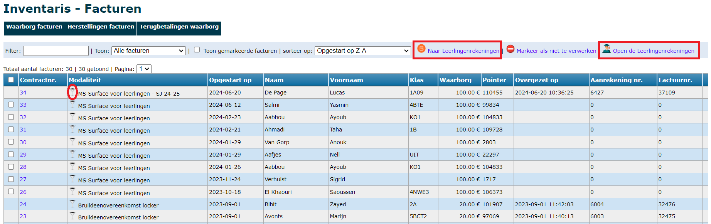

Bij alle factuurtypes is het mogelijk om facturen aan te duiden als 'niet te verwerken'. Dit kan nodig zijn, omdat je bepaalde kosten bv. al manueel hebt toegevoegd aan de leerlingenrekeningen. In dat geval vink je de betreffende factu(u)r(en) aan en klik je op <LegacyAction img="noAccess.png" text="Markeer als niet te verwerken"/>. De geselecteerde facturen zullen in het rood getoond worden en kunnen niet meer aangevinkt worden, waardoor ze niet per ongeluk overgezet kunnen worden naar de leerlingenrekeningen. Je kan deze actie ongedaan maken door achteraan op <LegacyAction img="noAccess.png"/> te klikken. Door het vakje 'Toon gemarkeerde facturen' bovenaan uit te vinken, worden deze rode lijnen niet meer getoond in het overzicht. 

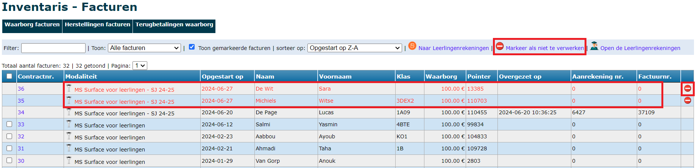

### 1. Waarborgfacturen

Aangezien waarborgfacturen op verschillende manieren betaald kunnen worden, moet je bij dit factuurtype nog wat extra info opgeven alvorens je kan overzetten naar de leerlingenrekeningen, nl. welke referentie er op de factuur moet komen.
- **Contractnummer als referentie**: Deze optie moet worden aangeduid bij waarborgen die reeds betaald zijn bij afhaling (cash, met BC of POM). Bij deze betalingen werd het contractnummer gebruikt als referentie. Dit nummer zal ook worden overgenomen in de module Leerlingenrekeningen en vervolgens in Exact Online. Op die manier kunnen de betaling en de factuur tegenover elkaar worden afgepunt. De verwerking in de module Leerlingenrekeningen is in dit geval puur administratief/boekhoudkundig. De facturen worden over het algemeen niet meer aan de ouders bezorgd. 
- **Gestructureerde mededeling als referentie**: Wanneer de waarborgfacturen niet meteen bij afhaling van het toestel betaald worden, kunnen ze overgezet worden naar de leerlingenrekeningen met een gestructureerde mededeling. Vanuit de module Leerlingenrekeningen kunnen de facturen vervolgens worden afgedrukt of digitaal verstuurd. De ouders kunnen dan gebruik maken van de gestructureerde mededeling (OGM-nummer) voor de betaling, waardoor de factuur ook weer automatisch kan worden afgepunt in Exact Online. 

Bij het overzetten kan je eveneens kiezen om de facturen over te zetten naar een bepaalde (reeds bestaande) notagroep of om een nieuwe notagroep aan te maken. In dat laatste geval, worden de facturen aangemaakt in een aparte school 'Inventaris'. Die school wordt automatisch aangemaakt wanneer je de eerste keer facturen overzet vanuit de module Inventaris.

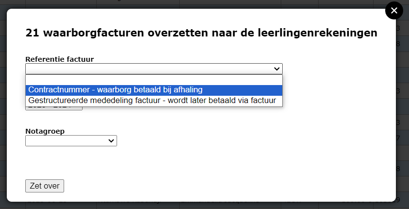

### 2. Herstelfacturen

Voor herstelfacturen moet de keuze m.b.t. de referentie niet gemaakt worden, aangezien dergelijke facturen steeds voorzien worden van een gestructureerde mededeling om vervolgens te verwerken zoals een gewone factuur in de module Leerlingenrekeningen. 

Een herstelfactuur kan op 2 manieren overgezet worden naar de module Leerlingenrekeningen. 

**1. De herstelkost komt op een aparte factuur** 

Selecteer in de module **Inventaris => Facturen => Herstellingen facturen** de herstelfacturen en zet ze over naar de module Leerlingenrekeningen. De facturen worden daar aangemaakt in een aparte school 'Inventaris'. Vanuit de module Leerlingenrekeningen kunnen de facturen op de gebruikelijke manier verstuurd worden naar de ouders en overgezet naar Exact Online. 

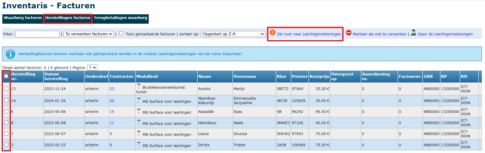

**2. Verrekening op de gewone schoolrekening** 

Indien je de herstelkost graag wil verrekenen met de (trimestriële) schoolrekening, moeten de herstelfacturen niet via de module Inventaris worden overgezet, maar kunnen ze rechtstreeks in de Leerlingenrekeningen worden geïmporteerd. Ga hiervoor naar de module Leerlingenrekeningen en selecteer de gewenste notagroep. Ga vervolgens naar het menu **Importeer => Herstellingen inventaris**.
Na het importeren zijn de herstelkosten te raadplegen via het menu 'Aanrekenen'. 

:::caution Opgelet! 
Herstelkosten kunnen maar 1x geïmporteerd worden. 
:::

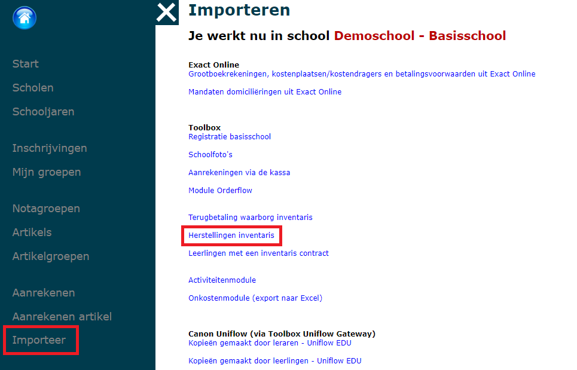
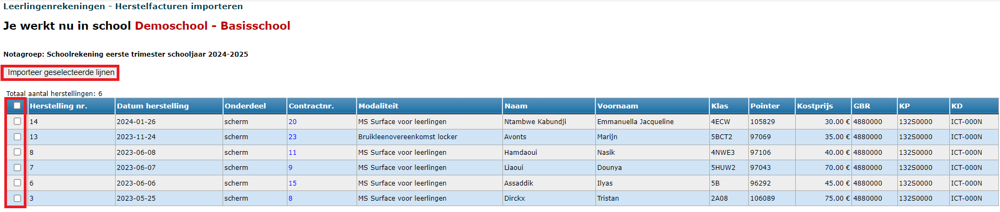

### 3. Terugbetaling waarborg

Bij de terug te betalen waarborgen zal de creditnota rekening houden met eventuele schade aan het toestel bij stopzetting van het contract. De prijs van de schade wordt apart vermeld op de creditnota, waardoor het terug te storten bedrag lager zal zijn dan het oorspronkelijke waarborgbedrag. Wanneer het schadebedrag hoger is dan de waarborg, zal er voor het restbedrag een aanrekening worden gemaakt. 

In het overzicht met terug te betalen waarborgen is er een bijkomende kolom voorzien met het rekeningenummer waarop de waarborg teruggestort moet worden. Het rekeningnummer wordt enkel getoond wanneer het werd ingevuld bij het stopzetten van het contract. Het kan nadien ook nog steeds worden aangevuld. Ga hiervoor naar het menu **Contracten** en kies voor 'Afgelopen contracten' in de dropdownlijst. Open het betreffende contract en klik helemaal onderaan op <LegacyAction img="stop.png" text="Wijzig informatie stop contract"/>.

De creditnota voor de terugbetaling kan op 2 manieren overgezet worden naar de module Leerlingenrekeningen. 

**1. Via een aparte creditnota** 

Selecteer in de module **Inventaris => Facturen => Terugbetalingen waarborg** de terugbetalingen en zet ze over naar de module Leerlingenrekeningen. De facturen worden daar aangemaakt in een aparte school 'Inventaris'. Vanuit de module Leerlingenrekeningen kunnen de facturen verstuurd worden naar de ouders en overgezet naar Exact Online. 

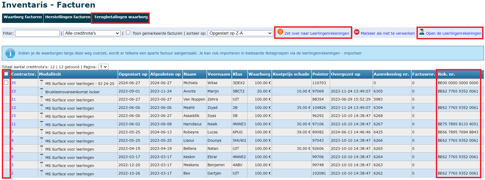

**2. Verrekening op de gewone schoolrekening** 

Indien je de terugbetaling van de waarborg graag wil verrekenen met de (trimestriële) schoolrekening, moeten de creditnota's niet via de module Inventaris worden overgezet, maar kunnen ze rechtstreeks in de Leerlingenrekeningen worden geïmporteerd. Ga hiervoor naar de module Leerlingenrekeningen en selecteer de gewenste notagroep. Ga vervolgens naar het menu **Importeer => Terugbetaling waarborg inventaris**.
Na het importeren zijn de creditnota's te raadplegen via het menu 'Aanrekenen'. 

:::caution Opgelet! 
De creditnota's kunnen maar 1x geïmporteerd worden.
::: 

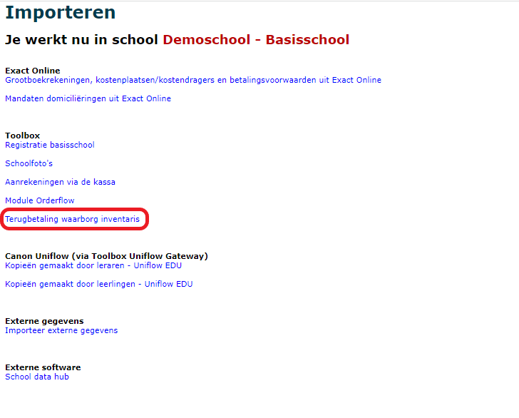

Via de <LegacyAction img="filter.png"/> icoontjes kan je ineens alle waarborgen van dezelfde modaliteit selecteren of alle leerlingen van eenzelfde klas. 

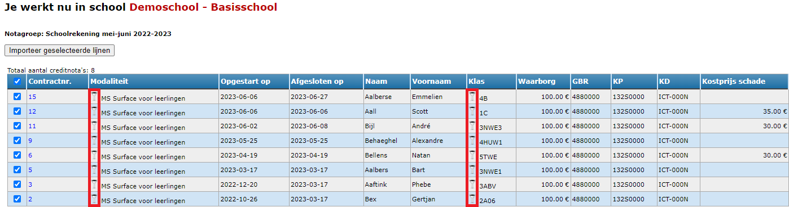

:::caution Opgelet! 
De creditnota's kunnen maar 1x geïmporteerd worden.
::: 

### 4. Periodieke gebruiksvergoeding/huur aanrekenen

Naast een waarborg is het ook mogelijk om periodiek een bedrag aan te rekenen voor items uit de module Inventaris zoals bv. een trimestriële gebruiksvergoeding. Dit dient rechtstreeks in de module Leerlingenrekeningen te gebeuren. Selecteer de gewenste notagroep en ga vervolgens via het menu **Importeer => Leerlingen met een inventariscontract**.

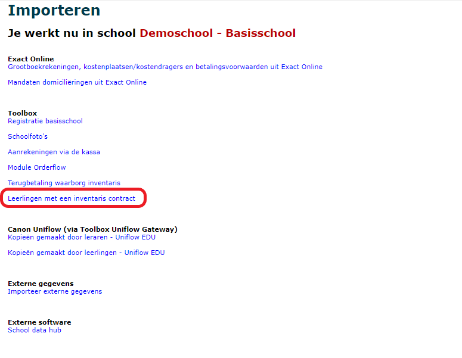

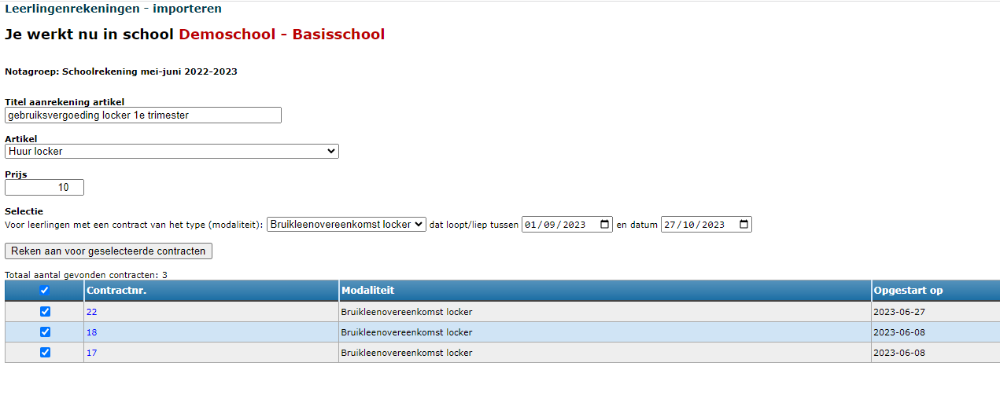

- **Titel**: Deze titel wordt getoond in het overzicht van alle aanrekeningen en maakt het zoeken makkelijker. Hij wordt NIET getoond op de factuur zelf.
- **Artikel**: Het gewenste artikel uit de leerlingenrekeningen moet vooraf aangemaakt worden in de module Leerlingenrekeningen via het menu Artikels.
- **Prijs**: Dit bedrag overschrijft het bedrag dat eventueel bij het artikel reeds werd ingegeven.
- **Selectie**: Selecteer hier de modaliteit uit de module Inventaris waarvoor je een aanrekening wil maken. Alle lopende contracten binnen een bepaalde periode worden vervolgens getoond. 

Na het importeren zijn de aanrekeningen terug te vinden via het menu 'Aanrekenen artikel'.

