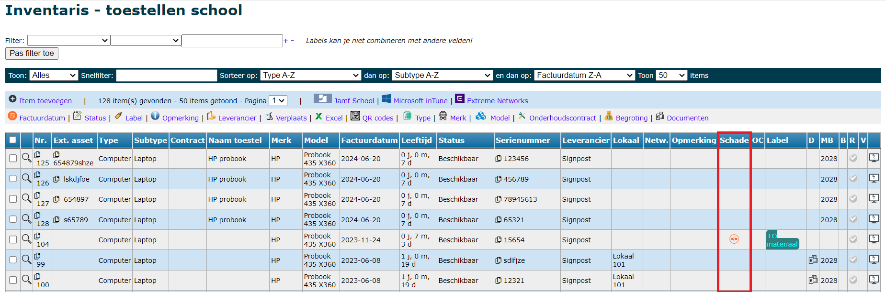

## Defect toestel registreren

in het menu **Items school** staat achteraan elk item een icoontje <LegacyAction img="defect.png"/> waarmee je een defect of herstelling kan registreren. Datzelfde icoontje vind je terug in het **contract** vóór het item. In het pop-up scherm kan je allerlei gegevens over het defect invullen alsook de herstelstatus en de algemene status van het toestel aanpassen. Indien de schade niet onder garantie kan worden hersteld, is het mogelijk om de kostprijs door te rekenen aan de gebruiker. Als in dit veld een bedrag wordt ingevuld, wordt er automatisch een herstelfactuur genereerd. Dat kan via het menu **Facturen** overgezet worden naar de module Leerlingenrekeningen van waaruit het verder verwerkt kan worden (bezorgen aan de ouders, inlezen in Exact Online). Krijg je van de leverancier die de herstelling uitvoert een casenummer of incidentnummer, dan kan je dat hier ook in vullen.

Bij elke herstelling is het eveneens mogelijk om een bericht te versturen naar een medewerker (bv. de ICT-coördinator of directeur). 

Na het ingeven van de herstelling is het mogelijk om het hersteldocument van Signpost <LegacyAction img="signpost.png"/> te downloaden. Dat kan via het contract of via het menu **Herstellingen**. Op dit document worden het serienummer en het labelnummer automatisch ingevuld. De overige gegevens zijn manueel aan te vullen. 

## Herstellingen opvolgen

Via het menu **Herstellingen** kan je alle herstellingen opzoeken per herstelstatus. Door op het blauwe **Item nr.** of **Contract nr.** te klikken open je het bijhorende item of contract. Zolang de herstelfactuur niet is overgezet naar de module Leerlingenrekeningen kan een herstelling nog verwijderd worden door achteraan op <LegacyAction img="remove.png"/> te klikken.

Via het **contract** kan je de herstelling verder opvolgen. Daar is het eveneens mogelijk om een bijlage aan de herstelling toe te voegen. Klik in het contract op het nummer van de herstelling om info toe te voegen of de herstelstatus te wijzigen. Klik op <LegacyAction img="pluscircle.png" text="Document toevoegen"/> om een document of foto te koppelen aan de herstelling. Dit document is gekoppeld aan het contract en niet aan het item. Alle documenten worden verzameld onder het menu **Documenten**.

 In het menu **Items school** kan je per item een historiek van alle herstellingen opgevragen. Klik daarvoor op het <LegacyAction img="edit.png"/>. In het tabblad Herstellingen worden ze opgelijst.

## Herstelfactuur
De herstelfactuur wordt automatisch gegenereerd wanneer er een bedrag (kostprijs voor de gebruiker) wordt ingevuld bij het invoeren van de herstelling. De herstelfacturen zijn terug te vinden in het menu **Facturen**. Van daaruit kunnen ze overgezet worden naar de module Leerlingenrekeningen. Voor meer info over het verwerken van facturen in de module Inventaris, klik [hier](/inventaris/toestel_toewijzen/#facturen). 

## Koppeling met Signpost M4S
Via het Menu **Signpost M4S** kunnen herstellingen vanuit M4S opgehaald worden via de knop <LegacyAction img="refresh.png" text="Haal meest recente informatie" op/>. Door op de blauwe link van het item nr. te klikken, wordt je doorgestuurd naar het betreffende item in de inventarislijst. 

:::caution Under construction
Er wordt momenteel nog gewerkt aan een automatische koppeling tussen de herstellingen in M4S en Toolbox om de opvolging eenvoudiger en efficiënter te maken. 
:::

