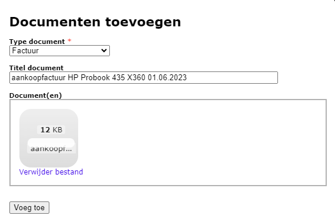
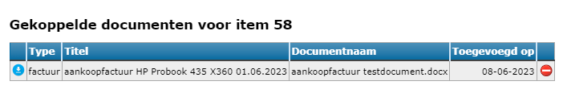
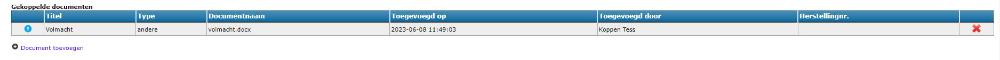
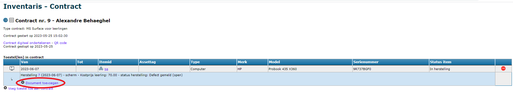

Via het menu **Documenten** zie je een overzicht van alle beschikbare documenten in de module Inventaris. Dat kan gaan om documenten die gekoppeld zijn aan een bepaald contract (zoals een foto van schade aan een item), maar ook om documenten die rechtstreeks gekoppeld zijn aan één of meerdere items (zoals een aankoopfactuur of handleiding voor een reeks toestellen). Door de filter bovenaan te gebruiken kan je de zoekresultaten in de lijst beperken tot een bepaald documenttype. 

Volgende types van documenten zijn momenteel gedefinieerd:
- factuur
- handleiding
- indienststellingsverslag
- veiligheidsinstructiekaart
- foto
- andere

In het menu **Documenten** kan je een document toevoegen door te klikken op <LegacyAction img="add.png"/>. Specifieer het type document en geef het een gepaste titel. Laad tot slot het betreffende document op. 

Documenten die op deze manier worden toegevoegd, kunnen later nog gekoppeld worden aan items, maar NIET aan herstellingen of contracten. Dergelijke documenten voeg je rechtstreeks in het contract toe. 

Het document is daarna terug te vinden in het overzicht. Volgende acties zijn vervolgens mogelijk:
- Download het document door te klikken op <LegacyAction img="download2.png"/>.

- Raadpleeg de items waaraan het document gekoppeld door te klikken op <LegacyAction img="model.png"/>. Je kan een document ook terug losmaken van een bepaald item. Dat doe je via het menu **Items school**. Klik in de rij van het item achteraan in kolom D (van document) op dit icoon <LegacyAction img="documenten.png"/>. De gegevens over het gekoppelde document verschijnen in een pop-up scherm. Klik achteraan op <LegacyAction img="noAccess.png"/> om het document los te koppelen van dit item. 
- Ga rechtstreeks naar het gekoppelde contract of de herstelling door op de blauwe link (contract- of herstellingsnummer) in de overeenkomstige kolom te klikken.  
- Verwijder een document door achteraan op <LegacyAction img="remove.png"/> te klikken.

:::caution Opgelet
Indien je een document verwijdert, wordt het **volledig verwijderd** uit de module Inventaris. Het verdwijnt dus ook bij alle gekoppelde items, herstellingen of contracten.
:::

## Een document aan een item koppelen

Een document kan aan één of meerdere items tegelijk worden toegevoegd via het menu **Items school**. Selecteer alle items waaraan je een bepaald document wil koppelen en klik in de taakbalk op <LegacyAction img="documenten.png" text ="Documenten"/>. Vervolgens heb je 2 opties:

- **Nieuw document**: Voeg een volledig nieuw document toe op dezelfde manier als hierboven omschreven. Het document is automatisch gekoppeld aan alle geselecteerde items en is bovendien terug te vinden in de lijst met documenten in het menu Documenten. Daar kan het document eventueel terug verwijderd worden. 

- **Bestaand document**: Je kan ook een reeds opgeladen document koppelen. Als je deze optie selecteert, wordt er een menu getoond met alle beschikbare documenten. Klik vooraan op <LegacyAction img="select.png"/> om het document te koppelen. 

Wanneer er aan een item een document gekoppeld is, zie je in het overzicht achteraan in de kolom D (van document) volgend icoon: <LegacyAction img="documenten.png"/>. Klik op dit icoon om de details van het document te raadplegen. 

Via de knop <LegacyAction img="download2.png"/> kan je het document downloaden en via <LegacyAction img="noAccess.png"/> kan je het document loskoppelen van dit specifiek item. Het document zelf is hiermee niet verwijderd en kan nog steeds gekoppeld worden aan andere items of opgevraagd worden via het menu Documenten.

## Een document aan een contract koppelen

Het is ook mogelijk om rechtstreeks in het contract een document te koppelen. Denk maar aan een volmacht van de ouders waarmee een leerling een toestel mag komen ophalen. Dergelijke documenten kunnen niet eerst aangemaakt worden in het menu Documenten, maar moeten rechtstreeks in het contract toegevoegd worden met de knop <LegacyAction img="pluscircle.png" text="Document toevoegen"/>. Documenten die op deze manier worden toegevoegd, zijn achteraf wel raadpleegbaar via het menu Documenten. 

Het document kan vervolgens gedownload worden via <LegacyAction img="download2.png"/> en verwijderd via <LegacyAction img="remove.png"/>. Indien een document in het contract verwijderd wordt, is het ook uit de lijst in het menu Documenten verdwenen. 

## Een document aan een schadegeval/herstelling koppelen

Voer eerst de schade of herstelling in via de gebruikelijke weg. Voor meer info zie ook het onderdeel [Herstellingen](/inventaris/herstelling/). Vervolgens kan je een document (bv. een foto van de schade) aan de herstelling toevoegen. Dat doe je steeds via het contract bij de betreffende herstelling. 

Eens het document is toegevoegd, kan je het downloaden via <LegacyAction img="download2.png"/>. Om het te verwijderen ga je langs het menu Documenten. Verwijder daar het document met <LegacyAction img="remove.png"/> en het zal ook meteen bij de herstelling zelf verwijderd zijn.

