## Defect toestel registreren

In het menu **Items school** staat achteraan elk item een icoontje <LegacyAction img="defect.png"/> waarmee je een defect of herstelling kan registreren. Datzelfde icoontje vind je terug in het **contract** vóór het item. In het pop-up scherm kan je allerlei gegevens over het defect invullen alsook de herstelstatus en de algemene status van het toestel aanpassen. Indien de schade niet onder garantie kan worden hersteld, is het mogelijk om de kostprijs door te rekenen aan de gebruiker. Als in dit veld een bedrag wordt ingevuld, wordt er automatisch een herstelfactuur genereerd. Dat kan via het menu **Facturen** overgezet worden naar de module Leerlingenrekeningen van waaruit het verder verwerkt kan worden (bezorgen aan de ouders, inlezen in Exact Online). 

Daarnaast kan je ook aangeven **waar** het toestel werd herstel (op school of extern). In het geval van een externe herstelling is er de mogelijkheid om op te geven wanneer het toestel bij de leverancier werd aangemeld en wanneer het effectief werd hersteld. Krijg je van de leverancier die de herstelling uitvoert een casenummer of incidentnummer, dan kan je dat hier ook invullen. Is de leverancier **Signpost**, dan zal je de herstelling ook meteen kunnen synchroniseren naar het platform M4S waardoor je geen dubbel werk hebt. Klik [hier](/inventaris/herstelling/#koppeling-met-signpost-m4s) voor meer info.

Naast het toestel zelf kan het voorkomen dat er ook accessoisers worden ingeleverd. Onderaan kan je aanvinken welke accessoires. Wanneer het toestel terug binnenkomt na een herstelling kan je met behulp van dit lijstje nagaan of de hersteller ook alle accessoires heeft terugbezorgd. 

Bij elke herstelling is het eveneens mogelijk om een bericht te versturen naar een medewerker (bv. de ICT-coördinator of directeur). 

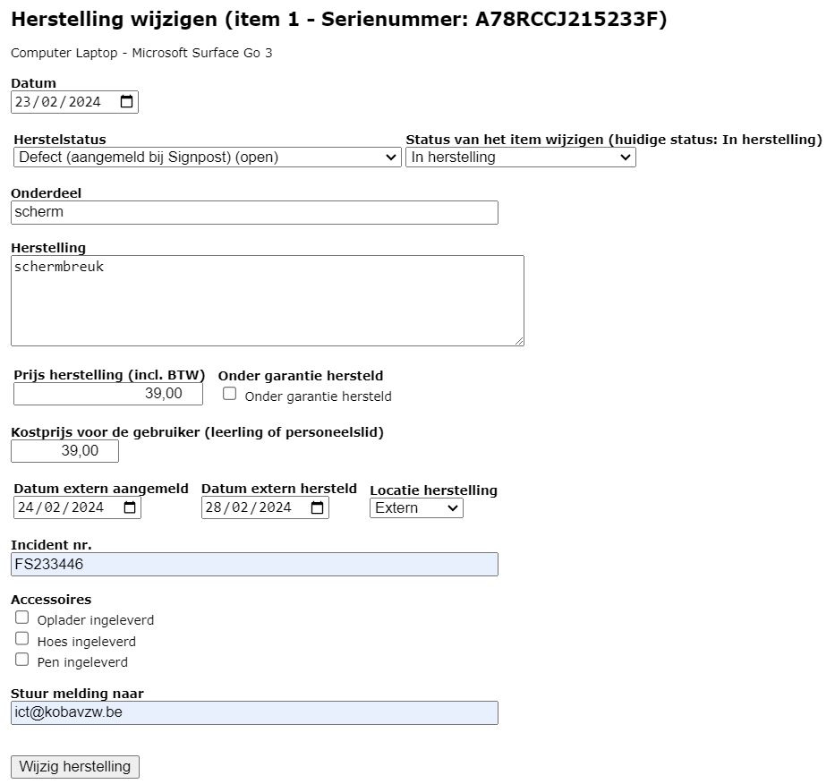

Na het ingeven van de herstelling kan je een generiek hersteldocument <LegacyAction img="pdf.png"/> downloaden of het specifiek hersteldocument van Signpost <LegacyAction img="signpost.png"/>. Op dit document worden het serienummer en het labelnummer automatisch ingevuld. De overige gegevens zijn manueel aan te vullen. Deze documenten vind je terug via het menu **Herstellingen** of rechtstreeks in het **contract**.

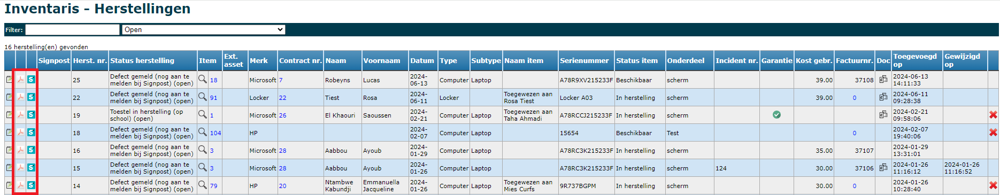
*Klik op de afbeelding om te vergroten.*

## Herstellingen opvolgen

Via het menu **Herstellingen** kan je alle herstellingen opzoeken per herstelstatus. Door op het blauwe **Item nr.** of **Contract nr.** te klikken open je het bijhorende item of contract. Zolang de herstelfactuur niet is overgezet naar de module Leerlingenrekeningen kan een herstelling nog verwijderd worden door achteraan op <LegacyAction img="remove.png"/> te klikken.

Via het **contract** kan je de herstelling verder opvolgen. Daar is het eveneens mogelijk om een bijlage aan de herstelling toe te voegen. Klik in het contract op het nummer van de herstelling om info toe te voegen of de herstelstatus te wijzigen. Klik op <LegacyAction img="pluscircle.png" text="Document toevoegen"/> om een document of foto te koppelen aan de herstelling. Dit document is gekoppeld aan het contract en niet aan het item. Alle documenten worden verzameld onder het menu **Documenten**.

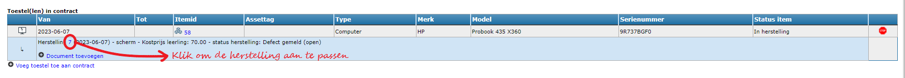
*Klik op de afbeelding om te vergroten.*

 Zowel in het menu **Herstellingen** als in het menu **Items school** kan je per item een historiek van alle herstellingen opgevragen. Klik daarvoor op het vergrootglas <LegacyAction img="zoeken.png"/>. In het tabblad 'Herstellingen' worden ze opgelijst. 

## Herstelfactuur
De herstelfactuur wordt automatisch gegenereerd wanneer er een bedrag (kostprijs voor de gebruiker) wordt ingevuld bij het invoeren van de herstelling. De herstelfacturen zijn terug te vinden in het menu **Facturen**. Van daaruit kunnen ze overgezet worden naar de module Leerlingenrekeningen. Je kan de herstelfacturen ook rechtstreeks in de module Leerlingenrekeningen importeren. Op die manier kan je de herstelkost opnemen op de reguliere (bv. trimesteriële) schoolrekening. Voor meer info over het verwerken van herstelfacturen, klik [hier](../Facturen/#2-herstelfacturen). 

## Permanente schade
In het menu **Items** kan je permanente schade aan een toestel ingeven. Denk bijvoorbeeld aan cosmetische schade (hoekje af) die niet hersteld zal worden, maar die je wel op het contract van de volgende eigenaar wil vermelden zodat die er uiteindelijk niet voor moet opdraaien. Om permanente schade in een nieuw contract te vermelden, gebruik je de variabele $$EERSTE_ITEM_SCHADE$$ in de modaliteit. Dubbelklik in de kolom 'Schade' achter het betreffende toestel om de schade te registreren. Permanente schade kan je herkennen aan volgend icoon <LegacyAction img="schade.png"/>. 

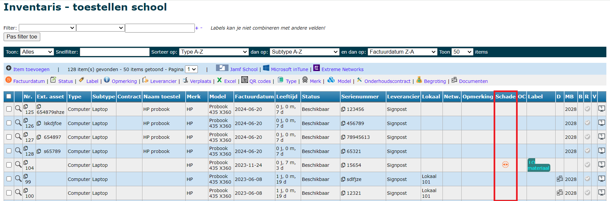
*Klik op de afbeelding om te vergroten.*

Bij het stopzetten van een contract kan je ook meteen **permanente schade** invullen. Schade die hier wordt ingegeven, wordt eveneens bijgehouden op niveau van het toestel en is dus ook in het menu Items te raadplegen of te wijzigen. Klik op het icoon om de geregistreerde schade te raadplegen of te wijzigen. Klik [hier](/inventaris/toestel_toewijzen/#contract-stopzetten) voor meer info over het stopzetten van contracten.

## Koppeling met Signpost M4S

### Voorbereiding
De inventarismodule heeft een automatische koppeling met Signpost M4S. Om die te activeren voeg je eerst in de **module Instellingen** van Toolbox bij 'Signpost M4S' de API credentials toe. Die kan je zelf genereren in M4S via 'Instituten => API Toegangscodes'. Indien de school in M4S meerdere organisaties heeft, vraag je per organisatie de toegangscodes aan. 

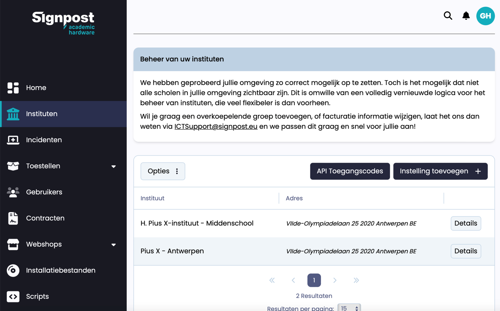

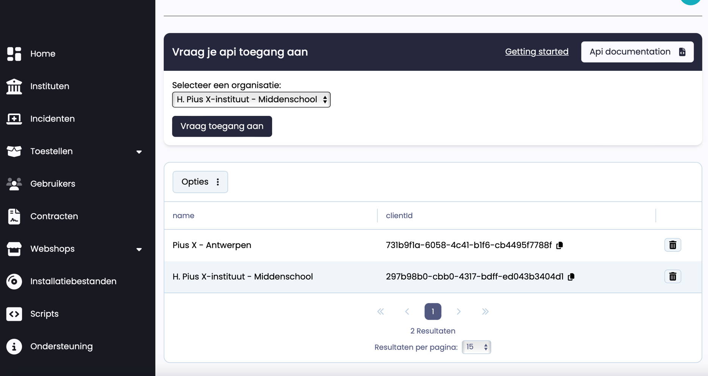

Voeg voor elke organisatie de API clientID en secret toe aan Toolbox via de module **Instellingen => M4S**. Verder kan je daar ook standaard contactpersonen ingeven voor de herstelling en voor de financiële afhandeling. Dit is handig wanneer bv. alle herstellingen steeds vanuit dezelfde persoon worden aangemaakt of wanneer steeds hetzelfde e-mailadres of telefoonnummer ingevuld moet worden. Je kan er ook voor kiezen om deze gegevens slechts gedeeltelijk in te vullen, bv. wel een standaard e-mailadres zoals ict@schoolnaam.be, maar geen naam. De lege velden worden bij het aanmaken van een herstelling ingevuld op basis van de ingelogde gebruiker.

    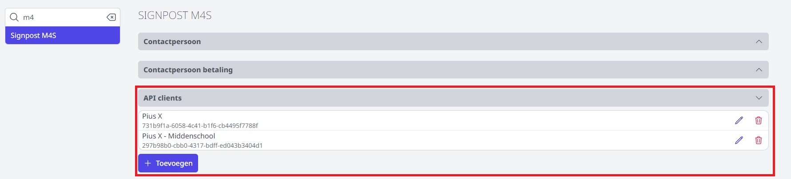

Wanneer de credentials zijn ingevuld in Toolbox zal je in de module Inventaris een melding zien in de vorm van een groen kader bovenaan. De credentials moeten namelijk nog (eenmalig) geïnitialiseerd worden. Klik op de blauwe linktekst om het initialiseren te starten. Daarmee worden de guids en de problem types opgehaald uit M4S. 

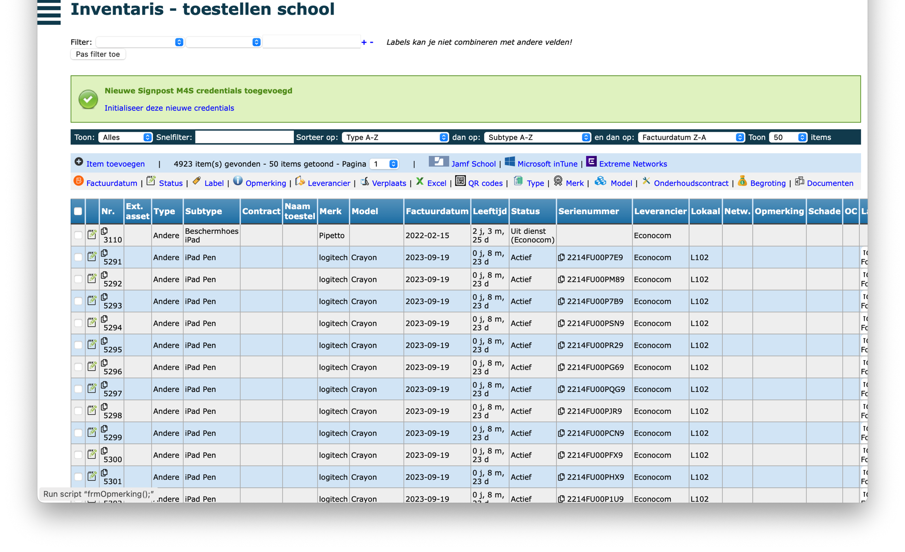

### Herstelling toevoegen
Als alle bovenstaande stappen zijn uitgevoerd, kan je op de gebruikelijke manier herstellingen aanmaken in Toolbox. De koppeling met M4S werkt automatisch voor alle items die gekoppeld zijn aan een leverancier waar de naam 'Signpost' in voorkomt. 'Signpost nv' zal dus ook herkend worden. Het is dus belangrijk om voor die items de leverancier correct in te stellen.

Van zodra je een herstelling vanuit een item of vanuit een contract toevoegt, zal je een extra knop te zien krijgen. Daarmee kan je de herstelling aanmaken in Toolbox en meteen doorgaan naar het scherm waarmee je de herstelling in M4S aanmaakt. De informatie van de herstelling in Toolbox wordt automatisch overgenomen in de herstelling voor M4S.

Van zodra de case is aangemaakt bij M4S, krijg je een QR code te zien. Als je die scant, kan je foto's aan je case (in M4S toevoegen). 

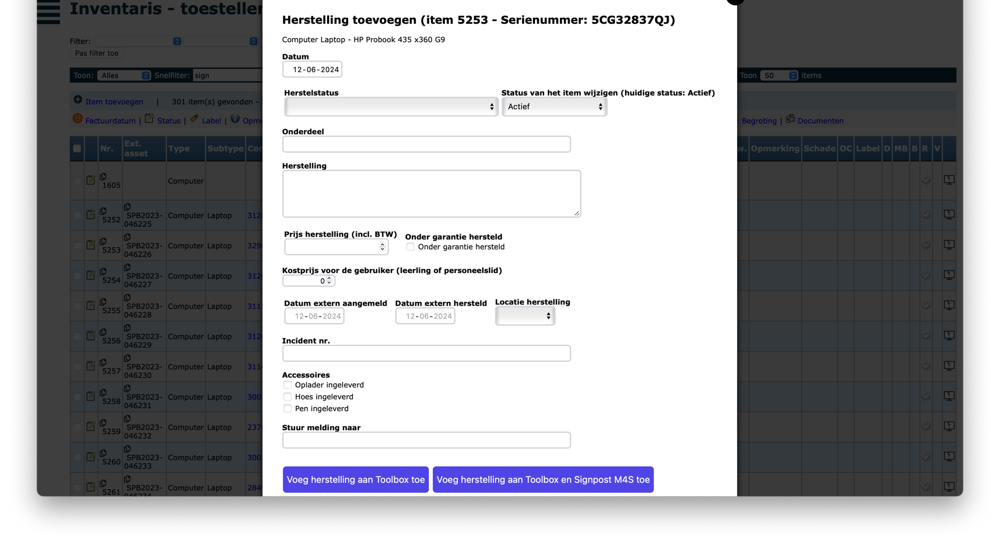
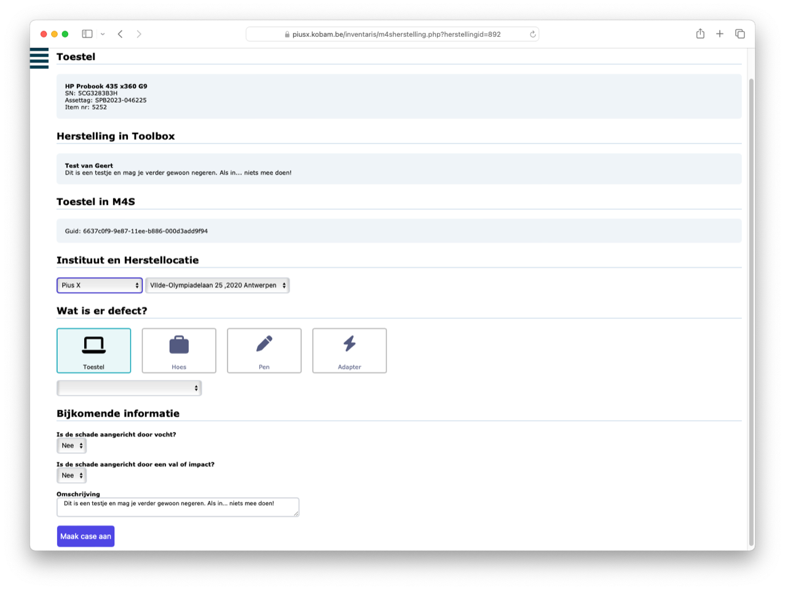
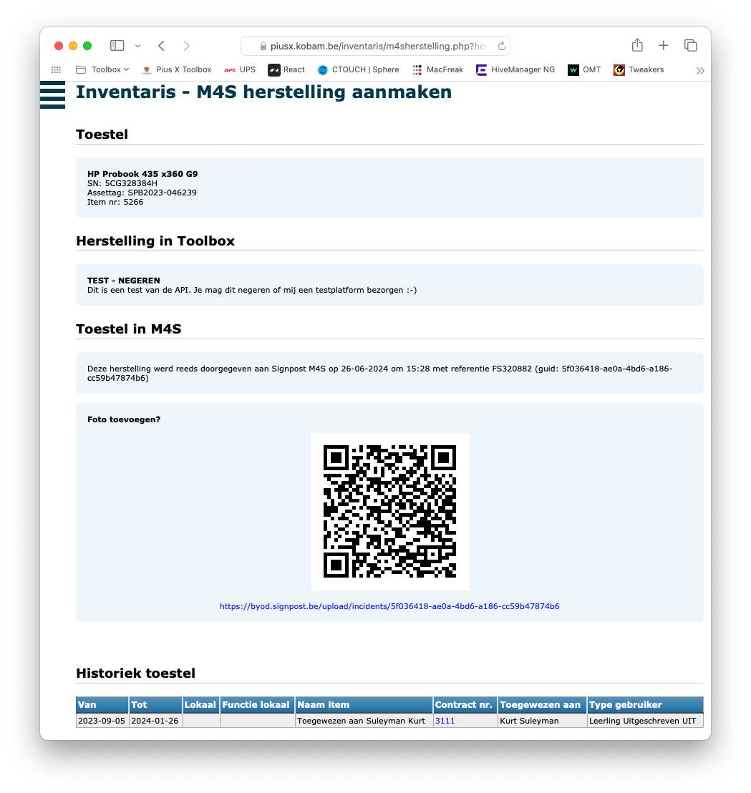

