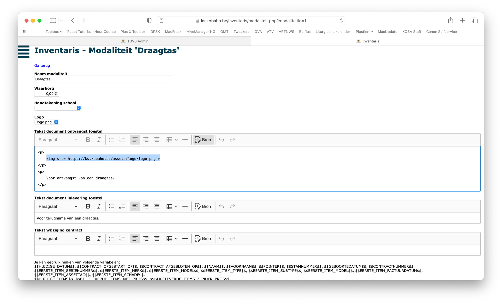
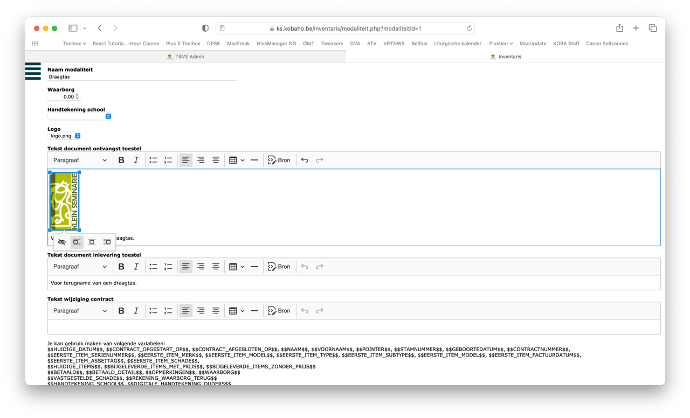

<ImageTitle img="inventaris.png">FAQ</ImageTitle>

### Hoe voeg ik een logo toe aan een contract?

Je kan in de modaliteiten in de editor de 'bron' aanzetten. Daar kan je dan een stukje HTML code in steken:  

```

```



