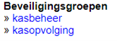

Rechten voor de module worden toegekend via de tegel gebruikersbeheer. Het rechtenbeheer is opgesplitst in kasbeheer en kasopvolging.

Voor de eindgebruiker is 'kasopvolging' voldoende. In de module zelf kan dan nog worden opgegeven of de bewuste gebruiker enkel leesrechten zou moeten krijgen of ook zelf manipulaties moet kunnen verrichten.

Het 'kasbeheer' laat toe om een aantal beheerstaken te kunnen uitvoeren, zoals het aanmaken van kassa’s en gebruikers eraan koppelen met bepaalde rechten.