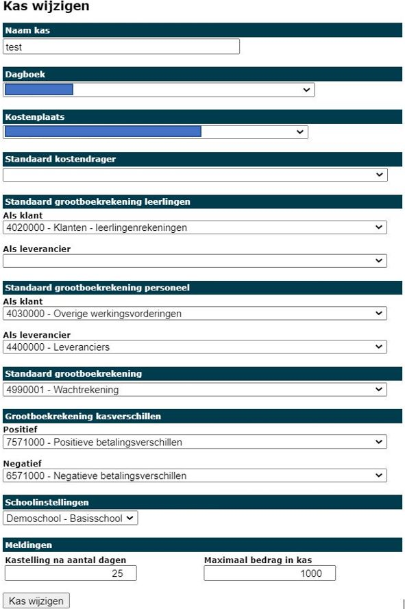

Voor het instellen van een kas zijn kasbeheersrechten vereist (zie [Rechten toekennen aan gebruikers](/kas/opstart_configuratie/rechten_toekennen)).

Klik op <LegacyAction img="spaarvarken.png" text="Beheer kassen" /> en klik vervolgens op <LegacyAction img="pluscircle.png" text="Kas toevoegen" /> om een nieuwe kas aan te maken.

Elke kas heeft een aantal vaste parameters die moeten worden ingesteld om te bepalen hoe de verrichtingen moeten worden overgezet naar Exact Online (EOL) en aan welke school de kas moet zijn gekoppeld. Dit laatste bepaalt welke relaties uit EOL standaard kunnen worden geselecteerd in de kas. De rekeningen die in onderstaand voorbeeld zijn opgegeven zijn in principe de standaard rekeningen die binnen de KOBA boekhouding worden gebruikt voor desbetreffende verrichtingen. Voor het instellen van **dagboek** en **kostenplaats** neemt u best contact op met uw boekhouder om de correcte gegevens op te vragen. 

Eenmaal de kas is toegevoegd, zal deze getoond worden in het overzicht van de beschikbare kassen.

Door de gegevens bij **meldingen** in te voeren, krijg je na x-aantal dagen of vanaf een bepaald bedrag een melding om een kastelling te doen of cash geld naar de bank te brengen. Deze melding kan genegeerd worden. 