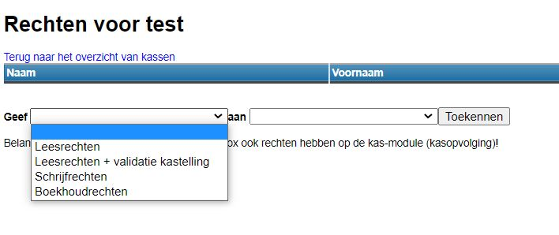

Per kas kan je gebruikers en rechten toewijzen. Voor elke individuele kas moeten de gebruikers steeds afzonderlijk worden toegewezen. 

Ga naar de betreffende kas en klik achteraan op <LegacyAction img="edit.png" />. Klik vervolgens op <LegacyAction img="gebruikersbeheer.png" /> om gebruikers toe te wijzen aan deze specifieke kas. Elke gebruiker moet ook nog rechten hebben om de module Kas te mogen openen. Dit dient afzonderlijk te worden geregeld in het algemene gebruikersbeheer van de Toolbox, waar de beveiligingsgroep “kasopvolging” voor de desbetreffende gebruiker(s) moet zijn geactiveerd. Voor meer info zie punt 1. 

Er kunnen vervolgens drie typen van gebruikersrechten worden toegekend:
- Leesrechten: De persoon kan enkel verrichtingen inzien, maar kan zelf niets toevoegen of wijzigen.
- Leesrechten + validatie kastelling: Zelfde rechten als hierboven + deze persoon kan de kastelling goedkeuren volgens het 4-ogenprincipe. 
- Schrijven: Zelfde rechten als hierboven + deze persoon kan zelf verrichtingen toevoegen. Deze persoon kan een toegevoegde verrichting NIET meer wijzigen. Hiervoor zijn boekhoudrechten nodig. 
- Boekhoudrechten: De persoon kan naast toevoegen ook wijzigingen aanbrengen aan verrichtingen voor zover deze nog niet zijn doorgeboekt naar Exact Online en geen kastelling heeft plaatsgevonden. Deze persoon kan de verrichtingen ook doorboeken naar Exact Online.

Om een gebruiker te verwijderen, klik dan op <LegacyAction img="remove.png" /> achter diens naam.