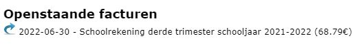
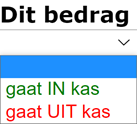

Klik op dit symbool <LegacyAction img="geld.png" /> om het kasblad te openen voor het toevoegen of raadplegen van verrichtingen.

Klik vervolgens op <LegacyAction img="pluscircle.png" text="kasverrichting toevoegen" />. Een pop-up scherm zal verschijnen om een verrichting te kunnen toevoegen. Geef hier de gevraagde gegevens op.

## Datum

De datum is standaard de dag van ingave. Deze datum is desgewenst aanpasbaar. In Exact Online zal dit tevens de boekingsdatum zijn van de verrichting. Om boekhoudkundige redenen is het niet mogelijk om een kasverrichting toe te voegen waarbij de datum vóór de laatst geregistreerde kasverrichting ligt. 

## Relatie

Van zodra er tenminste twee karakters worden opgegeven begint het systeem alle bekende relaties te filteren die in het systeem voorkomen. Dit zijn alle relaties (leerlingen + leraren) die via het administratieve pakket Informat of Wisa aan de Toolbox zijn toegevoegd. Vervolgens kan je uit de verkregen lijst de desbetreffende relatie geselecteren. Afhankelijk van de eerder geconfigureerde instellingen kan een relatie zowel een klant als een leverancier zijn. Het is belangrijk dit juist te selecteren, omdat klant en leverancier een verschillende boekhoudkundige verwerking kennen.

De kas is ook verbonden met de module openstaande facturen. Eens een leerling als klant wordt geselecteerd, zullen alle openstaande facturen voor deze leerling worden getoond. Selecteer een factuur om ze te koppelen aan de cash betaling. Ook wanneer het gaat om een deelbetaling, kan je een factuur selecteren. Het betaalde gedeelte wordt automatisch afgepunt in Exact Online nadat de betalingen uit de kasmodule zijn overgezet. 

## Omschrijving

Geef hier een vrij in te vullen omschrijving mee. Bijvoorbeeld: “Betaling schoolfactuur”. Dit is tevens de omschrijving van de boeking in Exact Online.

## Grootboekrekening

De grootboekrekening die als tegenrekening van het gekozen dagboek zal worden gebruikt is standaard bepaald aan de hand van het type relatie, boeking en de eerder opgegeven instellingen. Dit is eventueel aanpasbaar door te klikken op       en een andere grootboekrekening uit de lijst te selecteren. De lijst bevat alle actieve grootboekrekeningen in het gekoppelde Exact Online dossier.

## Bedrag

Geef hier het bedrag op. Dit moet altijd een positief bedrag zijn.

## Dit bedrag

Bepaal hier of het bedrag uit de kas wordt onttrokken (<Text color="red">gaat UIT kas</Text>) ofwel aan de kas wordt toegevoegd (<Text color="green">gaat IN kas</Text>).

