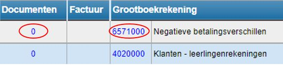

Een kasverrichting kan enkel worden gewijzigd door iemand met boekhoudrechten. Enkel de laatste kasverrichting kan nog volledig gewijzigd worden. De vorige kasverrichtingen kunnen in beperkte mate gewijzigd worden indien ze nog niet zijn doorgeboekt naar Exact Online

Klik op dit symbool  om het kasblad te openen.

Klik achteraan de verrichting op  en voer de gewenste wijzigingen in. Enkel bij de laatst toegevoegde verrichting zal je alles nog kunnen wijzigen. 

Klik in het overzicht bij omschrijving op om de omschrijving te wijzigen.

Klik op het getal onder documenten om een document toe te voegen. Een scherm verschijnt waar je een document naartoe kan slepen. Door in het witte vak te klikken, kan je een document uit je bestanden selecteren. Dit document wordt (voorlopig) niet mee overgezet naar Exact Online. 

Klik op het getal onder **grootboekrekening** deze aan te passen. 
