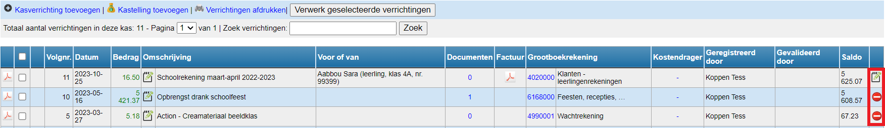
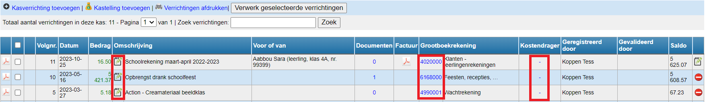
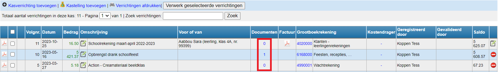

## 1. Kasverrichting wijzigen

Een kasverrichting kan enkel worden gewijzigd door iemand met boekhoudrechten en ook **enkel de laatste kasverrichting** kan volledig gecorrigeerd worden. De vorige kasverrichtingen kunnen in beperkte mate (omschrijving, grootboekrekening en kostendrager) worden aangepast indien ze nog niet zijn doorgeboekt naar Exact Online. Heb je toch een fout gemaakt bij een eerdere verrichting? Voeg dan een correctieboeking toe. Vraag eventueel je regioboekhouder om je hierbij te helpen. 

Klik op dit symbool <LegacyAction img="geld.png"/> om de kas te openen.

Klik achteraan bij de verrichting op <LegacyAction img="edit.png"/> en voer de gewenste wijzigingen in. Enkel bij de laatst toegevoegde verrichting zal je alles nog kunnen corrigeren. 

#### Mogelijke wijzigingen bij alle verrichtingen die nog niet zijn overgezet naar Exact Online:
- Klik in de kolom **omschrijving** op <LegacyAction img="edit.png"/> om enkel de omschrijving van de verrichting te wijzigen.
- Klik op het nummer van de **grootboekrekening** om een andere grootboekrekening te selecteren.

- Klik in de kolom **kostendrager** om die te wijzigen of toe te voegen.

## 2. Documenten toevoegen

Klik op het getal in de kolom **documenten** om een document toe te voegen. Er verschijnt een scherm waar je een document naartoe kan slepen. Door in het witte vak te klikken, kan je een document uit je bestanden selecteren. Dit document wordt tevens mee overgezet naar Exact Online. 

