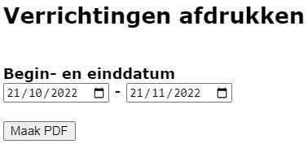

Klik op dit symbool <LegacyAction img="geld.png" /> om het kasblad te openen.

Klik op <LegacyAction img="pdf.png" /> vóór de kasverrichting om een ontvangstbewijs af te drukken voor deze verrichting.

Klik bovenaan op <LegacyAction img="printer.png" text="Verrichtingen afdrukken" /> om een overzicht van alle kasverrichtingen van een bepaalde periode af te drukken. 

In een volgende scherm kan je aangeven voor welke periode je de verrichtingen wil afdrukken. Vervolgens wordt er een pdf-document gegenereerd. 

