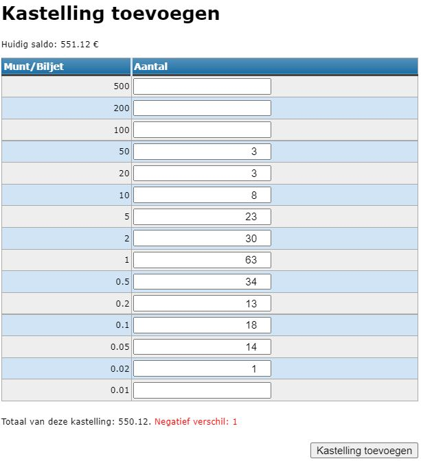
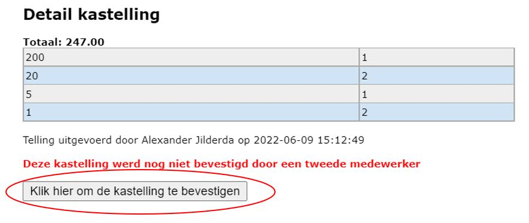

Klik op dit symbool <LegacyAction img="geld.png" /> om het kasblad te openen.

Klik vervolgens op <LegacyAction img="geld.png" text="Kastelling toevoegen" />. Een pop-up scherm zal verschijnen om een telling te kunnen toevoegen. Geef hier steeds het aantal munten of biljetten op en dus geen bedragen. 

Onderaan zie je meteen of er een <Text color="green">positief</Text> of <Text color="red">negatief</Text> kasverschil is en hoeveel dit verschil bedraagt. Het biedt je de mogelijkheid om de aantallen nog eens opnieuw te tellen.

:::caution
Eens de kastelling is toegevoegd, kan deze niet meer worden gewijzigd. 
:::

Na het toevoegen van de kastelling verschijnt er een extra verrichtingslijn met eventueel een positief of negatief betalingsverschil.

Aan het begin van de verrichtingslijn geeft dit icoon <LegacyAction img="alert.png" /> weer dat de kastelling nog gevalideerd moet worden door een tweede persoon. Dit moet gebeuren door iemand die hiervoor de rechten heeft. Meer info over gebruikers en rechten vind je [hier](/kas/opstart_configuratie/gebruikersbeheer/).

Door te klikken op dit icoon zie je een overzicht van de kastelling. De persoon die de kastelling moet valideren ziet onderaan ook een knop om de kastelling te bevestigen. 

