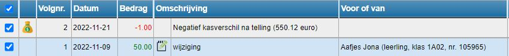

Klik op dit symbool <LegacyAction img="geld.png" /> om het kasblad te openen.

Selecteer de verrichtingen die je wil overzetten naar Exact Online. 

Klik bovenaan op 

Voor het doorboeken van verrichtingen naar Exact Online zijn de nodige rechten vereist, zowel in de kasmodule als in Exact Online.