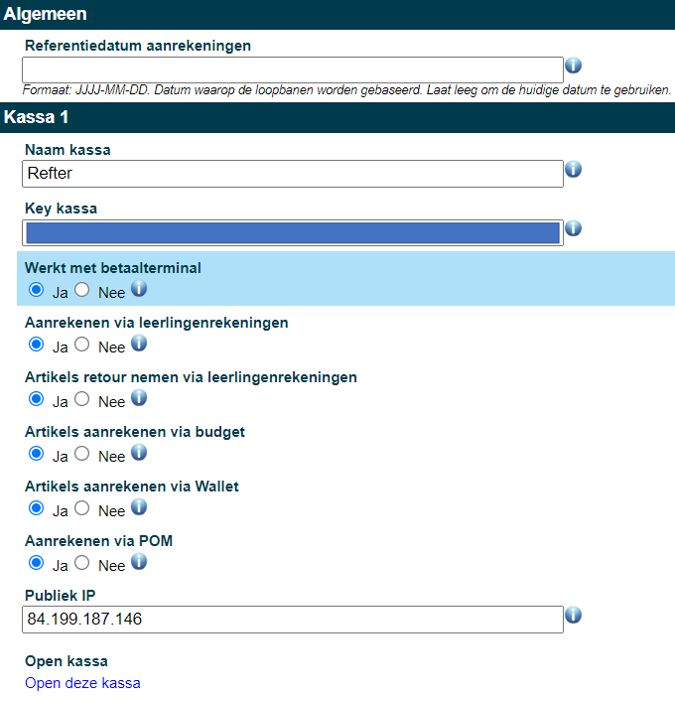
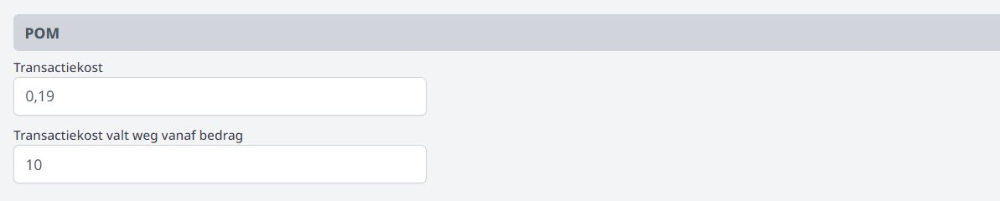

Alvorens met de module Kassa te kunnen starten, dienen de benodigde kassa's te worden aangemaakt in de module Instellingen van de Toolbox. Hiervoor zijn beheersrechten vereist die toegang geven tot deze module. Je kan 3 verschillende kassa's instellen. 

### Kassa instellen

**Referentiedatum aanrekeningen** blijft in de meeste gevallen leeg. Deze datum kan ingevuld worden om verkopen te organiseren voor leerlingen die ingeschreven zijn met een datum in de toekomst. Bv. voor het organiseren van een verkoop van turngerief in de zomervakantie voor leerlingen die pas op 1 september officieel zijn ingeschreven in de school. In dit geval vul je bij de referentiedatum 01/09/20** in.

**Naam kassa**: Vul hier een gepaste naam in voor je kassa, bv. cafetaria, schoolwinkel, ...

**Key en Publiek IP** moeten enkel worden ingevuld indien je met een fysieke kassa werkt. Deze gegevens horen bij het specifieke toestel en zal je daar terugvinden. Als je werkt met een pc, laptop of mobiel toestel zoals tablet of smartphone, is het niet nodig om deze gegevens in te vullen.

### Betaalmodaliteiten instellen

**Werkt met betaalterminal**: De school moet hiervoor in het bezit zijn van een betaalterminal zoals een bancontacttoestel. 

**Aanrekenen of retour nemen via de leerlingenrekeningen**:  De artikelen kunnen via de leerlingenrekeningen worden aangerekend/gecrediteerd door gebruik te maken van de functie 'importeer' in de module leerlingenrekeningen. 

**Artikels aanrekenen via budget** biedt de mogelijkheid om in de kassamodule budgetten aan te maken, bv. voor bepaalde vakken of activiteiten. Wanneer bv. een leerkracht niet specifiek voor een leerling, maar wel voor een vak materiaal ophaalt in het schoolwinkeltje, kan hiervoor de betaalmethode 'budget' gebruikt worden. Deze budgetten kunnen steeds worden opgevolgd in de kassamodule. 

**Artikels aanrekenen via Wallet**: Deze functie werkt enkel in combinatie met de module Wallet in Toolbox. Leerlingen (of hun ouders) en personeelsleden kunnen geld opladen in hun digitale wallet en kunnen hun aankopen hiermee betalen. De wallet werkt ook in combinatie met een scanapparaat en een unieke barcode per persoon. 

**Aanrekenen via POM**: Er wordt een QR code gegenereerd die men kan scannen via Payconiq of in de eigen bankapp. POM is echter wel betalend en zal pas functioneel zijn van zodra het contract is geactiveerd. Tarieven raadplegen en activeren kan via https://app.pom.be/nl/connect/kobatoolbox/tarieven. De transactiekost kan indien gewenst via de kassa worden doorgerekend aan de 'klant'. Stel hiervoor helemaal onderaan de 'transactiekost' in. Je kan tot slot ook opgeven dat deze kost vanaf een bepaald aankoopbedrag wegvalt.  

 